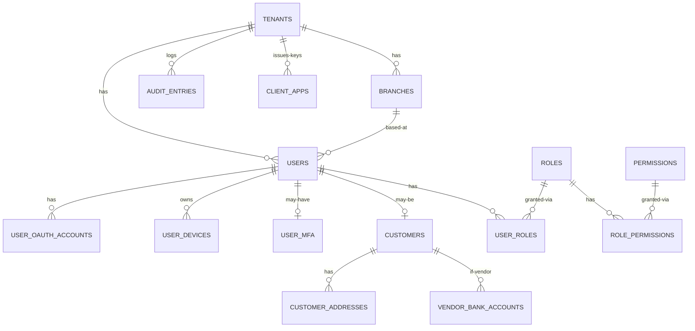

# `identity-service` Schema

> Owns: tenants, branches, users, authentication artifacts (OAuth, MFA, devices),
> RBAC (roles + permissions), customers (with vendor sub-type), customer
> addresses, vendor bank accounts, audit log, and client-app keys for
> inter-service auth.
>
> Conventions: see [`../07-database-design.md`](../07-database-design.md) §3.
> **Column names are PascalCase, double-quoted in SQL.** Table names are
> snake_case. Primary key column is `id` (lowercase, by TypeORM convention).

**Database name:** `identity_db`

**Anchors:**
- Tenancy: `D:\charqol\core-service\src\` company/org models — [`06-extended-patterns.md`](../06-extended-patterns.md) §9
- Users + roles + perms: `D:\charqol\user-service\src\api\users\` + `D:\Batterlicious\user-service\src\domain.types\authorization\enums.ts`
- OAuth + Devices + MFA: `D:\charqol\` — [`06`](../06-extended-patterns.md) §8
- Customers: `D:\charqol\accounting-service\src\database\models\customer.model.ts`
- Addresses with Indian conventions: `D:\Batterlicious\batterlicious-service\src\database\typeorm\models\address.entity.ts` — [`06`](../06-extended-patterns.md) §14
- Audit log: `D:\kleo\kleo-backend-exp\src\database\typeorm\models\` — [`04-cross-cutting.md`](../04-cross-cutting.md) §1
- Client-app keys: `D:\charqol\core-service\sister-service-api-keys.json`

---

## Tables overview

| # | Table                  | Purpose                                                                                          |
|---|------------------------|--------------------------------------------------------------------------------------------------|
| 1 | `tenants`              | Top-level organisation. Single row today (`PT Kharade Group of Industries`).                     |
| 2 | `branches`             | Shops within a tenant. Single row today (`Mukundnagar shop`).                                    |
| 3 | `users`                | All humans + service accounts.                                                                   |
| 4 | `user_oauth_accounts`  | Google/Facebook OAuth links per user (optional login methods).                                   |
| 5 | `user_devices`         | One row per device login; user can review/revoke sessions.                                       |
| 6 | `user_mfa`             | TOTP secret + 10 single-use backup codes (SystemAdmin role only).                                |
| 7 | `roles`                | `SystemAdmin / Receptionist / Customer / Vendor`.                                                |
| 8 | `permissions`          | Tuples like `Order.Create`, `RateCard.Update`.                                                   |
| 9 | `role_permissions`     | Many-to-many.                                                                                    |
| 10| `user_roles`           | Many-to-many — a user can be SystemAdmin + Receptionist simultaneously.                          |
| 11| `customers`            | Retail customer + B2B vendor (sub-type via `CustomerType`).                                      |
| 12| `customer_addresses`   | Multiple per customer; Indian address decomposition + lat/long.                                  |
| 13| `vendor_bank_accounts` | Bank details for payout (B2B vendors only).                                                      |
| 14| `client_apps`          | Sister-service `x-api-key` registrations.                                                        |
| 15| `audit_entries`        | Admin/Receptionist action log (180-day hot retention).                                           |

Plus shared infra: `event_store`, `idempotency_keys` (see `07-database-design.md` §6).

---

## 1. `tenants`

| Field         | Type            | Constraints              | Notes                                          |
|---------------|-----------------|--------------------------|------------------------------------------------|
| `id`          | UUID            | PK                       |                                                |
| `Name`        | VARCHAR(255)    | NOT NULL                 | "PT Kharade Group of Industries"               |
| `LegalName`   | VARCHAR(255)    |                          |                                                |
| `Gstin`       | VARCHAR(15)     |                          | India GST identifier                           |
| `Pan`         | VARCHAR(10)     |                          |                                                |
| `LogoUrl`     | VARCHAR(512)    |                          |                                                |
| `IsActive`    | BOOLEAN         | NOT NULL DEFAULT TRUE    |                                                |
| `CreatedAt`   | TIMESTAMPTZ     | NOT NULL DEFAULT now()   |                                                |
| `UpdatedAt`   | TIMESTAMPTZ     | NOT NULL DEFAULT now()   |                                                |
| `DeletedAt`   | TIMESTAMPTZ     |                          |                                                |

```sql
CREATE TABLE tenants (
  id            UUID PRIMARY KEY DEFAULT gen_random_uuid(),
  "Name"        VARCHAR(255) NOT NULL,
  "LegalName"   VARCHAR(255),
  "Gstin"       VARCHAR(15),
  "Pan"         VARCHAR(10),
  "LogoUrl"     VARCHAR(512),
  "IsActive"    BOOLEAN      NOT NULL DEFAULT TRUE,
  "CreatedAt"   TIMESTAMPTZ  NOT NULL DEFAULT now(),
  "UpdatedAt"   TIMESTAMPTZ  NOT NULL DEFAULT now(),
  "DeletedAt"   TIMESTAMPTZ
);
```

---

## 2. `branches`

| Field             | Type            | Constraints                              | Notes                                          |
|-------------------|-----------------|------------------------------------------|------------------------------------------------|
| `id`              | UUID            | PK                                       |                                                |
| `TenantId`        | UUID            | NOT NULL, FK → tenants(id)               |                                                |
| `Code`            | VARCHAR(32)     | NOT NULL                                 | "MNG-01"                                       |
| `Name`            | VARCHAR(255)    | NOT NULL                                 | "Mukundnagar shop"                             |
| `AddressLine`    | VARCHAR(512)    |                                          |                                                |
| `City`            | VARCHAR(128)    |                                          |                                                |
| `State`           | VARCHAR(128)    |                                          | "Maharashtra"                                  |
| `Pincode`         | VARCHAR(10)     |                                          |                                                |
| `Phone`           | VARCHAR(20)     |                                          | +91XXXXXXXXXX                                  |
| `Email`           | VARCHAR(255)    |                                          |                                                |
| `Latitude`        | DECIMAL(10,7)   |                                          |                                                |
| `Longitude`       | DECIMAL(10,7)   |                                          |                                                |
| `OperatingHours`  | JSONB           |                                          | `{"mon":{"open":"08:00","close":"21:00"}, ...}` |
| `IsActive`        | BOOLEAN         | NOT NULL DEFAULT TRUE                    |                                                |
| `CreatedAt`, `UpdatedAt`, `DeletedAt` | … | (standard)                          |                                                |

```sql
CREATE TABLE branches (
  id                UUID PRIMARY KEY DEFAULT gen_random_uuid(),
  "TenantId"        UUID NOT NULL REFERENCES tenants(id),
  "Code"            VARCHAR(32)  NOT NULL,
  "Name"            VARCHAR(255) NOT NULL,
  "AddressLine"     VARCHAR(512),
  "City"            VARCHAR(128),
  "State"           VARCHAR(128),
  "Pincode"         VARCHAR(10),
  "Phone"           VARCHAR(20),
  "Email"           VARCHAR(255),
  "Latitude"        DECIMAL(10,7),
  "Longitude"       DECIMAL(10,7),
  "OperatingHours"  JSONB,
  "IsActive"        BOOLEAN     NOT NULL DEFAULT TRUE,
  "CreatedAt"       TIMESTAMPTZ NOT NULL DEFAULT now(),
  "UpdatedAt"       TIMESTAMPTZ NOT NULL DEFAULT now(),
  "DeletedAt"       TIMESTAMPTZ,
  CONSTRAINT ux_branches_tenant_code UNIQUE ("TenantId", "Code")
);
CREATE INDEX ix_branches_tenant ON branches ("TenantId") WHERE "DeletedAt" IS NULL;
```

---

## 3. `users`

| Field                  | Type              | Constraints                                                | Notes                                                       |
|------------------------|-------------------|------------------------------------------------------------|-------------------------------------------------------------|
| `id`                   | UUID              | PK                                                         |                                                             |
| `TenantId`             | UUID              | NOT NULL, FK → tenants(id)                                 |                                                             |
| `BranchId`             | UUID              | NOT NULL, FK → branches(id)                                | Default branch for staff                                    |
| `FirstName`            | VARCHAR(128)      | NOT NULL                                                   |                                                             |
| `LastName`             | VARCHAR(128)      |                                                            |                                                             |
| `Email`                | VARCHAR(255)      |                                                            | Lowercased on save                                          |
| `Phone`                | VARCHAR(20)       |                                                            | E.164 `+91XXXXXXXXXX`                                       |
| `EmailVerifiedAt`      | TIMESTAMPTZ       |                                                            |                                                             |
| `PhoneVerifiedAt`      | TIMESTAMPTZ       |                                                            |                                                             |
| `PasswordHash`         | VARCHAR(255)      |                                                            | argon2id; nullable for OTP-only users                       |
| `PasswordChangedAt`    | TIMESTAMPTZ       |                                                            | Drives 180-day expiry                                       |
| `PreferredLanguage`    | CHAR(2)           | NOT NULL DEFAULT 'en'                                      | `en` / `mr`                                                  |
| `ProfileImageUrl`      | VARCHAR(512)      |                                                            |                                                             |
| `ThemePrefs`           | JSONB             |                                                            | See [`04`](../04-cross-cutting.md) §4 token shape           |
| `IsActive`             | BOOLEAN           | NOT NULL DEFAULT TRUE                                      |                                                             |
| `LastLoginAt`          | TIMESTAMPTZ       |                                                            |                                                             |
| `CreatedAt`, `UpdatedAt`, `DeletedAt` | …   |                                                            |                                                             |
| `CreatedBy`, `UpdatedBy` | UUID            |                                                            | Audit columns                                               |

```sql
CREATE TABLE users (
  id                    UUID PRIMARY KEY DEFAULT gen_random_uuid(),
  "TenantId"            UUID NOT NULL REFERENCES tenants(id),
  "BranchId"            UUID NOT NULL REFERENCES branches(id),
  "FirstName"           VARCHAR(128) NOT NULL,
  "LastName"            VARCHAR(128),
  "Email"               VARCHAR(255),
  "Phone"               VARCHAR(20),
  "EmailVerifiedAt"     TIMESTAMPTZ,
  "PhoneVerifiedAt"     TIMESTAMPTZ,
  "PasswordHash"        VARCHAR(255),
  "PasswordChangedAt"   TIMESTAMPTZ,
  "PreferredLanguage"   CHAR(2)     NOT NULL DEFAULT 'en',
  "ProfileImageUrl"     VARCHAR(512),
  "ThemePrefs"          JSONB,
  "IsActive"            BOOLEAN     NOT NULL DEFAULT TRUE,
  "LastLoginAt"         TIMESTAMPTZ,
  "CreatedAt"           TIMESTAMPTZ NOT NULL DEFAULT now(),
  "UpdatedAt"           TIMESTAMPTZ NOT NULL DEFAULT now(),
  "DeletedAt"           TIMESTAMPTZ,
  "CreatedBy"           UUID,
  "UpdatedBy"           UUID
);

CREATE UNIQUE INDEX ux_users_tenant_email ON users ("TenantId", lower("Email")) WHERE "Email" IS NOT NULL AND "DeletedAt" IS NULL;
CREATE UNIQUE INDEX ux_users_tenant_phone ON users ("TenantId", "Phone") WHERE "Phone" IS NOT NULL AND "DeletedAt" IS NULL;
CREATE INDEX ix_users_tenant_branch ON users ("TenantId", "BranchId") WHERE "DeletedAt" IS NULL;
```

---

## 4. `user_oauth_accounts`

| Field             | Type                | Constraints                                | Notes                                       |
|-------------------|---------------------|--------------------------------------------|---------------------------------------------|
| `id`              | UUID                | PK                                         |                                             |
| `UserId`          | UUID                | NOT NULL, FK → users(id) ON DELETE CASCADE |                                             |
| `Provider`        | oauth_provider_enum | NOT NULL                                   | `Google`, `Facebook`, `Apple` (later)       |
| `ProviderSubject` | VARCHAR(255)        | NOT NULL                                   | OAuth `sub` claim                           |
| `EmailAtProvider` | VARCHAR(255)        |                                            |                                             |
| `LinkedAt`        | TIMESTAMPTZ         | NOT NULL DEFAULT now()                     |                                             |
| `LastUsedAt`      | TIMESTAMPTZ         |                                            |                                             |

```sql
CREATE TYPE oauth_provider_enum AS ENUM ('Google','Facebook','Apple');

CREATE TABLE user_oauth_accounts (
  id                  UUID PRIMARY KEY DEFAULT gen_random_uuid(),
  "UserId"            UUID NOT NULL REFERENCES users(id) ON DELETE CASCADE,
  "Provider"          oauth_provider_enum NOT NULL,
  "ProviderSubject"   VARCHAR(255) NOT NULL,
  "EmailAtProvider"   VARCHAR(255),
  "LinkedAt"          TIMESTAMPTZ NOT NULL DEFAULT now(),
  "LastUsedAt"        TIMESTAMPTZ,
  CONSTRAINT ux_oauth_provider_subject UNIQUE ("Provider", "ProviderSubject")
);
CREATE INDEX ix_oauth_user ON user_oauth_accounts ("UserId");
```

---

## 5. `user_devices`

| Field          | Type                 | Constraints                                  | Notes                                              |
|----------------|----------------------|----------------------------------------------|----------------------------------------------------|
| `id`           | UUID                 | PK                                           |                                                    |
| `UserId`       | UUID                 | NOT NULL, FK → users(id) ON DELETE CASCADE   |                                                    |
| `DeviceId`     | VARCHAR(128)         | NOT NULL                                     | Device fingerprint (FCM token / iOS DeviceID)      |
| `DeviceName`   | VARCHAR(255)         |                                              | "Pixel 7" — for the "active sessions" UI            |
| `Platform`     | device_platform_enum |                                              | `Android / iOS / Web`                              |
| `AppVersion`   | VARCHAR(32)          |                                              |                                                    |
| `OsVersion`    | VARCHAR(32)          |                                              |                                                    |
| `FcmToken`     | VARCHAR(512)         |                                              | For push notifications                              |
| `IpAddress`    | VARCHAR(64)          |                                              |                                                    |
| `UserAgent`    | VARCHAR(512)         |                                              |                                                    |
| `FirstSeenAt`  | TIMESTAMPTZ          | NOT NULL DEFAULT now()                       |                                                    |
| `LastSeenAt`   | TIMESTAMPTZ          | NOT NULL DEFAULT now()                       |                                                    |
| `RevokedAt`    | TIMESTAMPTZ          |                                              | Set when user revokes the session                   |

```sql
CREATE TYPE device_platform_enum AS ENUM ('Android','iOS','Web');

CREATE TABLE user_devices (
  id              UUID PRIMARY KEY DEFAULT gen_random_uuid(),
  "UserId"        UUID NOT NULL REFERENCES users(id) ON DELETE CASCADE,
  "DeviceId"      VARCHAR(128) NOT NULL,
  "DeviceName"    VARCHAR(255),
  "Platform"      device_platform_enum,
  "AppVersion"    VARCHAR(32),
  "OsVersion"     VARCHAR(32),
  "FcmToken"      VARCHAR(512),
  "IpAddress"     VARCHAR(64),
  "UserAgent"     VARCHAR(512),
  "FirstSeenAt"   TIMESTAMPTZ NOT NULL DEFAULT now(),
  "LastSeenAt"    TIMESTAMPTZ NOT NULL DEFAULT now(),
  "RevokedAt"     TIMESTAMPTZ
);
CREATE INDEX ix_user_devices_user_active ON user_devices ("UserId") WHERE "RevokedAt" IS NULL;
CREATE UNIQUE INDEX ux_user_devices_user_device ON user_devices ("UserId", "DeviceId") WHERE "RevokedAt" IS NULL;
```

---

## 6. `user_mfa`

One row per user that has set up MFA (currently SystemAdmin role only — see [`01-backend.md`](../01-backend.md) §6.5).

| Field          | Type            | Constraints                                  | Notes                                                |
|----------------|-----------------|----------------------------------------------|------------------------------------------------------|
| `UserId`       | UUID            | PK, FK → users(id) ON DELETE CASCADE         | One-to-one                                           |
| `Method`       | mfa_method_enum | NOT NULL                                     | `TOTP` today; `WebAuthn` later                       |
| `TotpSecret`   | VARCHAR(64)     | NOT NULL                                     | Base32; encrypt at rest using `pgp_sym_encrypt`      |
| `BackupCodes`  | JSONB           | NOT NULL                                     | `[{"hash":"...","used_at":null}, …]` (10 single-use) |
| `EnabledAt`    | TIMESTAMPTZ     | NOT NULL DEFAULT now()                       |                                                      |
| `LastUsedAt`   | TIMESTAMPTZ     |                                              |                                                      |

```sql
CREATE TYPE mfa_method_enum AS ENUM ('TOTP','WebAuthn');

CREATE TABLE user_mfa (
  "UserId"       UUID PRIMARY KEY REFERENCES users(id) ON DELETE CASCADE,
  "Method"       mfa_method_enum NOT NULL,
  "TotpSecret"   VARCHAR(64)     NOT NULL,
  "BackupCodes"  JSONB           NOT NULL,
  "EnabledAt"    TIMESTAMPTZ     NOT NULL DEFAULT now(),
  "LastUsedAt"   TIMESTAMPTZ
);
```

---

## 7. `roles`

| Field          | Type           | Constraints              | Notes                                       |
|----------------|----------------|--------------------------|---------------------------------------------|
| `id`           | UUID           | PK                       |                                             |
| `TenantId`     | UUID           | NULL                     | `NULL` for system roles; set for custom roles |
| `Code`         | VARCHAR(64)    | NOT NULL                 | `SystemAdmin`, `Receptionist`, `Customer`, `Vendor` |
| `Name`         | VARCHAR(128)   | NOT NULL                 |                                             |
| `Description`  | TEXT           |                          |                                             |
| `IsSystem`     | BOOLEAN        | NOT NULL DEFAULT TRUE    | System roles can't be deleted               |
| `CreatedAt`, `UpdatedAt`, `DeletedAt` | … |                  |                                             |

```sql
CREATE TABLE roles (
  id            UUID PRIMARY KEY DEFAULT gen_random_uuid(),
  "TenantId"    UUID,
  "Code"        VARCHAR(64)  NOT NULL,
  "Name"        VARCHAR(128) NOT NULL,
  "Description" TEXT,
  "IsSystem"    BOOLEAN     NOT NULL DEFAULT TRUE,
  "CreatedAt"   TIMESTAMPTZ NOT NULL DEFAULT now(),
  "UpdatedAt"   TIMESTAMPTZ NOT NULL DEFAULT now(),
  "DeletedAt"   TIMESTAMPTZ
);
CREATE UNIQUE INDEX ux_roles_tenant_code ON roles (COALESCE("TenantId", '00000000-0000-0000-0000-000000000000'::uuid), "Code") WHERE "DeletedAt" IS NULL;
```

---

## 8. `permissions`

Permissions are platform-wide, seeded once.

| Field          | Type           | Constraints              | Notes                                       |
|----------------|----------------|--------------------------|---------------------------------------------|
| `id`           | UUID           | PK                       |                                             |
| `Code`         | VARCHAR(128)   | NOT NULL UNIQUE          | `Order.Create`, `RateCard.Update`, `Audit.View` |
| `Resource`     | VARCHAR(64)    | NOT NULL                 | `Order`                                     |
| `Action`       | VARCHAR(64)    | NOT NULL                 | `Create`                                    |
| `Description`  | TEXT           |                          |                                             |
| `CreatedAt`    | TIMESTAMPTZ    | NOT NULL DEFAULT now()   |                                             |

```sql
CREATE TABLE permissions (
  id            UUID PRIMARY KEY DEFAULT gen_random_uuid(),
  "Code"        VARCHAR(128) NOT NULL UNIQUE,
  "Resource"    VARCHAR(64)  NOT NULL,
  "Action"      VARCHAR(64)  NOT NULL,
  "Description" TEXT,
  "CreatedAt"   TIMESTAMPTZ  NOT NULL DEFAULT now()
);
```

---

## 9. `role_permissions`

```sql
CREATE TABLE role_permissions (
  "RoleId"        UUID NOT NULL REFERENCES roles(id) ON DELETE CASCADE,
  "PermissionId"  UUID NOT NULL REFERENCES permissions(id) ON DELETE CASCADE,
  "GrantedAt"     TIMESTAMPTZ NOT NULL DEFAULT now(),
  "GrantedBy"     UUID,
  PRIMARY KEY ("RoleId", "PermissionId")
);
CREATE INDEX ix_role_permissions_perm ON role_permissions ("PermissionId");
```

---

## 10. `user_roles`

```sql
CREATE TABLE user_roles (
  "UserId"    UUID NOT NULL REFERENCES users(id) ON DELETE CASCADE,
  "RoleId"    UUID NOT NULL REFERENCES roles(id) ON DELETE CASCADE,
  "TenantId"  UUID NOT NULL,
  "BranchId"  UUID,
  "GrantedAt" TIMESTAMPTZ NOT NULL DEFAULT now(),
  "GrantedBy" UUID,
  PRIMARY KEY ("UserId", "RoleId", "TenantId")
);
CREATE INDEX ix_user_roles_role ON user_roles ("RoleId");
```

---

## 11. `customers`

A `customer` extends a `user` (1:0..1) — every customer is a user, but not every user is a customer (admin staff are users without customer profiles).

| Field                  | Type                | Constraints                                      | Notes                                                                      |
|------------------------|---------------------|--------------------------------------------------|----------------------------------------------------------------------------|
| `id`                   | UUID                | PK                                               |                                                                            |
| `TenantId`             | UUID                | NOT NULL, FK → tenants(id)                       |                                                                            |
| `BranchId`             | UUID                | NOT NULL, FK → branches(id)                      | Home branch                                                                |
| `UserId`               | UUID                | UNIQUE, FK → users(id)                           | Internal join                                                              |
| `CustomerCode`         | VARCHAR(32)         | NOT NULL                                         | "PTK-CUST-00001" (human-readable)                                          |
| `CustomerType`         | customer_type_enum  | NOT NULL                                         | `Retail` or `Vendor`                                                       |
| `Name`                 | VARCHAR(255)        | NOT NULL                                         | Convenience copy for search                                                |
| `BusinessName`         | VARCHAR(255)        |                                                  | Set when `"CustomerType"='Vendor'` ("Hotel Sahyadri")                      |
| `Gstin`                | VARCHAR(15)         |                                                  | Vendor only                                                                |
| `CreditLimit`          | NUMERIC(15,2)       | NOT NULL DEFAULT 0                               | B2B credit cap; see also wallet negative-floor pattern ([06] §6)           |
| `PaymentTermsDays`     | INT                 | NOT NULL DEFAULT 0                               | Net X for vendors (0 = COD)                                                |
| `PriceTier`            | VARCHAR(32)         | NOT NULL DEFAULT 'Default'                       | Vendor pricing band                                                        |
| `ReferralSource`       | VARCHAR(64)         |                                                  |                                                                            |
| `OnboardedAt`          | TIMESTAMPTZ         | NOT NULL DEFAULT now()                           |                                                                            |
| `IsBlocked`            | BOOLEAN             | NOT NULL DEFAULT FALSE                           |                                                                            |
| `BlockedReason`        | TEXT                |                                                  |                                                                            |
| `CreatedAt`, `UpdatedAt`, `DeletedAt` | …    |                                                  |                                                                            |
| `CreatedBy`, `UpdatedBy` | UUID              |                                                  |                                                                            |

```sql
CREATE TYPE customer_type_enum AS ENUM ('Retail','Vendor');

CREATE TABLE customers (
  id                    UUID PRIMARY KEY DEFAULT gen_random_uuid(),
  "TenantId"            UUID NOT NULL REFERENCES tenants(id),
  "BranchId"            UUID NOT NULL REFERENCES branches(id),
  "UserId"              UUID UNIQUE REFERENCES users(id),
  "CustomerCode"        VARCHAR(32)  NOT NULL,
  "CustomerType"        customer_type_enum NOT NULL,
  "Name"                VARCHAR(255) NOT NULL,
  "BusinessName"        VARCHAR(255),
  "Gstin"               VARCHAR(15),
  "CreditLimit"         NUMERIC(15,2) NOT NULL DEFAULT 0,
  "PaymentTermsDays"    INT           NOT NULL DEFAULT 0,
  "PriceTier"           VARCHAR(32)   NOT NULL DEFAULT 'Default',
  "ReferralSource"      VARCHAR(64),
  "OnboardedAt"         TIMESTAMPTZ   NOT NULL DEFAULT now(),
  "IsBlocked"           BOOLEAN       NOT NULL DEFAULT FALSE,
  "BlockedReason"       TEXT,
  "CreatedAt"           TIMESTAMPTZ   NOT NULL DEFAULT now(),
  "UpdatedAt"           TIMESTAMPTZ   NOT NULL DEFAULT now(),
  "DeletedAt"           TIMESTAMPTZ,
  "CreatedBy"           UUID,
  "UpdatedBy"           UUID,
  CONSTRAINT ux_customers_tenant_code UNIQUE ("TenantId", "CustomerCode")
);

CREATE INDEX ix_customers_tenant_branch ON customers ("TenantId", "BranchId") WHERE "DeletedAt" IS NULL;
CREATE INDEX ix_customers_type ON customers ("CustomerType") WHERE "DeletedAt" IS NULL;
CREATE INDEX ix_customers_name_trgm ON customers USING gin ("Name" gin_trgm_ops);
```

---

## 12. `customer_addresses`

Source: `D:\Batterlicious\batterlicious-service\src\database\typeorm\models\address.entity.ts` — Indian conventions, see [`06`](../06-extended-patterns.md) §14.

| Field            | Type             | Constraints                                       | Notes                                                |
|------------------|------------------|---------------------------------------------------|------------------------------------------------------|
| `id`             | UUID             | PK                                                |                                                      |
| `CustomerId`     | UUID             | NOT NULL, FK → customers(id) ON DELETE CASCADE    |                                                      |
| `Label`          | VARCHAR(64)      | NOT NULL DEFAULT 'Home'                           | `Home / Office / Other` (free text)                  |
| `RecipientName`  | VARCHAR(255)     |                                                   | Override                                             |
| `Flat`           | VARCHAR(64)      |                                                   |                                                      |
| `Building`       | VARCHAR(255)     |                                                   |                                                      |
| `Society`        | VARCHAR(255)     |                                                   |                                                      |
| `Landmark`       | VARCHAR(255)     |                                                   |                                                      |
| `Area`           | VARCHAR(128)     |                                                   |                                                      |
| `City`           | VARCHAR(128)     | NOT NULL                                          |                                                      |
| `State`          | VARCHAR(128)     | NOT NULL                                          |                                                      |
| `Pincode`        | VARCHAR(10)      | NOT NULL                                          |                                                      |
| `Latitude`       | DECIMAL(10,7)    |                                                   |                                                      |
| `Longitude`      | DECIMAL(10,7)    |                                                   |                                                      |
| `IsDefault`      | BOOLEAN          | NOT NULL DEFAULT FALSE                            |                                                      |
| `CreatedAt`, `UpdatedAt`, `DeletedAt` | … |                                                  |                                                      |

```sql
CREATE TABLE customer_addresses (
  id                UUID PRIMARY KEY DEFAULT gen_random_uuid(),
  "CustomerId"      UUID NOT NULL REFERENCES customers(id) ON DELETE CASCADE,
  "Label"           VARCHAR(64)  NOT NULL DEFAULT 'Home',
  "RecipientName"   VARCHAR(255),
  "Flat"            VARCHAR(64),
  "Building"        VARCHAR(255),
  "Society"         VARCHAR(255),
  "Landmark"        VARCHAR(255),
  "Area"            VARCHAR(128),
  "City"            VARCHAR(128) NOT NULL,
  "State"           VARCHAR(128) NOT NULL,
  "Pincode"         VARCHAR(10)  NOT NULL,
  "Latitude"        DECIMAL(10,7),
  "Longitude"       DECIMAL(10,7),
  "IsDefault"       BOOLEAN     NOT NULL DEFAULT FALSE,
  "CreatedAt"       TIMESTAMPTZ NOT NULL DEFAULT now(),
  "UpdatedAt"       TIMESTAMPTZ NOT NULL DEFAULT now(),
  "DeletedAt"       TIMESTAMPTZ
);
CREATE INDEX ix_customer_addresses_customer ON customer_addresses ("CustomerId") WHERE "DeletedAt" IS NULL;
CREATE UNIQUE INDEX ux_customer_addresses_default ON customer_addresses ("CustomerId") WHERE "IsDefault" = TRUE AND "DeletedAt" IS NULL;
```

The partial unique index enforces "at most one default address per customer".

---

## 13. `vendor_bank_accounts`

For B2B vendor settlement payouts. Source: `D:\Batterlicious\batterlicious-service\src\database\typeorm\models\vendor.bank.accounts.entity.ts`.

| Field             | Type             | Constraints                                       | Notes                                          |
|-------------------|------------------|---------------------------------------------------|------------------------------------------------|
| `id`              | UUID             | PK                                                |                                                |
| `CustomerId`      | UUID             | NOT NULL, FK → customers(id) ON DELETE CASCADE    | Vendor only                                    |
| `AccountHolder`   | VARCHAR(255)     | NOT NULL                                          |                                                |
| `AccountNumber`   | VARCHAR(32)      | NOT NULL                                          | Encrypted at rest (`pgp_sym_encrypt`)           |
| `Ifsc`            | VARCHAR(11)      | NOT NULL                                          |                                                |
| `BankName`        | VARCHAR(128)     | NOT NULL                                          |                                                |
| `BranchName`      | VARCHAR(128)     |                                                   |                                                |
| `UpiVpa`          | VARCHAR(128)     |                                                   |                                                |
| `IsPrimary`       | BOOLEAN          | NOT NULL DEFAULT FALSE                            |                                                |
| `VerifiedAt`      | TIMESTAMPTZ      |                                                   | After a ₹1 penny-test                          |
| `CreatedAt`, `UpdatedAt`, `DeletedAt` | … |                                                  |                                                |

```sql
CREATE TABLE vendor_bank_accounts (
  id                UUID PRIMARY KEY DEFAULT gen_random_uuid(),
  "CustomerId"      UUID NOT NULL REFERENCES customers(id) ON DELETE CASCADE,
  "AccountHolder"   VARCHAR(255) NOT NULL,
  "AccountNumber"   VARCHAR(32)  NOT NULL,
  "Ifsc"            VARCHAR(11)  NOT NULL,
  "BankName"        VARCHAR(128) NOT NULL,
  "BranchName"      VARCHAR(128),
  "UpiVpa"          VARCHAR(128),
  "IsPrimary"       BOOLEAN     NOT NULL DEFAULT FALSE,
  "VerifiedAt"      TIMESTAMPTZ,
  "CreatedAt"       TIMESTAMPTZ NOT NULL DEFAULT now(),
  "UpdatedAt"       TIMESTAMPTZ NOT NULL DEFAULT now(),
  "DeletedAt"       TIMESTAMPTZ
);
CREATE INDEX ix_vendor_bank_customer ON vendor_bank_accounts ("CustomerId") WHERE "DeletedAt" IS NULL;
CREATE UNIQUE INDEX ux_vendor_bank_primary ON vendor_bank_accounts ("CustomerId") WHERE "IsPrimary" = TRUE AND "DeletedAt" IS NULL;
```

---

## 14. `client_apps` (sister-service API keys)

Source: `D:\charqol\core-service\sister-service-api-keys.json` + `client.app.auth.middleware.ts`. Replaces the JSON file with a DB-backed lookup.

| Field             | Type             | Constraints                                       | Notes                                          |
|-------------------|------------------|---------------------------------------------------|------------------------------------------------|
| `id`              | UUID             | PK                                                |                                                |
| `ClientCode`      | VARCHAR(64)      | NOT NULL UNIQUE                                   | `ORDERS-SERVICE`, `ADMIN-PORTAL`, `CUSTOMER-APP` |
| `Name`            | VARCHAR(128)     | NOT NULL                                          |                                                |
| `ApiKeyHash`      | VARCHAR(255)     | NOT NULL                                          | argon2id hash; raw key shown only at creation  |
| `AllowedOrigins`  | TEXT[]           |                                                   | CORS allow-list                                |
| `Permissions`     | TEXT[]           |                                                   | Coarse permission codes the client may use     |
| `IsActive`        | BOOLEAN          | NOT NULL DEFAULT TRUE                             |                                                |
| `RotatedAt`       | TIMESTAMPTZ      |                                                   |                                                |
| `ExpiresAt`       | TIMESTAMPTZ      |                                                   |                                                |
| `LastUsedAt`      | TIMESTAMPTZ      |                                                   |                                                |
| `CreatedAt`, `UpdatedAt`, `DeletedAt` | … |                                                  |                                                |

```sql
CREATE TABLE client_apps (
  id                UUID PRIMARY KEY DEFAULT gen_random_uuid(),
  "ClientCode"      VARCHAR(64)  NOT NULL UNIQUE,
  "Name"            VARCHAR(128) NOT NULL,
  "ApiKeyHash"      VARCHAR(255) NOT NULL,
  "AllowedOrigins"  TEXT[],
  "Permissions"     TEXT[],
  "IsActive"        BOOLEAN     NOT NULL DEFAULT TRUE,
  "RotatedAt"       TIMESTAMPTZ,
  "ExpiresAt"       TIMESTAMPTZ,
  "LastUsedAt"      TIMESTAMPTZ,
  "CreatedAt"       TIMESTAMPTZ NOT NULL DEFAULT now(),
  "UpdatedAt"       TIMESTAMPTZ NOT NULL DEFAULT now(),
  "DeletedAt"       TIMESTAMPTZ
);
```

---

## 15. `audit_entries`

Source pattern: `D:\kleo\kleo-backend-exp` audit + [`04-cross-cutting.md`](../04-cross-cutting.md) §1.

| Field             | Type            | Constraints                                       | Notes                                          |
|-------------------|-----------------|---------------------------------------------------|------------------------------------------------|
| `id`              | UUID            | PK                                                |                                                |
| `TenantId`        | UUID            | NOT NULL                                          |                                                |
| `UserId`          | UUID            |                                                   | Actor                                          |
| `ActorName`       | VARCHAR(255)    | NOT NULL                                          | "Rohan Patil (Receptionist)"                   |
| `Resource`        | VARCHAR(64)     | NOT NULL                                          | `Order`, `RateCard`, `User`                    |
| `ResourceId`      | UUID            |                                                   |                                                |
| `Action`          | VARCHAR(64)     | NOT NULL                                          | `Order.StatusUpdate`                            |
| `Before`          | JSONB           |                                                   |                                                |
| `After`           | JSONB           |                                                   |                                                |
| `IpAddress`       | VARCHAR(64)     |                                                   |                                                |
| `UserAgent`       | VARCHAR(512)    |                                                   |                                                |
| `CorrelationId`   | UUID            |                                                   | Joins to logger correlation                    |
| `CreatedAt`       | TIMESTAMPTZ     | NOT NULL DEFAULT now()                            |                                                |

```sql
CREATE TABLE audit_entries (
  id                UUID PRIMARY KEY DEFAULT gen_random_uuid(),
  "TenantId"        UUID NOT NULL,
  "UserId"          UUID,
  "ActorName"       VARCHAR(255) NOT NULL,
  "Resource"        VARCHAR(64)  NOT NULL,
  "ResourceId"      UUID,
  "Action"          VARCHAR(64)  NOT NULL,
  "Before"          JSONB,
  "After"           JSONB,
  "IpAddress"       VARCHAR(64),
  "UserAgent"       VARCHAR(512),
  "CorrelationId"   UUID,
  "CreatedAt"       TIMESTAMPTZ  NOT NULL DEFAULT now()
);
CREATE INDEX ix_audit_tenant_created ON audit_entries ("TenantId", "CreatedAt" DESC);
CREATE INDEX ix_audit_resource ON audit_entries ("Resource", "ResourceId");
CREATE INDEX ix_audit_user ON audit_entries ("UserId");
```

Retention: 180 d hot; nightly BullMQ job archives rows older than 180 d to S3 + deletes.

---

## ER diagram (identity service)



---

## Seed data (boot order)

```
1. tenants            ← seed.data/tenants.seed.json       (1 row: PT Kharade Group)
2. branches           ← seed.data/branches.seed.json      (1 row: Mukundnagar)
3. roles              ← seed.data/roles.seed.json         (SystemAdmin, Receptionist, Customer, Vendor)
4. permissions        ← seed.data/permissions.seed.json   (~40 tuples)
5. role_permissions   ← seed.data/role_privileges/*.json  (one file per role; rean pattern)
6. users + user_roles ← seed.data/system_admin.seed.json  (1 system admin user)
7. client_apps        ← seed.data/client_apps.seed.json   (one per service + admin-portal + customer-app)
```

Seed-file keys are PascalCase too — they unmarshal directly into the entity:
```json
// seed.data/tenants.seed.json
[
  { "Name": "PT Kharade Group of Industries", "LegalName": "PT Kharade Group of Industries", "IsActive": true }
]
```

Reference: `D:\Rean\reancare-service\src\startup\seeder.ts` + `seed.data\role.privileges\`.

---

*End of identity schema. Continue with [`02-catalog-pricing-schema.md`](02-catalog-pricing-schema.md).*
