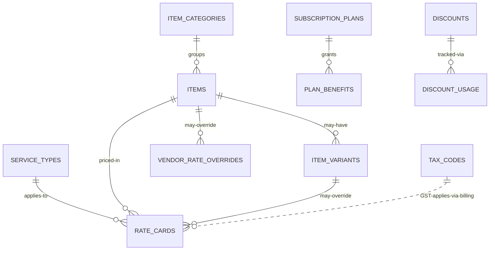

# `catalog-pricing-service` Schema

> Owns: item catalogue (categories, items, variants), pricing (rate cards,
> vendor overrides, surcharges, tax codes), subscription plans, and discounts.
>
> Conventions: see [`../07-database-design.md`](../07-database-design.md) §3.
> **Column names are PascalCase, double-quoted in SQL.**

**Database name:** `catalog_pricing_db`

**Anchors:**
- Categories & items & variants: `D:\Batterlicious\batterlicious-service\src\database\typeorm\models\` (`category.entity.ts`, `product.entity.ts`, `product.variants.entity.ts`)
- Rate cards: BRIEF §2.3 — deliverable #14
- Surcharges: BRIEF §2.3 (home delivery ₹40, express +25%)
- Tax codes: `D:\charqol\accounting-service\src\database\models\` (TaxCode entity)
- Subscription plans: `D:\Batterlicious\batterlicious-service\src\database\typeorm\models\subscription.entity.ts` — [`06`](../06-extended-patterns.md) §1
- Discounts: `discounts.entity.ts` + `discount.usage.entity.ts` — [`06`](../06-extended-patterns.md) §5

---

## Tables overview

| #  | Table                  | Purpose                                                                              |
|----|------------------------|--------------------------------------------------------------------------------------|
| 1  | `service_types`        | Lookup: `DryClean / Laundry / PressOnly` (and future).                                |
| 2  | `item_categories`      | Item groupings.                                                                       |
| 3  | `items`                | The catalog (Shirt, Pant, Bedsheet, Curtain, …).                                      |
| 4  | `item_variants`        | Size/fabric variants.                                                                 |
| 5  | `rate_cards`           | Item × service-type → rate. Versioned via `EffectiveFrom`/`EffectiveTo`.              |
| 6  | `vendor_rate_overrides`| Vendor-specific overrides (B2B contract pricing).                                     |
| 7  | `surcharge_config`     | Key-value: home-delivery charge, express %, etc.                                      |
| 8  | `tax_codes`            | GST codes.                                                                            |
| 9  | `subscription_plans`   | Customer + vendor plans (monthly / quarterly / half-yearly / yearly).                 |
| 10 | `plan_benefits`        | Per-plan benefits.                                                                    |
| 11 | `discounts`            | Coupons + auto-apply discounts.                                                       |
| 12 | `discount_usage`       | Every redemption.                                                                     |

Plus shared infra: `event_store`, `idempotency_keys`.

---

## 1. `service_types`

| Field          | Type           | Constraints              | Notes                                       |
|----------------|----------------|--------------------------|---------------------------------------------|
| `id`           | UUID           | PK                       |                                             |
| `Code`         | VARCHAR(32)    | NOT NULL UNIQUE          | `DRY_CLEAN`, `LAUNDRY`, `PRESS_ONLY`         |
| `Name`         | VARCHAR(128)   | NOT NULL                 | "Dry Clean"                                 |
| `NameMr`       | VARCHAR(128)   |                          | "ड्राय क्लीन" (Marathi)                       |
| `Description`  | TEXT           |                          |                                             |
| `SortOrder`    | INT            | NOT NULL DEFAULT 0       |                                             |
| `IsActive`     | BOOLEAN        | NOT NULL DEFAULT TRUE    |                                             |
| `CreatedAt`, `UpdatedAt`, `DeletedAt` | … |                  |                                             |

```sql
CREATE TABLE service_types (
  id            UUID PRIMARY KEY DEFAULT gen_random_uuid(),
  "Code"        VARCHAR(32)  NOT NULL UNIQUE,
  "Name"        VARCHAR(128) NOT NULL,
  "NameMr"      VARCHAR(128),
  "Description" TEXT,
  "SortOrder"   INT          NOT NULL DEFAULT 0,
  "IsActive"    BOOLEAN      NOT NULL DEFAULT TRUE,
  "CreatedAt"   TIMESTAMPTZ  NOT NULL DEFAULT now(),
  "UpdatedAt"   TIMESTAMPTZ  NOT NULL DEFAULT now(),
  "DeletedAt"   TIMESTAMPTZ
);
```

---

## 2. `item_categories`

| Field         | Type           | Constraints                                       | Notes                                          |
|---------------|----------------|---------------------------------------------------|------------------------------------------------|
| `id`          | UUID           | PK                                                |                                                |
| `TenantId`    | UUID           | NOT NULL                                          |                                                |
| `Code`        | VARCHAR(64)    | NOT NULL                                          | `SHIRTS_TOPS`                                  |
| `Name`        | VARCHAR(128)   | NOT NULL                                          | "Shirts & tops"                                |
| `NameMr`      | VARCHAR(128)   |                                                   |                                                |
| `Description` | TEXT           |                                                   |                                                |
| `ParentId`    | UUID           |                                                   | Self-FK; nullable                              |
| `SortOrder`   | INT            | NOT NULL DEFAULT 0                                |                                                |
| `Icon`        | VARCHAR(64)    |                                                   | Iconify name                                   |
| `ImageUrl`    | VARCHAR(512)   |                                                   |                                                |
| `IsActive`    | BOOLEAN        | NOT NULL DEFAULT TRUE                             |                                                |
| `CreatedAt`, `UpdatedAt`, `DeletedAt` | … |                                                  |                                                |
| `CreatedBy`, `UpdatedBy` | UUID |                                                  |                                                |

```sql
CREATE TABLE item_categories (
  id            UUID PRIMARY KEY DEFAULT gen_random_uuid(),
  "TenantId"    UUID NOT NULL,
  "Code"        VARCHAR(64)  NOT NULL,
  "Name"        VARCHAR(128) NOT NULL,
  "NameMr"      VARCHAR(128),
  "Description" TEXT,
  "ParentId"    UUID REFERENCES item_categories(id),
  "SortOrder"   INT          NOT NULL DEFAULT 0,
  "Icon"        VARCHAR(64),
  "ImageUrl"    VARCHAR(512),
  "IsActive"    BOOLEAN      NOT NULL DEFAULT TRUE,
  "CreatedAt"   TIMESTAMPTZ  NOT NULL DEFAULT now(),
  "UpdatedAt"   TIMESTAMPTZ  NOT NULL DEFAULT now(),
  "DeletedAt"   TIMESTAMPTZ,
  "CreatedBy"   UUID,
  "UpdatedBy"   UUID,
  CONSTRAINT ux_item_categories_tenant_code UNIQUE ("TenantId", "Code")
);
CREATE INDEX ix_item_categories_tenant ON item_categories ("TenantId") WHERE "DeletedAt" IS NULL;
CREATE INDEX ix_item_categories_parent ON item_categories ("ParentId");
```

---

## 3. `items`

| Field                 | Type           | Constraints                                       | Notes                                                |
|-----------------------|----------------|---------------------------------------------------|------------------------------------------------------|
| `id`                  | UUID           | PK                                                |                                                      |
| `TenantId`            | UUID           | NOT NULL                                          |                                                      |
| `CategoryId`          | UUID           | NOT NULL, FK → item_categories(id)                |                                                      |
| `Code`                | VARCHAR(64)    | NOT NULL                                          | `SHIRT`, `PANT`, `SARI`, `BEDSHEET`                  |
| `Name`                | VARCHAR(128)   | NOT NULL                                          |                                                      |
| `NameMr`              | VARCHAR(128)   |                                                   |                                                      |
| `Description`         | TEXT           |                                                   |                                                      |
| `ImageUrl`            | VARCHAR(512)   |                                                   |                                                      |
| `ApplicableServices`  | TEXT[]         | NOT NULL                                          | Array of `"Code"` values from service_types          |
| `DefaultUom`          | VARCHAR(16)    | NOT NULL DEFAULT 'piece'                          | `piece`, `kg`, `sqft`                                |
| `IsVendorOnly`        | BOOLEAN        | NOT NULL DEFAULT FALSE                            | Bedsheet/curtain only listed to vendors              |
| `SortOrder`           | INT            | NOT NULL DEFAULT 0                                |                                                      |
| `IsActive`            | BOOLEAN        | NOT NULL DEFAULT TRUE                             |                                                      |
| `CreatedAt`, `UpdatedAt`, `DeletedAt` | … |                                                  |                                                      |
| `CreatedBy`, `UpdatedBy` | UUID |                                                  |                                                      |

```sql
CREATE TABLE items (
  id                    UUID PRIMARY KEY DEFAULT gen_random_uuid(),
  "TenantId"            UUID NOT NULL,
  "CategoryId"          UUID NOT NULL REFERENCES item_categories(id),
  "Code"                VARCHAR(64)  NOT NULL,
  "Name"                VARCHAR(128) NOT NULL,
  "NameMr"              VARCHAR(128),
  "Description"         TEXT,
  "ImageUrl"            VARCHAR(512),
  "ApplicableServices"  TEXT[]       NOT NULL,
  "DefaultUom"          VARCHAR(16)  NOT NULL DEFAULT 'piece',
  "IsVendorOnly"        BOOLEAN      NOT NULL DEFAULT FALSE,
  "SortOrder"           INT          NOT NULL DEFAULT 0,
  "IsActive"            BOOLEAN      NOT NULL DEFAULT TRUE,
  "CreatedAt"           TIMESTAMPTZ  NOT NULL DEFAULT now(),
  "UpdatedAt"           TIMESTAMPTZ  NOT NULL DEFAULT now(),
  "DeletedAt"           TIMESTAMPTZ,
  "CreatedBy"           UUID,
  "UpdatedBy"           UUID,
  CONSTRAINT ux_items_tenant_code UNIQUE ("TenantId", "Code")
);
CREATE INDEX ix_items_tenant_category ON items ("TenantId", "CategoryId") WHERE "DeletedAt" IS NULL;
CREATE INDEX ix_items_name_trgm ON items USING gin ("Name" gin_trgm_ops);
```

---

## 4. `item_variants`

| Field              | Type           | Constraints                                       | Notes                                          |
|--------------------|----------------|---------------------------------------------------|------------------------------------------------|
| `id`               | UUID           | PK                                                |                                                |
| `ItemId`           | UUID           | NOT NULL, FK → items(id) ON DELETE CASCADE        |                                                |
| `Code`             | VARCHAR(64)    | NOT NULL                                          | `SINGLE`, `DOUBLE`, `KING`                     |
| `Name`             | VARCHAR(128)   | NOT NULL                                          | "King size"                                    |
| `VariantType`      | VARCHAR(32)    | NOT NULL                                          | `Size`, `Fabric`, `Color`                      |
| `Uom`              | VARCHAR(16)    | NOT NULL                                          | `piece` / `sqft`                               |
| `PriceAdjustment`  | NUMERIC(15,2)  | NOT NULL DEFAULT 0                                | Delta over the base item rate                  |
| `IsDefault`        | BOOLEAN        | NOT NULL DEFAULT FALSE                            |                                                |
| `SortOrder`        | INT            | NOT NULL DEFAULT 0                                |                                                |
| `IsActive`         | BOOLEAN        | NOT NULL DEFAULT TRUE                             |                                                |
| `CreatedAt`, `UpdatedAt`, `DeletedAt` | … |                                                  |                                                |

```sql
CREATE TABLE item_variants (
  id                  UUID PRIMARY KEY DEFAULT gen_random_uuid(),
  "ItemId"            UUID NOT NULL REFERENCES items(id) ON DELETE CASCADE,
  "Code"              VARCHAR(64)  NOT NULL,
  "Name"              VARCHAR(128) NOT NULL,
  "VariantType"       VARCHAR(32)  NOT NULL,
  "Uom"               VARCHAR(16)  NOT NULL,
  "PriceAdjustment"   NUMERIC(15,2) NOT NULL DEFAULT 0,
  "IsDefault"         BOOLEAN     NOT NULL DEFAULT FALSE,
  "SortOrder"         INT         NOT NULL DEFAULT 0,
  "IsActive"          BOOLEAN     NOT NULL DEFAULT TRUE,
  "CreatedAt"         TIMESTAMPTZ NOT NULL DEFAULT now(),
  "UpdatedAt"         TIMESTAMPTZ NOT NULL DEFAULT now(),
  "DeletedAt"         TIMESTAMPTZ,
  CONSTRAINT ux_item_variants_item_code UNIQUE ("ItemId", "Code")
);
CREATE INDEX ix_item_variants_item ON item_variants ("ItemId") WHERE "DeletedAt" IS NULL;
```

---

## 5. `rate_cards`

Versioned via `"EffectiveFrom"`/`"EffectiveTo"` so historic orders can be re-priced for refunds/audits without history loss.

| Field               | Type             | Constraints                                       | Notes                                                              |
|---------------------|------------------|---------------------------------------------------|--------------------------------------------------------------------|
| `id`                | UUID             | PK                                                |                                                                    |
| `TenantId`          | UUID             | NOT NULL                                          |                                                                    |
| `BranchId`          | UUID             |                                                   | NULL = applies to all branches                                     |
| `ItemId`            | UUID             | NOT NULL, FK → items(id)                          |                                                                    |
| `VariantId`         | UUID             | FK → item_variants(id)                            | NULL when item has no variants                                     |
| `ServiceTypeCode`   | VARCHAR(32)      | NOT NULL                                          | `DRY_CLEAN`, `LAUNDRY`, `PRESS_ONLY`                               |
| `Rate`              | NUMERIC(15,2)    | NOT NULL                                          | Base rate                                                          |
| `Uom`               | VARCHAR(16)      | NOT NULL                                          |                                                                    |
| `EffectiveFrom`     | DATE             | NOT NULL                                          |                                                                    |
| `EffectiveTo`       | DATE             |                                                   | NULL = current                                                     |
| `IsVendorRate`      | BOOLEAN          | NOT NULL DEFAULT FALSE                            | Bulk/B2B base rate                                                 |
| `CreatedAt`, `UpdatedAt`, `DeletedAt` | …   |                                                  |                                                                    |
| `CreatedBy`, `UpdatedBy` | UUID     |                                                  |                                                                    |

```sql
CREATE TABLE rate_cards (
  id                  UUID PRIMARY KEY DEFAULT gen_random_uuid(),
  "TenantId"          UUID NOT NULL,
  "BranchId"          UUID,
  "ItemId"            UUID NOT NULL REFERENCES items(id),
  "VariantId"         UUID REFERENCES item_variants(id),
  "ServiceTypeCode"   VARCHAR(32)   NOT NULL,
  "Rate"              NUMERIC(15,2) NOT NULL CHECK ("Rate" >= 0),
  "Uom"               VARCHAR(16)   NOT NULL,
  "EffectiveFrom"     DATE          NOT NULL,
  "EffectiveTo"       DATE,
  "IsVendorRate"      BOOLEAN       NOT NULL DEFAULT FALSE,
  "CreatedAt"         TIMESTAMPTZ   NOT NULL DEFAULT now(),
  "UpdatedAt"         TIMESTAMPTZ   NOT NULL DEFAULT now(),
  "DeletedAt"         TIMESTAMPTZ,
  "CreatedBy"         UUID,
  "UpdatedBy"         UUID
);
CREATE INDEX ix_rate_cards_lookup
  ON rate_cards ("TenantId", "ItemId", "ServiceTypeCode", "EffectiveFrom")
  WHERE "DeletedAt" IS NULL;
CREATE INDEX ix_rate_cards_variant ON rate_cards ("VariantId") WHERE "VariantId" IS NOT NULL;

-- only one active row per (tenant, branch, item, variant, service, vendor flag)
CREATE UNIQUE INDEX ux_rate_cards_active
  ON rate_cards ("TenantId",
                 COALESCE("BranchId",  '00000000-0000-0000-0000-000000000000'::uuid),
                 "ItemId",
                 COALESCE("VariantId", '00000000-0000-0000-0000-000000000000'::uuid),
                 "ServiceTypeCode",
                 "IsVendorRate")
  WHERE "EffectiveTo" IS NULL AND "DeletedAt" IS NULL;
```

**Pricing resolution algorithm** (cached in Redis 1 h):
1. Vendor order? → look up `vendor_rate_overrides`; if hit, use that.
2. Otherwise: `SELECT "Rate" FROM rate_cards WHERE "TenantId"=$t AND "ItemId"=$i AND ("VariantId"=$v OR "VariantId" IS NULL) AND "ServiceTypeCode"=$s AND "IsVendorRate"=$isVendor AND "EffectiveFrom" <= today AND ("EffectiveTo" IS NULL OR "EffectiveTo" >= today) ORDER BY "VariantId" NULLS LAST LIMIT 1;`
3. Apply subscription % discount (if any), then surcharges, then GST.

---

## 6. `vendor_rate_overrides`

| Field             | Type             | Constraints                                       | Notes                                          |
|-------------------|------------------|---------------------------------------------------|------------------------------------------------|
| `id`              | UUID             | PK                                                |                                                |
| `TenantId`        | UUID             | NOT NULL                                          |                                                |
| `CustomerId`      | UUID             | NOT NULL                                          | Cross-service → `customers.id` (vendor only)   |
| `ItemId`          | UUID             | NOT NULL                                          |                                                |
| `VariantId`       | UUID             |                                                   |                                                |
| `ServiceTypeCode` | VARCHAR(32)      | NOT NULL                                          |                                                |
| `Rate`            | NUMERIC(15,2)    | NOT NULL                                          |                                                |
| `Uom`             | VARCHAR(16)      | NOT NULL                                          |                                                |
| `EffectiveFrom`   | DATE             | NOT NULL                                          |                                                |
| `EffectiveTo`     | DATE             |                                                   |                                                |
| `ContractRef`     | VARCHAR(64)      |                                                   | Reference to signed contract                   |
| `CreatedAt`, `UpdatedAt`, `DeletedAt` | …  |                                                  |                                                |
| `CreatedBy`, `UpdatedBy` | UUID    |                                                  |                                                |

```sql
CREATE TABLE vendor_rate_overrides (
  id                  UUID PRIMARY KEY DEFAULT gen_random_uuid(),
  "TenantId"          UUID NOT NULL,
  "CustomerId"        UUID NOT NULL,
  "ItemId"            UUID NOT NULL,
  "VariantId"         UUID,
  "ServiceTypeCode"   VARCHAR(32)   NOT NULL,
  "Rate"              NUMERIC(15,2) NOT NULL CHECK ("Rate" >= 0),
  "Uom"               VARCHAR(16)   NOT NULL,
  "EffectiveFrom"     DATE          NOT NULL,
  "EffectiveTo"       DATE,
  "ContractRef"       VARCHAR(64),
  "CreatedAt"         TIMESTAMPTZ   NOT NULL DEFAULT now(),
  "UpdatedAt"         TIMESTAMPTZ   NOT NULL DEFAULT now(),
  "DeletedAt"         TIMESTAMPTZ,
  "CreatedBy"         UUID,
  "UpdatedBy"         UUID
);
CREATE INDEX ix_vendor_rates_lookup
  ON vendor_rate_overrides ("TenantId", "CustomerId", "ItemId", "ServiceTypeCode", "EffectiveFrom")
  WHERE "DeletedAt" IS NULL;
```

---

## 7. `surcharge_config`

| Field            | Type           | Constraints                                       | Notes                                          |
|------------------|----------------|---------------------------------------------------|------------------------------------------------|
| `id`             | UUID           | PK                                                |                                                |
| `TenantId`       | UUID           | NOT NULL                                          |                                                |
| `Key`            | VARCHAR(64)    | NOT NULL                                          | `HOME_DELIVERY_FLAT_INR`, `EXPRESS_PCT`        |
| `Value`          | NUMERIC(15,4)  | NOT NULL                                          | 40.00, 25.00, 0.00 (BRIEF defaults)            |
| `Unit`           | VARCHAR(16)    | NOT NULL                                          | `INR`, `PCT`                                   |
| `Description`    | TEXT           |                                                   |                                                |
| `EffectiveFrom`  | DATE           | NOT NULL DEFAULT current_date                     |                                                |
| `CreatedAt`, `UpdatedAt`, `DeletedAt` | … |                                                  |                                                |
| `CreatedBy`, `UpdatedBy` | UUID |                                                  |                                                |

```sql
CREATE TABLE surcharge_config (
  id              UUID PRIMARY KEY DEFAULT gen_random_uuid(),
  "TenantId"      UUID NOT NULL,
  "Key"           VARCHAR(64)  NOT NULL,
  "Value"         NUMERIC(15,4) NOT NULL,
  "Unit"          VARCHAR(16)  NOT NULL,
  "Description"   TEXT,
  "EffectiveFrom" DATE         NOT NULL DEFAULT current_date,
  "CreatedAt"     TIMESTAMPTZ  NOT NULL DEFAULT now(),
  "UpdatedAt"     TIMESTAMPTZ  NOT NULL DEFAULT now(),
  "DeletedAt"     TIMESTAMPTZ,
  "CreatedBy"     UUID,
  "UpdatedBy"     UUID,
  CONSTRAINT ux_surcharge_tenant_key UNIQUE ("TenantId", "Key")
);
```

Seed (BRIEF §2.3):
```json
[
  { "Key": "HOME_DELIVERY_FLAT_INR", "Value": 40,  "Unit": "INR" },
  { "Key": "EXPRESS_PCT",            "Value": 25,  "Unit": "PCT" },
  { "Key": "GST_DEFAULT_PCT",        "Value": 0,   "Unit": "PCT" }
]
```

---

## 8. `tax_codes`

| Field         | Type           | Constraints                                       | Notes                                          |
|---------------|----------------|---------------------------------------------------|------------------------------------------------|
| `id`          | UUID           | PK                                                |                                                |
| `TenantId`    | UUID           |                                                   | NULL = platform-wide                           |
| `Code`        | VARCHAR(32)    | NOT NULL UNIQUE                                   | `GST_5`, `GST_12`, `GST_18`, `EXEMPT`           |
| `Name`        | VARCHAR(128)   | NOT NULL                                          |                                                |
| `TaxType`     | tax_type_enum  | NOT NULL                                          | `CGST`, `SGST`, `IGST`, `GST_COMBINED`, `EXEMPT` |
| `Percent`     | NUMERIC(5,2)   | NOT NULL DEFAULT 0                                |                                                |
| `HsnSac`      | VARCHAR(16)    |                                                   | HSN/SAC service code (`999719` for laundry)    |
| `IsActive`    | BOOLEAN        | NOT NULL DEFAULT TRUE                             |                                                |
| `CreatedAt`, `UpdatedAt`, `DeletedAt` | … |                                                  |                                                |

```sql
CREATE TYPE tax_type_enum AS ENUM ('CGST','SGST','IGST','GST_COMBINED','EXEMPT');

CREATE TABLE tax_codes (
  id          UUID PRIMARY KEY DEFAULT gen_random_uuid(),
  "TenantId"  UUID,
  "Code"      VARCHAR(32)  NOT NULL UNIQUE,
  "Name"      VARCHAR(128) NOT NULL,
  "TaxType"   tax_type_enum NOT NULL,
  "Percent"   NUMERIC(5,2) NOT NULL DEFAULT 0 CHECK ("Percent" >= 0),
  "HsnSac"    VARCHAR(16),
  "IsActive"  BOOLEAN     NOT NULL DEFAULT TRUE,
  "CreatedAt" TIMESTAMPTZ NOT NULL DEFAULT now(),
  "UpdatedAt" TIMESTAMPTZ NOT NULL DEFAULT now(),
  "DeletedAt" TIMESTAMPTZ
);
```

Seed:
```json
[
  { "Code": "EXEMPT",  "Name": "Exempt",      "TaxType": "EXEMPT",        "Percent": 0 },
  { "Code": "GST_5",   "Name": "GST 5%",      "TaxType": "GST_COMBINED",  "Percent": 5,  "HsnSac": "999719" },
  { "Code": "GST_12",  "Name": "GST 12%",     "TaxType": "GST_COMBINED",  "Percent": 12, "HsnSac": "999719" },
  { "Code": "GST_18",  "Name": "GST 18%",     "TaxType": "GST_COMBINED",  "Percent": 18, "HsnSac": "999719" }
]
```

---

## 9. `subscription_plans`

Source: `D:\Batterlicious\batterlicious-service\src\database\typeorm\models\subscription.entity.ts` — [`06`](../06-extended-patterns.md) §1.

| Field               | Type                | Constraints                                       | Notes                                                       |
|---------------------|---------------------|---------------------------------------------------|-------------------------------------------------------------|
| `id`                | UUID                | PK                                                |                                                             |
| `TenantId`          | UUID                | NOT NULL                                          |                                                             |
| `Code`              | VARCHAR(64)         | NOT NULL                                          | `RETAIL_MONTHLY_STD`                                         |
| `Name`              | VARCHAR(128)        | NOT NULL                                          | "Monthly Saver"                                              |
| `NameMr`            | VARCHAR(128)        |                                                   |                                                             |
| `Description`       | TEXT                |                                                   |                                                             |
| `Audience`          | plan_audience_enum  | NOT NULL                                          | `Retail`, `Vendor`                                          |
| `Frequency`         | plan_frequency_enum | NOT NULL                                          | `Monthly`, `Quarterly`, `HalfYearly`, `Yearly`              |
| `Price`             | NUMERIC(15,2)       | NOT NULL                                          | Plan cost                                                   |
| `DiscountPercent`   | NUMERIC(5,2)        | NOT NULL DEFAULT 0                                | Applied to rate-card rates                                  |
| `FreePickups`       | INT                 | NOT NULL DEFAULT 0                                | Free home pickups per cycle                                 |
| `PrioritySlot`      | BOOLEAN             | NOT NULL DEFAULT FALSE                            | Bypass slot full-up rejection                                |
| `ExpressIncluded`   | BOOLEAN             | NOT NULL DEFAULT FALSE                            | No express surcharge                                         |
| `EffectiveFrom`     | DATE                | NOT NULL                                          |                                                             |
| `EffectiveTo`       | DATE                |                                                   |                                                             |
| `IsActive`          | BOOLEAN             | NOT NULL DEFAULT TRUE                             |                                                             |
| `CreatedAt`, `UpdatedAt`, `DeletedAt` | …    |                                                  |                                                             |
| `CreatedBy`, `UpdatedBy` | UUID    |                                                  |                                                             |

```sql
CREATE TYPE plan_audience_enum AS ENUM ('Retail','Vendor');
CREATE TYPE plan_frequency_enum AS ENUM ('Monthly','Quarterly','HalfYearly','Yearly');

CREATE TABLE subscription_plans (
  id                  UUID PRIMARY KEY DEFAULT gen_random_uuid(),
  "TenantId"          UUID NOT NULL,
  "Code"              VARCHAR(64)  NOT NULL,
  "Name"              VARCHAR(128) NOT NULL,
  "NameMr"            VARCHAR(128),
  "Description"       TEXT,
  "Audience"          plan_audience_enum  NOT NULL,
  "Frequency"         plan_frequency_enum NOT NULL,
  "Price"             NUMERIC(15,2) NOT NULL CHECK ("Price" >= 0),
  "DiscountPercent"   NUMERIC(5,2)  NOT NULL DEFAULT 0 CHECK ("DiscountPercent" BETWEEN 0 AND 100),
  "FreePickups"       INT           NOT NULL DEFAULT 0,
  "PrioritySlot"      BOOLEAN       NOT NULL DEFAULT FALSE,
  "ExpressIncluded"   BOOLEAN       NOT NULL DEFAULT FALSE,
  "EffectiveFrom"     DATE          NOT NULL,
  "EffectiveTo"       DATE,
  "IsActive"          BOOLEAN       NOT NULL DEFAULT TRUE,
  "CreatedAt"         TIMESTAMPTZ   NOT NULL DEFAULT now(),
  "UpdatedAt"         TIMESTAMPTZ   NOT NULL DEFAULT now(),
  "DeletedAt"         TIMESTAMPTZ,
  "CreatedBy"         UUID,
  "UpdatedBy"         UUID,
  CONSTRAINT ux_subscription_plans_tenant_code UNIQUE ("TenantId", "Code")
);
CREATE INDEX ix_subscription_plans_tenant_active ON subscription_plans ("TenantId") WHERE "IsActive" = TRUE AND "DeletedAt" IS NULL;
```

---

## 10. `plan_benefits`

| Field          | Type           | Constraints                                                  | Notes                                          |
|----------------|----------------|--------------------------------------------------------------|------------------------------------------------|
| `id`           | UUID           | PK                                                           |                                                |
| `PlanId`       | UUID           | NOT NULL, FK → subscription_plans(id) ON DELETE CASCADE      |                                                |
| `BenefitType`  | VARCHAR(64)    | NOT NULL                                                     | `ITEM_DISCOUNT`, `FREE_DELIVERY_THRESHOLD`     |
| `ValueNumeric` | NUMERIC(15,2)  |                                                              |                                                |
| `ValueText`    | VARCHAR(255)   |                                                              |                                                |
| `Data`         | JSONB          |                                                              | Catch-all                                      |
| `SortOrder`    | INT            | NOT NULL DEFAULT 0                                           |                                                |
| `CreatedAt`, `UpdatedAt` | …    |                                                              |                                                |

```sql
CREATE TABLE plan_benefits (
  id              UUID PRIMARY KEY DEFAULT gen_random_uuid(),
  "PlanId"        UUID NOT NULL REFERENCES subscription_plans(id) ON DELETE CASCADE,
  "BenefitType"   VARCHAR(64) NOT NULL,
  "ValueNumeric"  NUMERIC(15,2),
  "ValueText"     VARCHAR(255),
  "Data"          JSONB,
  "SortOrder"     INT         NOT NULL DEFAULT 0,
  "CreatedAt"     TIMESTAMPTZ NOT NULL DEFAULT now(),
  "UpdatedAt"     TIMESTAMPTZ NOT NULL DEFAULT now()
);
CREATE INDEX ix_plan_benefits_plan ON plan_benefits ("PlanId");
```

---

## 11. `discounts`

Source: `D:\Batterlicious\batterlicious-service\src\database\typeorm\models\discounts.entity.ts` — [`06`](../06-extended-patterns.md) §5.

| Field                  | Type                | Constraints                                       | Notes                                                       |
|------------------------|---------------------|---------------------------------------------------|-------------------------------------------------------------|
| `id`                   | UUID                | PK                                                |                                                             |
| `TenantId`             | UUID                | NOT NULL                                          |                                                             |
| `Name`                 | VARCHAR(255)        | NOT NULL                                          | "Diwali 20% off"                                            |
| `Description`          | TEXT                |                                                   |                                                             |
| `DiscountType`         | discount_type_enum  | NOT NULL                                          | `Percent`, `Flat`, `FreeItem`, `FreePickup`                  |
| `Value`                | NUMERIC(15,2)       | NOT NULL                                          | 20 (for 20%), 100 (for ₹100 flat)                            |
| `MaxDiscountAmount`    | NUMERIC(15,2)       |                                                   | Cap on Percent discounts                                     |
| `MinPurchaseAmount`    | NUMERIC(15,2)       | NOT NULL DEFAULT 0                                |                                                             |
| `ApplicableTo`         | discount_scope_enum | NOT NULL                                          | `Order`, `Item`, `Category`                                  |
| `ApplicableRefId`      | UUID                |                                                   | item_id or category_id                                       |
| `CouponCode`           | VARCHAR(64)         |                                                   | Customer-entered; null for auto-apply                        |
| `UsageLimitTotal`      | INT                 |                                                   | NULL = unlimited                                             |
| `UsageLimitPerUser`    | INT                 |                                                   |                                                             |
| `ValidFrom`            | TIMESTAMPTZ         | NOT NULL                                          |                                                             |
| `ValidTo`              | TIMESTAMPTZ         | NOT NULL                                          |                                                             |
| `CustomerId`           | UUID                |                                                   | If set: vendor-specific                                      |
| `IsActive`             | BOOLEAN             | NOT NULL DEFAULT TRUE                             |                                                             |
| `CreatedAt`, `UpdatedAt`, `DeletedAt` | …    |                                                  |                                                             |
| `CreatedBy`, `UpdatedBy` | UUID      |                                                  |                                                             |

```sql
CREATE TYPE discount_type_enum AS ENUM ('Percent','Flat','FreeItem','FreePickup');
CREATE TYPE discount_scope_enum AS ENUM ('Order','Item','Category');

CREATE TABLE discounts (
  id                     UUID PRIMARY KEY DEFAULT gen_random_uuid(),
  "TenantId"             UUID NOT NULL,
  "Name"                 VARCHAR(255) NOT NULL,
  "Description"          TEXT,
  "DiscountType"         discount_type_enum   NOT NULL,
  "Value"                NUMERIC(15,2)        NOT NULL CHECK ("Value" >= 0),
  "MaxDiscountAmount"    NUMERIC(15,2),
  "MinPurchaseAmount"    NUMERIC(15,2)        NOT NULL DEFAULT 0,
  "ApplicableTo"         discount_scope_enum  NOT NULL,
  "ApplicableRefId"      UUID,
  "CouponCode"           VARCHAR(64),
  "UsageLimitTotal"      INT,
  "UsageLimitPerUser"    INT,
  "ValidFrom"            TIMESTAMPTZ NOT NULL,
  "ValidTo"              TIMESTAMPTZ NOT NULL,
  "CustomerId"           UUID,
  "IsActive"             BOOLEAN     NOT NULL DEFAULT TRUE,
  "CreatedAt"            TIMESTAMPTZ NOT NULL DEFAULT now(),
  "UpdatedAt"            TIMESTAMPTZ NOT NULL DEFAULT now(),
  "DeletedAt"            TIMESTAMPTZ,
  "CreatedBy"            UUID,
  "UpdatedBy"            UUID,
  CONSTRAINT ck_discounts_valid_window CHECK ("ValidFrom" < "ValidTo")
);
CREATE INDEX ix_discounts_tenant_active ON discounts ("TenantId") WHERE "IsActive" = TRUE AND "DeletedAt" IS NULL;
CREATE UNIQUE INDEX ux_discounts_tenant_coupon ON discounts ("TenantId", "CouponCode") WHERE "CouponCode" IS NOT NULL AND "DeletedAt" IS NULL;
CREATE INDEX ix_discounts_vendor ON discounts ("CustomerId") WHERE "CustomerId" IS NOT NULL;
```

---

## 12. `discount_usage`

| Field             | Type             | Constraints                                       | Notes                                          |
|-------------------|------------------|---------------------------------------------------|------------------------------------------------|
| `id`              | UUID             | PK                                                |                                                |
| `DiscountId`      | UUID             | NOT NULL, FK → discounts(id) ON DELETE CASCADE    |                                                |
| `CustomerId`      | UUID             | NOT NULL                                          | Cross-service                                  |
| `OrderId`         | UUID             | NOT NULL                                          | Cross-service → orders                         |
| `DiscountAmount`  | NUMERIC(15,2)    | NOT NULL                                          | Actual amount discounted in INR                |
| `UsedAt`          | TIMESTAMPTZ      | NOT NULL DEFAULT now()                            |                                                |

```sql
CREATE TABLE discount_usage (
  id                UUID PRIMARY KEY DEFAULT gen_random_uuid(),
  "DiscountId"      UUID NOT NULL REFERENCES discounts(id) ON DELETE CASCADE,
  "CustomerId"      UUID NOT NULL,
  "OrderId"         UUID NOT NULL,
  "DiscountAmount"  NUMERIC(15,2) NOT NULL CHECK ("DiscountAmount" >= 0),
  "UsedAt"          TIMESTAMPTZ   NOT NULL DEFAULT now()
);
CREATE INDEX ix_discount_usage_discount ON discount_usage ("DiscountId");
CREATE INDEX ix_discount_usage_customer ON discount_usage ("CustomerId");
CREATE INDEX ix_discount_usage_order ON discount_usage ("OrderId");
```

---

## ER diagram (catalog-pricing service)



---

## Cross-service references

| Column                                         | Refers to                                            | Notes                                              |
|------------------------------------------------|------------------------------------------------------|----------------------------------------------------|
| `vendor_rate_overrides."CustomerId"`           | `identity_db.customers.id`                            | Must be `"CustomerType"='Vendor'`                  |
| `discounts."CustomerId"`                       | `identity_db.customers.id`                            | When set, discount is vendor-specific              |
| `discount_usage."CustomerId"` / `"OrderId"`    | `identity_db.customers.id` / `orders_db.orders.id`    |                                                    |
| `*."TenantId"` / `*."BranchId"`                | `identity_db.tenants.id` / `branches.id`              |                                                    |
| `*."CreatedBy"` / `*."UpdatedBy"`              | `identity_db.users.id`                                |                                                    |

---

## Seed data

Per BRIEF deliverable #14. JSON keys use PascalCase (unmarshal direct to entity).

```
seed.data/
├── service_types.seed.json
├── item_categories.seed.json
├── items.seed.json
├── item_variants.seed.json
├── tax_codes.seed.json
├── surcharge_config.seed.json
└── rates.seed.json          ← BRIEF §2.3 verbatim
```

`rates.seed.json` content (populates `rate_cards`):

```json
[
  { "ItemCode": "SHIRT",      "ServiceCode": "DRY_CLEAN",  "Rate": 50,  "Uom": "piece", "IsVendorRate": false },
  { "ItemCode": "PANT",       "ServiceCode": "DRY_CLEAN",  "Rate": 50,  "Uom": "piece", "IsVendorRate": false },
  { "ItemCode": "JERKIN",     "ServiceCode": "DRY_CLEAN",  "Rate": 120, "Uom": "piece", "IsVendorRate": false },
  { "ItemCode": "TOWEL",      "ServiceCode": "DRY_CLEAN",  "Rate": 60,  "Uom": "piece", "IsVendorRate": false },
  { "ItemCode": "SARI",       "ServiceCode": "DRY_CLEAN",  "Rate": 120, "Uom": "piece", "IsVendorRate": false },

  { "ItemCode": "SHIRT",      "ServiceCode": "PRESS_ONLY", "Rate": 10,  "Uom": "piece", "IsVendorRate": false },
  { "ItemCode": "PANT",       "ServiceCode": "PRESS_ONLY", "Rate": 10,  "Uom": "piece", "IsVendorRate": false },
  { "ItemCode": "KURTA",      "ServiceCode": "PRESS_ONLY", "Rate": 15,  "Uom": "piece", "IsVendorRate": false },
  { "ItemCode": "L_KURTA",    "ServiceCode": "PRESS_ONLY", "Rate": 20,  "Uom": "piece", "IsVendorRate": false },
  { "ItemCode": "SARI",       "ServiceCode": "PRESS_ONLY", "Rate": 40,  "Uom": "piece", "IsVendorRate": false },

  // Laundry (wash + iron) — author's recommended schedule
  { "ItemCode": "SHIRT",      "ServiceCode": "LAUNDRY",    "Rate": 30,  "Uom": "piece", "IsVendorRate": false },
  { "ItemCode": "PANT",       "ServiceCode": "LAUNDRY",    "Rate": 35,  "Uom": "piece", "IsVendorRate": false },
  { "ItemCode": "TOWEL",      "ServiceCode": "LAUNDRY",    "Rate": 25,  "Uom": "piece", "IsVendorRate": false },
  { "ItemCode": "BEDSHEET_S", "ServiceCode": "LAUNDRY",    "Rate": 60,  "Uom": "piece", "IsVendorRate": false },
  { "ItemCode": "BEDSHEET_K", "ServiceCode": "LAUNDRY",    "Rate": 90,  "Uom": "piece", "IsVendorRate": false },

  // Vendor (B2B / hotel / hospital)
  { "ItemCode": "BEDSHEET_S", "ServiceCode": "LAUNDRY",    "Rate": 40,  "Uom": "piece", "IsVendorRate": true  },
  { "ItemCode": "BEDSHEET_K", "ServiceCode": "LAUNDRY",    "Rate": 65,  "Uom": "piece", "IsVendorRate": true  },
  { "ItemCode": "PILLOW_COVER","ServiceCode":"LAUNDRY",    "Rate": 12,  "Uom": "piece", "IsVendorRate": true  },
  { "ItemCode": "CURTAIN",    "ServiceCode": "DRY_CLEAN",  "Rate": 18,  "Uom": "sqft",  "IsVendorRate": true  },
  { "ItemCode": "SOFA_COVER", "ServiceCode": "DRY_CLEAN",  "Rate": 250, "Uom": "piece", "IsVendorRate": true  }
]
```

---

*End of catalog/pricing schema. Continue with [`03-orders-schema.md`](03-orders-schema.md).*
