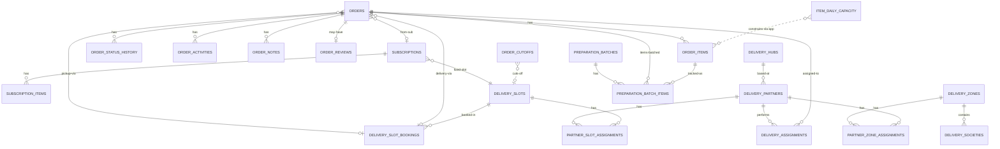

# `orders-service` Schema

> Owns: orders + items + status history + customer-facing activity timeline +
> reviews, subscriptions (pause/resume + day-of-week), full delivery domain,
> preparation batches, slot capacity + cutoffs.
>
> Conventions: see [`../07-database-design.md`](../07-database-design.md) §3.
> **Column names are PascalCase, double-quoted in SQL.**
>
> Biggest schema — 22 tables.

**Database name:** `orders_db`

**Anchors:**
- Orders, items, status history: `D:\Batterlicious\batterlicious-service\src\database\typeorm\models\order.entity.ts` + `order.items.entity.ts` + `order.histories.entity.ts`
- Order activity: [`06`](../06-extended-patterns.md) §20
- Subscriptions: [`06`](../06-extended-patterns.md) §1
- Preparation batches: [`06`](../06-extended-patterns.md) §3
- Slot capacity + cutoffs: [`06`](../06-extended-patterns.md) §4
- Full delivery domain: [`06`](../06-extended-patterns.md) §2

---

## Tables overview

| #  | Table                          | Purpose                                                                                  |
|----|--------------------------------|------------------------------------------------------------------------------------------|
| 1  | `orders`                       | Aggregate root.                                                                            |
| 2  | `order_items`                  | Line items.                                                                                |
| 3  | `order_status_history`         | Admin-facing audit of every status transition.                                            |
| 4  | `order_activities`             | Customer-facing timeline.                                                                 |
| 5  | `order_notes`                  | Delivery instructions, internal staff notes.                                              |
| 6  | `order_reviews`                | Post-delivery rating + feedback.                                                          |
| 7  | `subscriptions`                | Subscription instance.                                                                    |
| 8  | `subscription_items`           | Per-item lines within a subscription.                                                      |
| 9  | `item_daily_capacity`          | Per-item per-day cap.                                                                      |
| 10 | `order_cutoffs`                | Per-slot cutoff time.                                                                      |
| 11 | `preparation_batches`          | Laundry wash-cycle / dry-clean batch.                                                     |
| 12 | `preparation_batch_items`      | Order × item rows within a batch.                                                          |
| 13 | `delivery_zones`               | Geographic region.                                                                        |
| 14 | `delivery_societies`           | Apartment complexes / residential clusters in a zone.                                     |
| 15 | `delivery_hubs`                | Operational distribution centres.                                                         |
| 16 | `delivery_partners`            | Delivery agents.                                                                          |
| 17 | `delivery_slots`               | Reusable time windows with `"MaxOrders"` capacity.                                         |
| 18 | `delivery_slot_bookings`       | Order × slot × date — the actual booking row.                                              |
| 19 | `delivery_charge_rates`        | Distance-bracket rate table.                                                              |
| 20 | `partner_zone_assignments`     | Which zones each partner covers.                                                          |
| 21 | `partner_slot_assignments`     | Which slots each partner works.                                                           |
| 22 | `delivery_assignments`         | Order × delivery_partner × slot × direction (pickup / delivery).                          |

Plus shared infra: `event_store`, `idempotency_keys`.

---

## 1. `orders`

The aggregate root.

| Field                       | Type                  | Constraints                                                  | Notes                                                          |
|-----------------------------|-----------------------|--------------------------------------------------------------|----------------------------------------------------------------|
| `id`                        | UUID                  | PK                                                           |                                                                |
| `TenantId`                  | UUID                  | NOT NULL                                                     |                                                                |
| `BranchId`                  | UUID                  | NOT NULL                                                     |                                                                |
| `OrderNo`                   | VARCHAR(32)           | NOT NULL                                                     | "PTK-2026-05-00042"                                              |
| `CustomerId`                | UUID                  | NOT NULL                                                     | Cross-service                                                   |
| `VendorId`                  | UUID                  |                                                              | NULL for retail; same as customer_id when billed-to vendor      |
| `BilledTo`                  | order_billed_to_enum  | NOT NULL                                                     | `Customer` or `Vendor`                                          |
| `Channel`                   | order_channel_enum    | NOT NULL                                                     | `WalkIn` / `HomePickup` / `DropAtShop`                           |
| `DeliveryType`              | delivery_type_enum    | NOT NULL                                                     | `HomeDelivery` / `CustomerPickup`                                |
| `Status`                    | order_status_enum     | NOT NULL DEFAULT 'Booked'                                    |                                                                |
| `IsExpress`                 | BOOLEAN               | NOT NULL DEFAULT FALSE                                       | +25% surcharge                                                  |
| `AddressId`                 | UUID                  |                                                              | Cross-service ref                                               |
| `PickupSlotBookingId`       | UUID                  |                                                              | FK → delivery_slot_bookings(id)                                 |
| `DeliverySlotBookingId`     | UUID                  |                                                              | FK → delivery_slot_bookings(id)                                 |
| `SubscriptionId`            | UUID                  |                                                              | FK → subscriptions(id) for subscription-driven orders           |
| `AppliedPlanId`             | UUID                  |                                                              | Snapshot                                                        |
| `AppliedDiscountId`         | UUID                  |                                                              | Cross-service                                                   |
| `DiscountAmount`            | NUMERIC(15,2)         | NOT NULL DEFAULT 0                                           |                                                                |
| `Subtotal`                  | NUMERIC(15,2)         | NOT NULL DEFAULT 0                                           |                                                                |
| `DeliveryCharge`            | NUMERIC(15,2)         | NOT NULL DEFAULT 0                                           |                                                                |
| `ExpressSurcharge`          | NUMERIC(15,2)         | NOT NULL DEFAULT 0                                           |                                                                |
| `TaxAmount`                 | NUMERIC(15,2)         | NOT NULL DEFAULT 0                                           |                                                                |
| `TotalAmount`               | NUMERIC(15,2)         | NOT NULL DEFAULT 0                                           |                                                                |
| `Currency`                  | CHAR(3)               | NOT NULL DEFAULT 'INR'                                       |                                                                |
| `PromisedPickupAt`          | TIMESTAMPTZ           |                                                              |                                                                |
| `PromisedReadyAt`           | TIMESTAMPTZ           |                                                              |                                                                |
| `PromisedDeliveryAt`        | TIMESTAMPTZ           |                                                              |                                                                |
| `ActualPickedUpAt`          | TIMESTAMPTZ           |                                                              |                                                                |
| `ActualReadyAt`             | TIMESTAMPTZ           |                                                              |                                                                |
| `ActualDeliveredAt`         | TIMESTAMPTZ           |                                                              |                                                                |
| `CancelledAt`               | TIMESTAMPTZ           |                                                              |                                                                |
| `CancelledReason`           | TEXT                  |                                                              |                                                                |
| `OnHoldReason`              | TEXT                  |                                                              |                                                                |
| `TotalItems`                | INT                   | NOT NULL DEFAULT 0                                           |                                                                |
| `Metadata`                  | JSONB                 |                                                              |                                                                |
| `CreatedAt`, `UpdatedAt`, `DeletedAt` | …      |                                                              |                                                                |
| `CreatedBy`, `UpdatedBy`    | UUID                  |                                                              |                                                                |

```sql
CREATE TYPE order_status_enum AS ENUM (
  'Booked','PickedUp','Received','InProcess','Ready',
  'OutForDelivery','Delivered','Closed',
  'Cancelled','OnHold'
);
CREATE TYPE order_billed_to_enum AS ENUM ('Customer','Vendor');
CREATE TYPE order_channel_enum   AS ENUM ('WalkIn','HomePickup','DropAtShop');
CREATE TYPE delivery_type_enum   AS ENUM ('HomeDelivery','CustomerPickup');

CREATE TABLE orders (
  id                          UUID PRIMARY KEY DEFAULT gen_random_uuid(),
  "TenantId"                  UUID NOT NULL,
  "BranchId"                  UUID NOT NULL,
  "OrderNo"                   VARCHAR(32)  NOT NULL,
  "CustomerId"                UUID NOT NULL,
  "VendorId"                  UUID,
  "BilledTo"                  order_billed_to_enum NOT NULL,
  "Channel"                   order_channel_enum   NOT NULL,
  "DeliveryType"              delivery_type_enum   NOT NULL,
  "Status"                    order_status_enum    NOT NULL DEFAULT 'Booked',
  "IsExpress"                 BOOLEAN     NOT NULL DEFAULT FALSE,
  "AddressId"                 UUID,
  "PickupSlotBookingId"       UUID,
  "DeliverySlotBookingId"     UUID,
  "SubscriptionId"            UUID,
  "AppliedPlanId"             UUID,
  "AppliedDiscountId"         UUID,
  "DiscountAmount"            NUMERIC(15,2) NOT NULL DEFAULT 0,
  "Subtotal"                  NUMERIC(15,2) NOT NULL DEFAULT 0,
  "DeliveryCharge"            NUMERIC(15,2) NOT NULL DEFAULT 0,
  "ExpressSurcharge"          NUMERIC(15,2) NOT NULL DEFAULT 0,
  "TaxAmount"                 NUMERIC(15,2) NOT NULL DEFAULT 0,
  "TotalAmount"               NUMERIC(15,2) NOT NULL DEFAULT 0,
  "Currency"                  CHAR(3)       NOT NULL DEFAULT 'INR',
  "PromisedPickupAt"          TIMESTAMPTZ,
  "PromisedReadyAt"           TIMESTAMPTZ,
  "PromisedDeliveryAt"        TIMESTAMPTZ,
  "ActualPickedUpAt"          TIMESTAMPTZ,
  "ActualReadyAt"             TIMESTAMPTZ,
  "ActualDeliveredAt"         TIMESTAMPTZ,
  "CancelledAt"               TIMESTAMPTZ,
  "CancelledReason"           TEXT,
  "OnHoldReason"              TEXT,
  "TotalItems"                INT          NOT NULL DEFAULT 0,
  "Metadata"                  JSONB,
  "CreatedAt"                 TIMESTAMPTZ  NOT NULL DEFAULT now(),
  "UpdatedAt"                 TIMESTAMPTZ  NOT NULL DEFAULT now(),
  "DeletedAt"                 TIMESTAMPTZ,
  "CreatedBy"                 UUID,
  "UpdatedBy"                 UUID,
  CONSTRAINT ux_orders_tenant_no UNIQUE ("TenantId", "OrderNo")
);
CREATE INDEX ix_orders_tenant_branch_status ON orders ("TenantId", "BranchId", "Status") WHERE "DeletedAt" IS NULL;
CREATE INDEX ix_orders_customer ON orders ("CustomerId", "CreatedAt" DESC) WHERE "DeletedAt" IS NULL;
CREATE INDEX ix_orders_vendor   ON orders ("VendorId", "CreatedAt" DESC) WHERE "VendorId" IS NOT NULL AND "DeletedAt" IS NULL;
CREATE INDEX ix_orders_subscription ON orders ("SubscriptionId") WHERE "SubscriptionId" IS NOT NULL;
CREATE INDEX ix_orders_active
  ON orders ("CreatedAt" DESC)
  WHERE "DeletedAt" IS NULL AND "Status" NOT IN ('Closed','Cancelled');
CREATE INDEX ix_orders_promised_pickup ON orders ("PromisedPickupAt") WHERE "DeletedAt" IS NULL AND "Status" IN ('Booked');
CREATE INDEX ix_orders_promised_delivery ON orders ("PromisedDeliveryAt") WHERE "DeletedAt" IS NULL AND "Status" IN ('Ready','OutForDelivery');
```

**Status transitions** enforced in code via `canTransitionOrder(from, to)`:
```
Booked → PickedUp | Received | Cancelled | OnHold
PickedUp → Received | Cancelled | OnHold
Received → InProcess | Cancelled | OnHold
InProcess → Ready | OnHold
Ready → OutForDelivery (if HomeDelivery) | Delivered (if CustomerPickup) | OnHold
OutForDelivery → Delivered | Ready (failed delivery)
Delivered → Closed
OnHold → (any non-Cancelled state it was on hold from)
Cancelled, Closed → (terminal)
```

---

## 2. `order_items`

| Field              | Type            | Constraints                                       | Notes                                          |
|--------------------|-----------------|---------------------------------------------------|------------------------------------------------|
| `id`               | UUID            | PK                                                |                                                |
| `OrderId`          | UUID            | NOT NULL, FK → orders(id) ON DELETE CASCADE       |                                                |
| `ItemId`           | UUID            | NOT NULL                                          | Cross-service                                  |
| `ItemCode`         | VARCHAR(64)     | NOT NULL                                          | Snapshot                                       |
| `ItemName`         | VARCHAR(128)    | NOT NULL                                          | Snapshot                                       |
| `VariantId`        | UUID            |                                                   | Cross-service                                  |
| `VariantName`      | VARCHAR(128)    |                                                   | Snapshot                                       |
| `ServiceTypeCode`  | VARCHAR(32)     | NOT NULL                                          |                                                |
| `RateCardId`       | UUID            |                                                   | Snapshot id                                    |
| `UnitRate`         | NUMERIC(15,2)   | NOT NULL                                          | Snapshot                                       |
| `Quantity`         | NUMERIC(10,2)   | NOT NULL                                          | Pieces or kg                                   |
| `Uom`              | VARCHAR(16)     | NOT NULL                                          |                                                |
| `LineDiscount`     | NUMERIC(15,2)   | NOT NULL DEFAULT 0                                |                                                |
| `TaxCodeId`        | UUID            |                                                   | Cross-service                                  |
| `TaxAmount`        | NUMERIC(15,2)   | NOT NULL DEFAULT 0                                |                                                |
| `LineTotal`        | NUMERIC(15,2)   | NOT NULL                                          |                                                |
| `Note`             | VARCHAR(255)    |                                                   | "Red stain on collar"                          |
| `PhotoUrl`         | VARCHAR(512)    |                                                   | Intake photo                                    |
| `CreatedAt`, `UpdatedAt` | …     |                                                  |                                                |

```sql
CREATE TABLE order_items (
  id                  UUID PRIMARY KEY DEFAULT gen_random_uuid(),
  "OrderId"           UUID NOT NULL REFERENCES orders(id) ON DELETE CASCADE,
  "ItemId"            UUID NOT NULL,
  "ItemCode"          VARCHAR(64)  NOT NULL,
  "ItemName"          VARCHAR(128) NOT NULL,
  "VariantId"         UUID,
  "VariantName"       VARCHAR(128),
  "ServiceTypeCode"   VARCHAR(32)  NOT NULL,
  "RateCardId"        UUID,
  "UnitRate"          NUMERIC(15,2) NOT NULL CHECK ("UnitRate" >= 0),
  "Quantity"          NUMERIC(10,2) NOT NULL CHECK ("Quantity" > 0),
  "Uom"               VARCHAR(16)   NOT NULL,
  "LineDiscount"      NUMERIC(15,2) NOT NULL DEFAULT 0,
  "TaxCodeId"         UUID,
  "TaxAmount"         NUMERIC(15,2) NOT NULL DEFAULT 0,
  "LineTotal"         NUMERIC(15,2) NOT NULL,
  "Note"              VARCHAR(255),
  "PhotoUrl"          VARCHAR(512),
  "CreatedAt"         TIMESTAMPTZ   NOT NULL DEFAULT now(),
  "UpdatedAt"         TIMESTAMPTZ   NOT NULL DEFAULT now()
);
CREATE INDEX ix_order_items_order ON order_items ("OrderId");
CREATE INDEX ix_order_items_item  ON order_items ("ItemId");
```

---

## 3. `order_status_history`

| Field             | Type              | Constraints                                       | Notes                                          |
|-------------------|-------------------|---------------------------------------------------|------------------------------------------------|
| `id`              | UUID              | PK                                                |                                                |
| `OrderId`         | UUID              | NOT NULL, FK → orders(id) ON DELETE CASCADE       |                                                |
| `FromStatus`      | order_status_enum |                                                   | NULL on initial Booked                          |
| `ToStatus`        | order_status_enum | NOT NULL                                          |                                                |
| `ChangedBy`       | UUID              |                                                   | UserId; NULL for system transitions             |
| `ChangedByName`   | VARCHAR(255)      |                                                   | Denormalised                                   |
| `Reason`          | TEXT              |                                                   |                                                |
| `Metadata`        | JSONB             |                                                   |                                                |
| `CreatedAt`       | TIMESTAMPTZ       | NOT NULL DEFAULT now()                            |                                                |

```sql
CREATE TABLE order_status_history (
  id                UUID PRIMARY KEY DEFAULT gen_random_uuid(),
  "OrderId"         UUID NOT NULL REFERENCES orders(id) ON DELETE CASCADE,
  "FromStatus"      order_status_enum,
  "ToStatus"        order_status_enum NOT NULL,
  "ChangedBy"       UUID,
  "ChangedByName"   VARCHAR(255),
  "Reason"          TEXT,
  "Metadata"        JSONB,
  "CreatedAt"       TIMESTAMPTZ NOT NULL DEFAULT now()
);
CREATE INDEX ix_order_status_history_order ON order_status_history ("OrderId", "CreatedAt" DESC);
```

---

## 4. `order_activities`

Customer-facing timeline. See [`06-extended-patterns.md`](../06-extended-patterns.md) §20.

| Field                  | Type             | Constraints                                       | Notes                                                |
|------------------------|------------------|---------------------------------------------------|------------------------------------------------------|
| `id`                   | UUID             | PK                                                |                                                      |
| `OrderId`              | UUID             | NOT NULL, FK → orders(id) ON DELETE CASCADE       |                                                      |
| `ActorType`            | actor_type_enum  | NOT NULL                                          | `System`, `Staff`, `Customer`                        |
| `ActorId`              | UUID             |                                                   |                                                      |
| `ActorName`            | VARCHAR(255)     |                                                   |                                                      |
| `ActivityType`         | VARCHAR(64)      | NOT NULL                                          | `StatusChanged`, `PaymentReceived`, …                 |
| `Title`                | VARCHAR(255)     | NOT NULL                                          | "Order is ready"                                     |
| `TitleMr`              | VARCHAR(255)     |                                                   | "ऑर्डर तयार आहे"                                       |
| `Body`                 | TEXT             |                                                   |                                                      |
| `Icon`                 | VARCHAR(64)      |                                                   | Iconify name                                          |
| `Data`                 | JSONB            |                                                   |                                                      |
| `VisibleToCustomer`    | BOOLEAN          | NOT NULL DEFAULT TRUE                             |                                                      |
| `CreatedAt`            | TIMESTAMPTZ      | NOT NULL DEFAULT now()                            |                                                      |

```sql
CREATE TYPE actor_type_enum AS ENUM ('System','Staff','Customer');

CREATE TABLE order_activities (
  id                      UUID PRIMARY KEY DEFAULT gen_random_uuid(),
  "OrderId"               UUID NOT NULL REFERENCES orders(id) ON DELETE CASCADE,
  "ActorType"             actor_type_enum NOT NULL,
  "ActorId"               UUID,
  "ActorName"             VARCHAR(255),
  "ActivityType"          VARCHAR(64)  NOT NULL,
  "Title"                 VARCHAR(255) NOT NULL,
  "TitleMr"               VARCHAR(255),
  "Body"                  TEXT,
  "Icon"                  VARCHAR(64),
  "Data"                  JSONB,
  "VisibleToCustomer"     BOOLEAN     NOT NULL DEFAULT TRUE,
  "CreatedAt"             TIMESTAMPTZ NOT NULL DEFAULT now()
);
CREATE INDEX ix_order_activities_order ON order_activities ("OrderId", "CreatedAt" DESC);
```

---

## 5. `order_notes`

| Field            | Type                  | Constraints                                       | Notes                                          |
|------------------|-----------------------|---------------------------------------------------|------------------------------------------------|
| `id`             | UUID                  | PK                                                |                                                |
| `OrderId`        | UUID                  | NOT NULL, FK → orders(id) ON DELETE CASCADE       |                                                |
| `NoteType`       | order_note_type_enum  | NOT NULL                                          | `DeliveryInstruction`, `StainAlert`, `Internal`, `CustomerComplaint` |
| `Body`           | TEXT                  | NOT NULL                                          |                                                |
| `IsInternal`     | BOOLEAN               | NOT NULL DEFAULT FALSE                            | False = visible to customer                    |
| `CreatedBy`      | UUID                  |                                                   |                                                |
| `CreatedByName`  | VARCHAR(255)          |                                                   |                                                |
| `CreatedAt`      | TIMESTAMPTZ           | NOT NULL DEFAULT now()                            |                                                |

```sql
CREATE TYPE order_note_type_enum AS ENUM ('DeliveryInstruction','StainAlert','Internal','CustomerComplaint');

CREATE TABLE order_notes (
  id                UUID PRIMARY KEY DEFAULT gen_random_uuid(),
  "OrderId"         UUID NOT NULL REFERENCES orders(id) ON DELETE CASCADE,
  "NoteType"        order_note_type_enum NOT NULL,
  "Body"            TEXT NOT NULL,
  "IsInternal"      BOOLEAN     NOT NULL DEFAULT FALSE,
  "CreatedBy"       UUID,
  "CreatedByName"   VARCHAR(255),
  "CreatedAt"       TIMESTAMPTZ NOT NULL DEFAULT now()
);
CREATE INDEX ix_order_notes_order ON order_notes ("OrderId");
```

---

## 6. `order_reviews`

| Field           | Type            | Constraints                                       | Notes                                          |
|-----------------|-----------------|---------------------------------------------------|------------------------------------------------|
| `id`            | UUID            | PK                                                |                                                |
| `OrderId`       | UUID            | NOT NULL UNIQUE, FK → orders(id)                  | One review per order                            |
| `CustomerId`    | UUID            | NOT NULL                                          |                                                |
| `Rating`        | INT             | NOT NULL                                          | 1-5                                            |
| `Comment`       | TEXT            |                                                   |                                                |
| `Photos`        | TEXT[]          |                                                   | Optional S3 URLs                                |
| `Dimensions`    | JSONB           |                                                   | `{quality:5, timeliness:4, courtesy:5}`        |
| `Reply`         | TEXT            |                                                   | Admin reply                                    |
| `RepliedAt`     | TIMESTAMPTZ     |                                                   |                                                |
| `RepliedBy`     | UUID            |                                                   |                                                |
| `CreatedAt`, `UpdatedAt` | …  |                                                  |                                                |

```sql
CREATE TABLE order_reviews (
  id              UUID PRIMARY KEY DEFAULT gen_random_uuid(),
  "OrderId"       UUID NOT NULL UNIQUE REFERENCES orders(id),
  "CustomerId"    UUID NOT NULL,
  "Rating"        INT  NOT NULL CHECK ("Rating" BETWEEN 1 AND 5),
  "Comment"       TEXT,
  "Photos"        TEXT[],
  "Dimensions"    JSONB,
  "Reply"         TEXT,
  "RepliedAt"     TIMESTAMPTZ,
  "RepliedBy"     UUID,
  "CreatedAt"     TIMESTAMPTZ NOT NULL DEFAULT now(),
  "UpdatedAt"     TIMESTAMPTZ NOT NULL DEFAULT now()
);
CREATE INDEX ix_order_reviews_customer ON order_reviews ("CustomerId", "CreatedAt" DESC);
CREATE INDEX ix_order_reviews_rating ON order_reviews ("Rating");
```

---

## 7. `subscriptions`

Source: `D:\Batterlicious\batterlicious-service\src\database\typeorm\models\subscription.entity.ts` — full pause/resume + day-of-week + split-payment.

| Field                       | Type                       | Constraints                                       | Notes                                                       |
|-----------------------------|----------------------------|---------------------------------------------------|-------------------------------------------------------------|
| `id`                        | UUID                       | PK                                                |                                                             |
| `TenantId`                  | UUID                       | NOT NULL                                          |                                                             |
| `BranchId`                  | UUID                       | NOT NULL                                          |                                                             |
| `CustomerId`                | UUID                       | NOT NULL                                          | Cross-service                                                |
| `PlanId`                    | UUID                       | NOT NULL                                          | Cross-service                                                |
| `PlanCodeSnapshot`          | VARCHAR(64)                | NOT NULL                                          | Snapshot                                                     |
| `Status`                    | subscription_status_enum   | NOT NULL DEFAULT 'Pending'                        |                                                             |
| `StartDate`                 | DATE                       | NOT NULL                                          |                                                             |
| `EndDate`                   | DATE                       | NOT NULL                                          |                                                             |
| `SelectedDays`              | INT[]                      |                                                   | `{1,3,5}` = Mon/Wed/Fri (ISO)                                |
| `FixedSlotId`               | UUID                       |                                                   | FK → delivery_slots(id)                                      |
| `PickupAddressId`           | UUID                       |                                                   | Cross-service                                                |
| `TotalAmount`               | NUMERIC(15,2)              | NOT NULL                                          |                                                             |
| `WalletPaidAmount`          | NUMERIC(15,2)              | NOT NULL DEFAULT 0                                |                                                             |
| `GatewayPaidAmount`         | NUMERIC(15,2)              | NOT NULL DEFAULT 0                                |                                                             |
| `PaymentStatus`             | sub_payment_status_enum    | NOT NULL DEFAULT 'Pending'                        |                                                             |
| `NextInvoiceDate`           | DATE                       |                                                   |                                                             |
| `PausedAt`                  | TIMESTAMPTZ                |                                                   |                                                             |
| `PausedReason`              | TEXT                       |                                                   |                                                             |
| `ResumedAt`                 | TIMESTAMPTZ                |                                                   |                                                             |
| `TotalPausedDays`           | INT                        | NOT NULL DEFAULT 0                                |                                                             |
| `CancelledAt`               | TIMESTAMPTZ                |                                                   |                                                             |
| `CancelledReason`           | TEXT                       |                                                   |                                                             |
| `FreePickupsRemaining`      | INT                        | NOT NULL DEFAULT 0                                |                                                             |
| `AutoRenew`                 | BOOLEAN                    | NOT NULL DEFAULT TRUE                             |                                                             |
| `RazorpaySubscriptionId`    | VARCHAR(64)                |                                                   |                                                             |
| `CreatedAt`, `UpdatedAt`, `DeletedAt` | …          |                                                  |                                                             |
| `CreatedBy`, `UpdatedBy`    | UUID                       |                                                  |                                                             |

```sql
CREATE TYPE subscription_status_enum AS ENUM ('Pending','Active','Paused','Cancelled','Expired');
CREATE TYPE sub_payment_status_enum AS ENUM ('Pending','Completed','Failed');

CREATE TABLE subscriptions (
  id                         UUID PRIMARY KEY DEFAULT gen_random_uuid(),
  "TenantId"                 UUID NOT NULL,
  "BranchId"                 UUID NOT NULL,
  "CustomerId"               UUID NOT NULL,
  "PlanId"                   UUID NOT NULL,
  "PlanCodeSnapshot"         VARCHAR(64) NOT NULL,
  "Status"                   subscription_status_enum NOT NULL DEFAULT 'Pending',
  "StartDate"                DATE NOT NULL,
  "EndDate"                  DATE NOT NULL,
  "SelectedDays"             INT[],
  "FixedSlotId"              UUID,
  "PickupAddressId"          UUID,
  "TotalAmount"              NUMERIC(15,2) NOT NULL CHECK ("TotalAmount" >= 0),
  "WalletPaidAmount"         NUMERIC(15,2) NOT NULL DEFAULT 0,
  "GatewayPaidAmount"        NUMERIC(15,2) NOT NULL DEFAULT 0,
  "PaymentStatus"            sub_payment_status_enum NOT NULL DEFAULT 'Pending',
  "NextInvoiceDate"          DATE,
  "PausedAt"                 TIMESTAMPTZ,
  "PausedReason"             TEXT,
  "ResumedAt"                TIMESTAMPTZ,
  "TotalPausedDays"          INT NOT NULL DEFAULT 0,
  "CancelledAt"              TIMESTAMPTZ,
  "CancelledReason"          TEXT,
  "FreePickupsRemaining"     INT NOT NULL DEFAULT 0,
  "AutoRenew"                BOOLEAN NOT NULL DEFAULT TRUE,
  "RazorpaySubscriptionId"   VARCHAR(64),
  "CreatedAt"                TIMESTAMPTZ NOT NULL DEFAULT now(),
  "UpdatedAt"                TIMESTAMPTZ NOT NULL DEFAULT now(),
  "DeletedAt"                TIMESTAMPTZ,
  "CreatedBy"                UUID,
  "UpdatedBy"                UUID,
  CONSTRAINT ck_subscriptions_split CHECK ("WalletPaidAmount" + "GatewayPaidAmount" <= "TotalAmount")
);
CREATE INDEX ix_subscriptions_customer ON subscriptions ("CustomerId") WHERE "DeletedAt" IS NULL;
CREATE INDEX ix_subscriptions_active ON subscriptions ("NextInvoiceDate")
  WHERE "Status" = 'Active' AND "DeletedAt" IS NULL;
CREATE INDEX ix_subscriptions_status ON subscriptions ("TenantId", "Status") WHERE "DeletedAt" IS NULL;
```

---

## 8. `subscription_items`

| Field                 | Type            | Constraints                                                  | Notes                                          |
|-----------------------|-----------------|--------------------------------------------------------------|------------------------------------------------|
| `id`                  | UUID            | PK                                                           |                                                |
| `SubscriptionId`      | UUID            | NOT NULL, FK → subscriptions(id) ON DELETE CASCADE           |                                                |
| `ItemId`              | UUID            | NOT NULL                                                     | Cross-service                                   |
| `ItemCode`            | VARCHAR(64)     | NOT NULL                                                     | Snapshot                                       |
| `VariantId`           | UUID            |                                                              |                                                |
| `ServiceTypeCode`     | VARCHAR(32)     | NOT NULL                                                     |                                                |
| `QuantityPerPickup`   | NUMERIC(10,2)   | NOT NULL                                                     | e.g. 5 shirts per pickup                       |
| `PricePerPickup`      | NUMERIC(15,2)   | NOT NULL                                                     | Snapshot                                       |
| `Status`              | VARCHAR(32)     | NOT NULL DEFAULT 'Active'                                    |                                                |
| `CreatedAt`, `UpdatedAt` | …     |                                                              |                                                |

```sql
CREATE TABLE subscription_items (
  id                      UUID PRIMARY KEY DEFAULT gen_random_uuid(),
  "SubscriptionId"        UUID NOT NULL REFERENCES subscriptions(id) ON DELETE CASCADE,
  "ItemId"                UUID NOT NULL,
  "ItemCode"              VARCHAR(64)  NOT NULL,
  "VariantId"             UUID,
  "ServiceTypeCode"       VARCHAR(32)  NOT NULL,
  "QuantityPerPickup"     NUMERIC(10,2) NOT NULL CHECK ("QuantityPerPickup" > 0),
  "PricePerPickup"        NUMERIC(15,2) NOT NULL,
  "Status"                VARCHAR(32)  NOT NULL DEFAULT 'Active',
  "CreatedAt"             TIMESTAMPTZ  NOT NULL DEFAULT now(),
  "UpdatedAt"             TIMESTAMPTZ  NOT NULL DEFAULT now()
);
CREATE INDEX ix_subscription_items_sub ON subscription_items ("SubscriptionId");
```

---

## 9. `item_daily_capacity`

| Field              | Type            | Constraints                                                       | Notes                                          |
|--------------------|-----------------|-------------------------------------------------------------------|------------------------------------------------|
| `id`               | UUID            | PK                                                                |                                                |
| `TenantId`         | UUID            | NOT NULL                                                          |                                                |
| `BranchId`         | UUID            | NOT NULL                                                          |                                                |
| `ItemId`           | UUID            | NOT NULL                                                          | Cross-service                                   |
| `ServiceTypeCode`  | VARCHAR(32)     | NOT NULL                                                          |                                                |
| `CapacityDate`     | DATE            | NOT NULL                                                          |                                                |
| `MaxQuantity`      | NUMERIC(10,2)   | NOT NULL                                                          |                                                |
| `BookedQuantity`   | NUMERIC(10,2)   | NOT NULL DEFAULT 0                                                |                                                |
| `Uom`              | VARCHAR(16)     | NOT NULL                                                          |                                                |
| `IsBlocked`        | BOOLEAN         | NOT NULL DEFAULT FALSE                                            |                                                |
| `BlockedReason`    | TEXT            |                                                                   |                                                |
| `CreatedAt`, `UpdatedAt` | …     |                                                                  |                                                |

```sql
CREATE TABLE item_daily_capacity (
  id                  UUID PRIMARY KEY DEFAULT gen_random_uuid(),
  "TenantId"          UUID NOT NULL,
  "BranchId"          UUID NOT NULL,
  "ItemId"            UUID NOT NULL,
  "ServiceTypeCode"   VARCHAR(32)  NOT NULL,
  "CapacityDate"      DATE         NOT NULL,
  "MaxQuantity"       NUMERIC(10,2) NOT NULL CHECK ("MaxQuantity" >= 0),
  "BookedQuantity"    NUMERIC(10,2) NOT NULL DEFAULT 0,
  "Uom"               VARCHAR(16)  NOT NULL,
  "IsBlocked"         BOOLEAN      NOT NULL DEFAULT FALSE,
  "BlockedReason"     TEXT,
  "CreatedAt"         TIMESTAMPTZ  NOT NULL DEFAULT now(),
  "UpdatedAt"         TIMESTAMPTZ  NOT NULL DEFAULT now(),
  CONSTRAINT ux_item_daily_capacity UNIQUE ("TenantId", "BranchId", "ItemId", "ServiceTypeCode", "CapacityDate")
);
CREATE INDEX ix_item_daily_capacity_date ON item_daily_capacity ("CapacityDate");
```

Booking increments `"BookedQuantity"` atomically:
```sql
UPDATE item_daily_capacity
   SET "BookedQuantity" = "BookedQuantity" + $qty
 WHERE id = $id
   AND "BookedQuantity" + $qty <= "MaxQuantity"
   AND "IsBlocked" = FALSE
RETURNING id;
```

---

## 10. `order_cutoffs`

| Field            | Type            | Constraints                                       | Notes                                          |
|------------------|-----------------|---------------------------------------------------|------------------------------------------------|
| `id`             | UUID            | PK                                                |                                                |
| `TenantId`       | UUID            | NOT NULL                                          |                                                |
| `BranchId`       | UUID            | NOT NULL                                          |                                                |
| `SlotId`         | UUID            | NOT NULL, FK → delivery_slots(id)                 |                                                |
| `CutoffDate`     | DATE            | NOT NULL                                          |                                                |
| `CutoffTime`     | TIME            | NOT NULL                                          |                                                |
| `IsBlocked`      | BOOLEAN         | NOT NULL DEFAULT FALSE                            |                                                |
| `BlockedReason`  | TEXT            |                                                   |                                                |
| `CreatedAt`, `UpdatedAt` | …     |                                                  |                                                |

```sql
CREATE TABLE order_cutoffs (
  id              UUID PRIMARY KEY DEFAULT gen_random_uuid(),
  "TenantId"      UUID NOT NULL,
  "BranchId"      UUID NOT NULL,
  "SlotId"        UUID NOT NULL,
  "CutoffDate"    DATE NOT NULL,
  "CutoffTime"    TIME NOT NULL,
  "IsBlocked"     BOOLEAN NOT NULL DEFAULT FALSE,
  "BlockedReason" TEXT,
  "CreatedAt"     TIMESTAMPTZ NOT NULL DEFAULT now(),
  "UpdatedAt"     TIMESTAMPTZ NOT NULL DEFAULT now(),
  CONSTRAINT ux_order_cutoffs UNIQUE ("TenantId", "BranchId", "SlotId", "CutoffDate")
);
```

---

## 11. `preparation_batches`

| Field                | Type             | Constraints                                       | Notes                                                |
|----------------------|------------------|---------------------------------------------------|------------------------------------------------------|
| `id`                 | UUID             | PK                                                |                                                      |
| `TenantId`           | UUID             | NOT NULL                                          |                                                      |
| `BranchId`           | UUID             | NOT NULL                                          |                                                      |
| `BatchNo`            | VARCHAR(32)      | NOT NULL                                          | "WASH-2026-05-14-001"                                 |
| `ServiceTypeCode`    | VARCHAR(32)      | NOT NULL                                          | DRY_CLEAN / LAUNDRY                                    |
| `Stage`              | batch_stage_enum | NOT NULL DEFAULT 'Pending'                        | See enum below                                        |
| `TotalItems`         | INT              | NOT NULL DEFAULT 0                                |                                                      |
| `PreparedItems`      | INT              | NOT NULL DEFAULT 0                                |                                                      |
| `PendingItems`       | INT              | NOT NULL DEFAULT 0                                |                                                      |
| `StartedAt`          | TIMESTAMPTZ      |                                                   |                                                      |
| `CompletedAt`        | TIMESTAMPTZ      |                                                   |                                                      |
| `Supervisor`         | UUID             |                                                   | UserId of operator                                    |
| `Machine`            | VARCHAR(64)      |                                                   |                                                      |
| `Notes`              | TEXT             |                                                   |                                                      |
| `CreatedAt`, `UpdatedAt`, `DeletedAt` | …  |                                                  |                                                      |

```sql
CREATE TYPE batch_stage_enum AS ENUM (
  'Pending','Sorting','Washing','Drying','Ironing','QualityCheck','ReadyForDelivery','Expired'
);

CREATE TABLE preparation_batches (
  id                    UUID PRIMARY KEY DEFAULT gen_random_uuid(),
  "TenantId"            UUID NOT NULL,
  "BranchId"            UUID NOT NULL,
  "BatchNo"             VARCHAR(32)  NOT NULL,
  "ServiceTypeCode"     VARCHAR(32)  NOT NULL,
  "Stage"               batch_stage_enum NOT NULL DEFAULT 'Pending',
  "TotalItems"          INT          NOT NULL DEFAULT 0,
  "PreparedItems"       INT          NOT NULL DEFAULT 0,
  "PendingItems"        INT          NOT NULL DEFAULT 0,
  "StartedAt"           TIMESTAMPTZ,
  "CompletedAt"         TIMESTAMPTZ,
  "Supervisor"          UUID,
  "Machine"             VARCHAR(64),
  "Notes"               TEXT,
  "CreatedAt"           TIMESTAMPTZ  NOT NULL DEFAULT now(),
  "UpdatedAt"           TIMESTAMPTZ  NOT NULL DEFAULT now(),
  "DeletedAt"           TIMESTAMPTZ,
  CONSTRAINT ux_prep_batches_tenant_no UNIQUE ("TenantId", "BatchNo")
);
CREATE INDEX ix_prep_batches_stage ON preparation_batches ("Stage") WHERE "DeletedAt" IS NULL;
```

---

## 12. `preparation_batch_items`

| Field                  | Type           | Constraints                                                       | Notes                                          |
|------------------------|----------------|-------------------------------------------------------------------|------------------------------------------------|
| `id`                   | UUID           | PK                                                                |                                                |
| `BatchId`              | UUID           | NOT NULL, FK → preparation_batches(id) ON DELETE CASCADE          |                                                |
| `OrderId`              | UUID           | NOT NULL, FK → orders(id)                                         |                                                |
| `OrderItemId`          | UUID           | NOT NULL, FK → order_items(id)                                    |                                                |
| `Status`               | VARCHAR(32)    | NOT NULL DEFAULT 'Pending'                                        | `Pending`/`InProcess`/`Done`/`Failed`            |
| `QualityCheckPassed`   | BOOLEAN        |                                                                   |                                                |
| `QcNotes`              | TEXT           |                                                                   |                                                |
| `ProcessedAt`          | TIMESTAMPTZ    |                                                                   |                                                |
| `CreatedAt`, `UpdatedAt` | …    |                                                                  |                                                |

```sql
CREATE TABLE preparation_batch_items (
  id                       UUID PRIMARY KEY DEFAULT gen_random_uuid(),
  "BatchId"                UUID NOT NULL REFERENCES preparation_batches(id) ON DELETE CASCADE,
  "OrderId"                UUID NOT NULL REFERENCES orders(id),
  "OrderItemId"            UUID NOT NULL REFERENCES order_items(id),
  "Status"                 VARCHAR(32) NOT NULL DEFAULT 'Pending',
  "QualityCheckPassed"     BOOLEAN,
  "QcNotes"                TEXT,
  "ProcessedAt"            TIMESTAMPTZ,
  "CreatedAt"              TIMESTAMPTZ NOT NULL DEFAULT now(),
  "UpdatedAt"              TIMESTAMPTZ NOT NULL DEFAULT now()
);
CREATE INDEX ix_prep_batch_items_batch ON preparation_batch_items ("BatchId");
CREATE INDEX ix_prep_batch_items_order ON preparation_batch_items ("OrderId");
```

---

## 13. `delivery_zones`

| Field        | Type            | Constraints                                       | Notes                                          |
|--------------|-----------------|---------------------------------------------------|------------------------------------------------|
| `id`         | UUID            | PK                                                |                                                |
| `TenantId`   | UUID            | NOT NULL                                          |                                                |
| `Code`       | VARCHAR(32)     | NOT NULL                                          | `MNG`, `PUNE_CITY`, `AUNDH`                    |
| `Name`       | VARCHAR(128)    | NOT NULL                                          |                                                |
| `Coverage`   | TEXT            |                                                   | Free text — pincodes / area names               |
| `Boundary`   | JSONB           |                                                   | Optional GeoJSON polygon                        |
| `IsActive`   | BOOLEAN         | NOT NULL DEFAULT TRUE                             |                                                |
| `CreatedAt`, `UpdatedAt`, `DeletedAt` | … |                                                  |                                                |

```sql
CREATE TABLE delivery_zones (
  id          UUID PRIMARY KEY DEFAULT gen_random_uuid(),
  "TenantId"  UUID NOT NULL,
  "Code"      VARCHAR(32)  NOT NULL,
  "Name"      VARCHAR(128) NOT NULL,
  "Coverage"  TEXT,
  "Boundary"  JSONB,
  "IsActive"  BOOLEAN     NOT NULL DEFAULT TRUE,
  "CreatedAt" TIMESTAMPTZ NOT NULL DEFAULT now(),
  "UpdatedAt" TIMESTAMPTZ NOT NULL DEFAULT now(),
  "DeletedAt" TIMESTAMPTZ,
  CONSTRAINT ux_delivery_zones_tenant_code UNIQUE ("TenantId", "Code")
);
```

---

## 14. `delivery_societies`

| Field             | Type            | Constraints                                                  | Notes                                          |
|-------------------|-----------------|--------------------------------------------------------------|------------------------------------------------|
| `id`              | UUID            | PK                                                           |                                                |
| `ZoneId`          | UUID            | NOT NULL, FK → delivery_zones(id)                            |                                                |
| `Name`            | VARCHAR(255)    | NOT NULL                                                     |                                                |
| `Pincode`         | VARCHAR(10)     |                                                              |                                                |
| `Latitude`        | DECIMAL(10,7)   |                                                              |                                                |
| `Longitude`       | DECIMAL(10,7)   |                                                              |                                                |
| `BuildingCount`   | INT             | NOT NULL DEFAULT 0                                           |                                                |
| `FlatCount`       | INT             | NOT NULL DEFAULT 0                                           |                                                |
| `IsActive`        | BOOLEAN         | NOT NULL DEFAULT TRUE                                        |                                                |
| `CreatedAt`, `UpdatedAt`, `DeletedAt` | …  |                                                             |                                                |

```sql
CREATE TABLE delivery_societies (
  id                UUID PRIMARY KEY DEFAULT gen_random_uuid(),
  "ZoneId"          UUID NOT NULL REFERENCES delivery_zones(id),
  "Name"            VARCHAR(255) NOT NULL,
  "Pincode"         VARCHAR(10),
  "Latitude"        DECIMAL(10,7),
  "Longitude"       DECIMAL(10,7),
  "BuildingCount"   INT NOT NULL DEFAULT 0,
  "FlatCount"       INT NOT NULL DEFAULT 0,
  "IsActive"        BOOLEAN     NOT NULL DEFAULT TRUE,
  "CreatedAt"       TIMESTAMPTZ NOT NULL DEFAULT now(),
  "UpdatedAt"       TIMESTAMPTZ NOT NULL DEFAULT now(),
  "DeletedAt"       TIMESTAMPTZ
);
CREATE INDEX ix_delivery_societies_zone ON delivery_societies ("ZoneId");
```

---

## 15. `delivery_hubs`

| Field          | Type            | Constraints                                       | Notes                                          |
|----------------|-----------------|---------------------------------------------------|------------------------------------------------|
| `id`           | UUID            | PK                                                |                                                |
| `TenantId`     | UUID            | NOT NULL                                          |                                                |
| `BranchId`     | UUID            | NOT NULL                                          |                                                |
| `Code`         | VARCHAR(32)     | NOT NULL                                          |                                                |
| `Name`         | VARCHAR(255)    | NOT NULL                                          | "Mukundnagar Hub"                              |
| `ManagerName`  | VARCHAR(255)    |                                                   |                                                |
| `ManagerPhone` | VARCHAR(20)     |                                                   |                                                |
| `AddressLine`  | VARCHAR(512)    |                                                   |                                                |
| `City`         | VARCHAR(128)    |                                                   |                                                |
| `State`        | VARCHAR(128)    |                                                   |                                                |
| `Pincode`      | VARCHAR(10)     |                                                   |                                                |
| `Latitude`     | DECIMAL(10,7)   |                                                   |                                                |
| `Longitude`    | DECIMAL(10,7)   |                                                   |                                                |
| `IsActive`     | BOOLEAN         | NOT NULL DEFAULT TRUE                             |                                                |
| `CreatedAt`, `UpdatedAt`, `DeletedAt` | … |                                                  |                                                |

```sql
CREATE TABLE delivery_hubs (
  id             UUID PRIMARY KEY DEFAULT gen_random_uuid(),
  "TenantId"     UUID NOT NULL,
  "BranchId"     UUID NOT NULL,
  "Code"         VARCHAR(32)  NOT NULL,
  "Name"         VARCHAR(255) NOT NULL,
  "ManagerName"  VARCHAR(255),
  "ManagerPhone" VARCHAR(20),
  "AddressLine"  VARCHAR(512),
  "City"         VARCHAR(128),
  "State"        VARCHAR(128),
  "Pincode"      VARCHAR(10),
  "Latitude"     DECIMAL(10,7),
  "Longitude"    DECIMAL(10,7),
  "IsActive"     BOOLEAN     NOT NULL DEFAULT TRUE,
  "CreatedAt"    TIMESTAMPTZ NOT NULL DEFAULT now(),
  "UpdatedAt"    TIMESTAMPTZ NOT NULL DEFAULT now(),
  "DeletedAt"    TIMESTAMPTZ,
  CONSTRAINT ux_delivery_hubs_tenant_code UNIQUE ("TenantId", "Code")
);
```

---

## 16. `delivery_partners`

| Field                   | Type            | Constraints                                       | Notes                                          |
|-------------------------|-----------------|---------------------------------------------------|------------------------------------------------|
| `id`                    | UUID            | PK                                                |                                                |
| `TenantId`              | UUID            | NOT NULL                                          |                                                |
| `BranchId`              | UUID            | NOT NULL                                          |                                                |
| `HubId`                 | UUID            |                                                   | FK → delivery_hubs(id)                          |
| `UserId`                | UUID            |                                                   | Cross-service — partner has a login             |
| `PartnerCode`           | VARCHAR(32)     | NOT NULL                                          | "DEL-001"                                       |
| `Name`                  | VARCHAR(255)    | NOT NULL                                          |                                                |
| `Phone`                 | VARCHAR(20)     | NOT NULL                                          |                                                |
| `VehicleType`           | VARCHAR(32)     |                                                   | `Bike`, `Cycle`, `Walking`                      |
| `VehicleNo`             | VARCHAR(32)     |                                                   |                                                |
| `LicenseNo`             | VARCHAR(32)     |                                                   |                                                |
| `LicenseDocumentUrl`    | VARCHAR(512)    |                                                   |                                                |
| `CoverageAreas`         | TEXT[]          |                                                   |                                                |
| `Rating`                | NUMERIC(3,2)    | NOT NULL DEFAULT 0                                |                                                |
| `ShiftPreference`       | VARCHAR(32)     |                                                   | `Morning`, `Evening`, `Full`                    |
| `MaxDeliveriesPerDay`   | INT             | NOT NULL DEFAULT 20                               |                                                |
| `TotalDeliveries`       | INT             | NOT NULL DEFAULT 0                                |                                                |
| `IsAvailable`           | BOOLEAN         | NOT NULL DEFAULT TRUE                             |                                                |
| `IsActive`              | BOOLEAN         | NOT NULL DEFAULT TRUE                             |                                                |
| `CreatedAt`, `UpdatedAt`, `DeletedAt` | … |                                                  |                                                |

```sql
CREATE TABLE delivery_partners (
  id                      UUID PRIMARY KEY DEFAULT gen_random_uuid(),
  "TenantId"              UUID NOT NULL,
  "BranchId"              UUID NOT NULL,
  "HubId"                 UUID REFERENCES delivery_hubs(id),
  "UserId"                UUID,
  "PartnerCode"           VARCHAR(32)  NOT NULL,
  "Name"                  VARCHAR(255) NOT NULL,
  "Phone"                 VARCHAR(20)  NOT NULL,
  "VehicleType"           VARCHAR(32),
  "VehicleNo"             VARCHAR(32),
  "LicenseNo"             VARCHAR(32),
  "LicenseDocumentUrl"    VARCHAR(512),
  "CoverageAreas"         TEXT[],
  "Rating"                NUMERIC(3,2) NOT NULL DEFAULT 0,
  "ShiftPreference"       VARCHAR(32),
  "MaxDeliveriesPerDay"   INT          NOT NULL DEFAULT 20,
  "TotalDeliveries"       INT          NOT NULL DEFAULT 0,
  "IsAvailable"           BOOLEAN     NOT NULL DEFAULT TRUE,
  "IsActive"              BOOLEAN     NOT NULL DEFAULT TRUE,
  "CreatedAt"             TIMESTAMPTZ NOT NULL DEFAULT now(),
  "UpdatedAt"             TIMESTAMPTZ NOT NULL DEFAULT now(),
  "DeletedAt"             TIMESTAMPTZ,
  CONSTRAINT ux_delivery_partners_tenant_code UNIQUE ("TenantId", "PartnerCode")
);
CREATE INDEX ix_delivery_partners_hub ON delivery_partners ("HubId");
CREATE INDEX ix_delivery_partners_available ON delivery_partners ("IsAvailable", "IsActive") WHERE "DeletedAt" IS NULL;
```

---

## 17. `delivery_slots`

| Field         | Type            | Constraints                                       | Notes                                                       |
|---------------|-----------------|---------------------------------------------------|-------------------------------------------------------------|
| `id`          | UUID            | PK                                                |                                                             |
| `TenantId`    | UUID            | NOT NULL                                          |                                                             |
| `BranchId`    | UUID            | NOT NULL                                          |                                                             |
| `Name`        | VARCHAR(64)     | NOT NULL                                          | "Morning 9-12"                                              |
| `NameMr`      | VARCHAR(64)     |                                                   |                                                             |
| `SlotType`    | slot_type_enum  | NOT NULL                                          | `Pickup`, `Delivery`, `Both`                                |
| `StartTime`   | TIME            | NOT NULL                                          |                                                             |
| `EndTime`     | TIME            | NOT NULL                                          |                                                             |
| `MaxOrders`   | INT             | NOT NULL                                          |                                                             |
| `SortOrder`   | INT             | NOT NULL DEFAULT 0                                |                                                             |
| `IsActive`    | BOOLEAN         | NOT NULL DEFAULT TRUE                             |                                                             |
| `CreatedAt`, `UpdatedAt`, `DeletedAt` | … |                                                  |                                                             |

```sql
CREATE TYPE slot_type_enum AS ENUM ('Pickup','Delivery','Both');

CREATE TABLE delivery_slots (
  id            UUID PRIMARY KEY DEFAULT gen_random_uuid(),
  "TenantId"    UUID NOT NULL,
  "BranchId"    UUID NOT NULL,
  "Name"        VARCHAR(64) NOT NULL,
  "NameMr"      VARCHAR(64),
  "SlotType"    slot_type_enum NOT NULL,
  "StartTime"   TIME NOT NULL,
  "EndTime"     TIME NOT NULL,
  "MaxOrders"   INT  NOT NULL CHECK ("MaxOrders" > 0),
  "SortOrder"   INT  NOT NULL DEFAULT 0,
  "IsActive"    BOOLEAN     NOT NULL DEFAULT TRUE,
  "CreatedAt"   TIMESTAMPTZ NOT NULL DEFAULT now(),
  "UpdatedAt"   TIMESTAMPTZ NOT NULL DEFAULT now(),
  "DeletedAt"   TIMESTAMPTZ,
  CONSTRAINT ck_slot_time CHECK ("StartTime" < "EndTime")
);
CREATE INDEX ix_delivery_slots_branch ON delivery_slots ("BranchId") WHERE "IsActive" = TRUE AND "DeletedAt" IS NULL;
```

---

## 18. `delivery_slot_bookings`

| Field            | Type            | Constraints                                       | Notes                                          |
|------------------|-----------------|---------------------------------------------------|------------------------------------------------|
| `id`             | UUID            | PK                                                |                                                |
| `TenantId`       | UUID            | NOT NULL                                          |                                                |
| `BranchId`       | UUID            | NOT NULL                                          |                                                |
| `SlotId`         | UUID            | NOT NULL, FK → delivery_slots(id)                 |                                                |
| `OrderId`        | UUID            |                                                   |                                                |
| `BookingDate`    | DATE            | NOT NULL                                          |                                                |
| `Direction`      | slot_type_enum  | NOT NULL                                          |                                                |
| `ReservedAt`     | TIMESTAMPTZ     | NOT NULL DEFAULT now()                            |                                                |
| `ConfirmedAt`    | TIMESTAMPTZ     |                                                   |                                                |
| `ReleasedAt`     | TIMESTAMPTZ     |                                                   | Set on cancellation                             |
| `CreatedAt`, `UpdatedAt` | …    |                                                  |                                                |

```sql
CREATE TABLE delivery_slot_bookings (
  id              UUID PRIMARY KEY DEFAULT gen_random_uuid(),
  "TenantId"      UUID NOT NULL,
  "BranchId"      UUID NOT NULL,
  "SlotId"        UUID NOT NULL REFERENCES delivery_slots(id),
  "OrderId"       UUID,
  "BookingDate"   DATE NOT NULL,
  "Direction"     slot_type_enum NOT NULL,
  "ReservedAt"    TIMESTAMPTZ NOT NULL DEFAULT now(),
  "ConfirmedAt"   TIMESTAMPTZ,
  "ReleasedAt"    TIMESTAMPTZ,
  "CreatedAt"     TIMESTAMPTZ NOT NULL DEFAULT now(),
  "UpdatedAt"     TIMESTAMPTZ NOT NULL DEFAULT now()
);
CREATE INDEX ix_slot_bookings_slot_date_active
  ON delivery_slot_bookings ("SlotId", "BookingDate")
  WHERE "ReleasedAt" IS NULL;
CREATE INDEX ix_slot_bookings_order ON delivery_slot_bookings ("OrderId") WHERE "OrderId" IS NOT NULL;
```

**Capacity check** (atomic):
```sql
WITH counted AS (
  SELECT COUNT(*) AS booked FROM delivery_slot_bookings
   WHERE "SlotId" = $1 AND "BookingDate" = $2 AND "ReleasedAt" IS NULL
)
INSERT INTO delivery_slot_bookings ("TenantId","BranchId","SlotId","BookingDate","Direction")
SELECT $3, $4, $1, $2, $5
  FROM counted, delivery_slots s
 WHERE s.id = $1
   AND (counted.booked < s."MaxOrders")
RETURNING id;
```

---

## 19. `delivery_charge_rates`

| Field                | Type            | Constraints                                       | Notes                                          |
|----------------------|-----------------|---------------------------------------------------|------------------------------------------------|
| `id`                 | UUID            | PK                                                |                                                |
| `TenantId`           | UUID            | NOT NULL                                          |                                                |
| `ServiceTypeCode`    | VARCHAR(32)     |                                                   | Optional; NULL = applies to all                 |
| `MinDistanceKm`      | NUMERIC(6,2)    | NOT NULL DEFAULT 0                                |                                                |
| `MaxDistanceKm`      | NUMERIC(6,2)    | NOT NULL                                          |                                                |
| `BaseCharge`         | NUMERIC(15,2)   | NOT NULL                                          |                                                |
| `ChargePerKm`        | NUMERIC(15,2)   | NOT NULL DEFAULT 0                                |                                                |
| `EffectiveFrom`      | DATE            | NOT NULL                                          |                                                |
| `EffectiveTo`        | DATE            |                                                   |                                                |
| `CreatedAt`, `UpdatedAt`, `DeletedAt` | … |                                                  |                                                |

```sql
CREATE TABLE delivery_charge_rates (
  id                  UUID PRIMARY KEY DEFAULT gen_random_uuid(),
  "TenantId"          UUID NOT NULL,
  "ServiceTypeCode"   VARCHAR(32),
  "MinDistanceKm"     NUMERIC(6,2) NOT NULL DEFAULT 0 CHECK ("MinDistanceKm" >= 0),
  "MaxDistanceKm"     NUMERIC(6,2) NOT NULL CHECK ("MaxDistanceKm" > "MinDistanceKm"),
  "BaseCharge"        NUMERIC(15,2) NOT NULL CHECK ("BaseCharge" >= 0),
  "ChargePerKm"       NUMERIC(15,2) NOT NULL DEFAULT 0,
  "EffectiveFrom"     DATE NOT NULL,
  "EffectiveTo"       DATE,
  "CreatedAt"         TIMESTAMPTZ NOT NULL DEFAULT now(),
  "UpdatedAt"         TIMESTAMPTZ NOT NULL DEFAULT now(),
  "DeletedAt"         TIMESTAMPTZ
);
CREATE INDEX ix_delivery_charge_rates_lookup
  ON delivery_charge_rates ("TenantId", "ServiceTypeCode", "MinDistanceKm")
  WHERE "DeletedAt" IS NULL;
```

Phase 1 seed (BRIEF §2.3 flat ₹40):
```json
[{ "MinDistanceKm": 0, "MaxDistanceKm": 10, "BaseCharge": 40, "ChargePerKm": 0 }]
```

---

## 20. `partner_zone_assignments`

```sql
CREATE TABLE partner_zone_assignments (
  "PartnerId"   UUID NOT NULL REFERENCES delivery_partners(id) ON DELETE CASCADE,
  "ZoneId"      UUID NOT NULL REFERENCES delivery_zones(id) ON DELETE CASCADE,
  "IsPrimary"   BOOLEAN NOT NULL DEFAULT FALSE,
  "AssignedAt"  TIMESTAMPTZ NOT NULL DEFAULT now(),
  PRIMARY KEY ("PartnerId", "ZoneId")
);
CREATE INDEX ix_partner_zone_zone ON partner_zone_assignments ("ZoneId");
```

---

## 21. `partner_slot_assignments`

```sql
CREATE TABLE partner_slot_assignments (
  "PartnerId"   UUID NOT NULL REFERENCES delivery_partners(id) ON DELETE CASCADE,
  "SlotId"      UUID NOT NULL REFERENCES delivery_slots(id) ON DELETE CASCADE,
  "AssignedAt"  TIMESTAMPTZ NOT NULL DEFAULT now(),
  PRIMARY KEY ("PartnerId", "SlotId")
);
CREATE INDEX ix_partner_slot_slot ON partner_slot_assignments ("SlotId");
```

---

## 22. `delivery_assignments`

| Field             | Type            | Constraints                                       | Notes                                          |
|-------------------|-----------------|---------------------------------------------------|------------------------------------------------|
| `id`              | UUID            | PK                                                |                                                |
| `OrderId`         | UUID            | NOT NULL, FK → orders(id)                         |                                                |
| `PartnerId`       | UUID            | NOT NULL, FK → delivery_partners(id)              |                                                |
| `Direction`       | slot_type_enum  | NOT NULL                                          |                                                |
| `ScheduledAt`     | TIMESTAMPTZ     | NOT NULL                                          |                                                |
| `StartedAt`       | TIMESTAMPTZ     |                                                   |                                                |
| `ArrivedAt`       | TIMESTAMPTZ     |                                                   |                                                |
| `CompletedAt`     | TIMESTAMPTZ     |                                                   |                                                |
| `FailedReason`    | TEXT            |                                                   |                                                |
| `DistanceKm`      | NUMERIC(6,2)    |                                                   |                                                |
| `ChargeApplied`   | NUMERIC(15,2)   |                                                   |                                                |
| `SignatureUrl`    | VARCHAR(512)    |                                                   | Proof-of-delivery e-signature                   |
| `PhotoUrl`        | VARCHAR(512)    |                                                   |                                                |
| `CreatedAt`, `UpdatedAt` | …    |                                                  |                                                |

```sql
CREATE TABLE delivery_assignments (
  id               UUID PRIMARY KEY DEFAULT gen_random_uuid(),
  "OrderId"        UUID NOT NULL REFERENCES orders(id),
  "PartnerId"      UUID NOT NULL REFERENCES delivery_partners(id),
  "Direction"      slot_type_enum NOT NULL,
  "ScheduledAt"    TIMESTAMPTZ NOT NULL,
  "StartedAt"      TIMESTAMPTZ,
  "ArrivedAt"      TIMESTAMPTZ,
  "CompletedAt"    TIMESTAMPTZ,
  "FailedReason"   TEXT,
  "DistanceKm"     NUMERIC(6,2),
  "ChargeApplied"  NUMERIC(15,2),
  "SignatureUrl"   VARCHAR(512),
  "PhotoUrl"       VARCHAR(512),
  "CreatedAt"      TIMESTAMPTZ NOT NULL DEFAULT now(),
  "UpdatedAt"      TIMESTAMPTZ NOT NULL DEFAULT now()
);
CREATE INDEX ix_delivery_assignments_partner_scheduled ON delivery_assignments ("PartnerId", "ScheduledAt");
CREATE INDEX ix_delivery_assignments_order ON delivery_assignments ("OrderId");
```

---

## ER diagram (orders service)



---

## Cross-service references

| Column                                       | Refers to                                                |
|----------------------------------------------|----------------------------------------------------------|
| `orders."CustomerId"` / `"VendorId"`         | `identity_db.customers.id`                                |
| `orders."AddressId"`                         | `identity_db.customer_addresses.id`                       |
| `orders."AppliedPlanId"`                     | `catalog_pricing_db.subscription_plans.id`                |
| `orders."AppliedDiscountId"`                 | `catalog_pricing_db.discounts.id`                         |
| `order_items."ItemId"` / `"VariantId"` / `"RateCardId"` / `"TaxCodeId"` | `catalog_pricing_db.*`         |
| `subscriptions."CustomerId"` / `"PlanId"` / `"PickupAddressId"` | various                                  |
| `*."CreatedBy"` / `"UpdatedBy"` / `"ChangedBy"` / `"ActorId"` | `identity_db.users.id`                       |

---

## Seed data

```
seed.data/
├── delivery_zones.seed.json       (PCMC, Pune City, Aundh, Mukundnagar)
├── delivery_hubs.seed.json        (Mukundnagar)
├── delivery_slots.seed.json       (Morning 9-12, Afternoon 1-4, Evening 5-8)
├── delivery_charge_rates.seed.json (flat ₹40 inside 10 km — BRIEF §2.3)
```

Seed JSON keys use PascalCase to match entity properties.

---

*End of orders schema. Continue with [`04-payments-schema.md`](04-payments-schema.md).*
