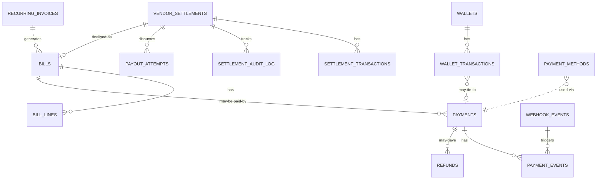

# `payments-service` Schema

> Owns: bills (invoices), recurring invoices, payments + state machine, payment
> events, refunds, webhook event log, saved payment methods, wallets + wallet
> transactions, vendor settlements + settlement transactions, payouts.
>
> Conventions: see [`../07-database-design.md`](../07-database-design.md) §3.
> **Column names are PascalCase, double-quoted in SQL.**

**Database name:** `payments_db`

**Anchors:**
- Bills + recurring invoices: `D:\charqol\accounting-service\src\database\models\` — [`06`](../06-extended-patterns.md) §12
- Payment state machine: `D:\Batterlicious\batterlicious-service\src\state.machines\payment.state.ts`
- Wallets: `D:\Batterlicious\batterlicious-service\src\database\typeorm\models\wallet.entity.ts` — [`06`](../06-extended-patterns.md) §6
- Vendor settlements: `vendor.settlements.entity.ts` — [`06`](../06-extended-patterns.md) §13

---

## Tables overview

| #  | Table                       | Purpose                                                                                |
|----|-----------------------------|----------------------------------------------------------------------------------------|
| 1  | `bills`                     | Invoice issued against an order or vendor settlement.                                   |
| 2  | `bill_lines`                | Itemised lines on a bill.                                                               |
| 3  | `recurring_invoices`        | Driver of subscription renewals.                                                        |
| 4  | `payments`                  | Payment attempt with state machine.                                                     |
| 5  | `payment_events`            | State-transition audit per payment.                                                     |
| 6  | `refunds`                   | Full or partial refund against a payment.                                               |
| 7  | `webhook_events`            | Raw inbound webhooks (Razorpay/Zoho).                                                   |
| 8  | `payment_methods`           | Saved payment method preferences.                                                       |
| 9  | `wallets`                   | One per customer; supports negative floor for B2B credit.                               |
| 10 | `wallet_transactions`       | Credit/debit movements with `"BalanceBefore"`/`"BalanceAfter"` snapshots.                |
| 11 | `vendor_settlements`        | Periodic statement of vendor billing → payout.                                          |
| 12 | `settlement_transactions`   | Lines in a settlement.                                                                   |
| 13 | `settlement_audit_log`      | Audit of adjustments / disputes.                                                          |
| 14 | `payout_attempts`           | Disbursement attempts to vendor bank account.                                            |

Plus shared infra: `event_store`, `idempotency_keys`.

---

## 1. `bills`

| Field                | Type                | Constraints                                       | Notes                                                       |
|----------------------|---------------------|---------------------------------------------------|-------------------------------------------------------------|
| `id`                 | UUID                | PK                                                |                                                             |
| `TenantId`           | UUID                | NOT NULL                                          |                                                             |
| `BranchId`           | UUID                | NOT NULL                                          |                                                             |
| `BillNo`             | VARCHAR(32)         | NOT NULL                                          | "INV-2026-05-00042"                                          |
| `BillType`           | bill_type_enum      | NOT NULL                                          | `RetailOrder`, `VendorOrder`, `VendorSettlement`, `Subscription` |
| `OrderId`            | UUID                |                                                   | Cross-service                                                |
| `SubscriptionId`     | UUID                |                                                   | Cross-service                                                |
| `CustomerId`         | UUID                | NOT NULL                                          | Cross-service                                                |
| `BilledToName`       | VARCHAR(255)        | NOT NULL                                          | Snapshot                                                     |
| `BilledToGstin`      | VARCHAR(15)         |                                                   | Snapshot                                                     |
| `BilledToAddress`    | JSONB               |                                                   | Snapshot of address                                          |
| `Status`             | bill_status_enum    | NOT NULL DEFAULT 'Draft'                          |                                                             |
| `Currency`           | CHAR(3)             | NOT NULL DEFAULT 'INR'                            |                                                             |
| `Subtotal`           | NUMERIC(15,2)       | NOT NULL DEFAULT 0                                |                                                             |
| `DiscountAmount`     | NUMERIC(15,2)       | NOT NULL DEFAULT 0                                |                                                             |
| `TaxAmount`          | NUMERIC(15,2)       | NOT NULL DEFAULT 0                                |                                                             |
| `TotalAmount`        | NUMERIC(15,2)       | NOT NULL DEFAULT 0                                |                                                             |
| `PaidAmount`         | NUMERIC(15,2)       | NOT NULL DEFAULT 0                                |                                                             |
| `BalanceAmount`      | NUMERIC(15,2)       | NOT NULL DEFAULT 0                                |                                                             |
| `PaymentTermsDays`   | INT                 | NOT NULL DEFAULT 0                                | Net X                                                        |
| `IssuedAt`           | TIMESTAMPTZ         |                                                   |                                                             |
| `DueAt`              | TIMESTAMPTZ         |                                                   |                                                             |
| `PaidAt`             | TIMESTAMPTZ         |                                                   |                                                             |
| `CancelledAt`        | TIMESTAMPTZ         |                                                   |                                                             |
| `PdfUrl`             | VARCHAR(512)        |                                                   |                                                             |
| `Metadata`           | JSONB               |                                                   |                                                             |
| `CreatedAt`, `UpdatedAt`, `DeletedAt` | …  |                                                  |                                                             |
| `CreatedBy`, `UpdatedBy` | UUID     |                                                  |                                                             |

```sql
CREATE TYPE bill_type_enum AS ENUM ('RetailOrder','VendorOrder','VendorSettlement','Subscription');
CREATE TYPE bill_status_enum AS ENUM ('Draft','Issued','PartiallyPaid','Paid','Cancelled','Overdue');

CREATE TABLE bills (
  id                    UUID PRIMARY KEY DEFAULT gen_random_uuid(),
  "TenantId"            UUID NOT NULL,
  "BranchId"            UUID NOT NULL,
  "BillNo"              VARCHAR(32) NOT NULL,
  "BillType"            bill_type_enum NOT NULL,
  "OrderId"             UUID,
  "SubscriptionId"      UUID,
  "CustomerId"          UUID NOT NULL,
  "BilledToName"        VARCHAR(255) NOT NULL,
  "BilledToGstin"       VARCHAR(15),
  "BilledToAddress"     JSONB,
  "Status"              bill_status_enum NOT NULL DEFAULT 'Draft',
  "Currency"            CHAR(3) NOT NULL DEFAULT 'INR',
  "Subtotal"            NUMERIC(15,2) NOT NULL DEFAULT 0,
  "DiscountAmount"      NUMERIC(15,2) NOT NULL DEFAULT 0,
  "TaxAmount"           NUMERIC(15,2) NOT NULL DEFAULT 0,
  "TotalAmount"         NUMERIC(15,2) NOT NULL DEFAULT 0,
  "PaidAmount"          NUMERIC(15,2) NOT NULL DEFAULT 0,
  "BalanceAmount"       NUMERIC(15,2) NOT NULL DEFAULT 0,
  "PaymentTermsDays"    INT NOT NULL DEFAULT 0,
  "IssuedAt"            TIMESTAMPTZ,
  "DueAt"               TIMESTAMPTZ,
  "PaidAt"              TIMESTAMPTZ,
  "CancelledAt"         TIMESTAMPTZ,
  "PdfUrl"              VARCHAR(512),
  "Metadata"            JSONB,
  "CreatedAt"           TIMESTAMPTZ NOT NULL DEFAULT now(),
  "UpdatedAt"           TIMESTAMPTZ NOT NULL DEFAULT now(),
  "DeletedAt"           TIMESTAMPTZ,
  "CreatedBy"           UUID,
  "UpdatedBy"           UUID,
  CONSTRAINT ux_bills_tenant_no UNIQUE ("TenantId", "BillNo")
);
CREATE INDEX ix_bills_customer_status ON bills ("CustomerId", "Status") WHERE "DeletedAt" IS NULL;
CREATE INDEX ix_bills_order ON bills ("OrderId") WHERE "OrderId" IS NOT NULL;
CREATE INDEX ix_bills_due ON bills ("DueAt") WHERE "Status" IN ('Issued','PartiallyPaid','Overdue') AND "DeletedAt" IS NULL;
```

---

## 2. `bill_lines`

| Field             | Type             | Constraints                                       | Notes                                          |
|-------------------|------------------|---------------------------------------------------|------------------------------------------------|
| `id`              | UUID             | PK                                                |                                                |
| `BillId`          | UUID             | NOT NULL, FK → bills(id) ON DELETE CASCADE        |                                                |
| `OrderItemId`     | UUID             |                                                   | Cross-service                                  |
| `Description`     | VARCHAR(255)     | NOT NULL                                          |                                                |
| `Quantity`        | NUMERIC(10,2)    | NOT NULL                                          |                                                |
| `UnitPrice`       | NUMERIC(15,2)    | NOT NULL                                          |                                                |
| `DiscountAmount`  | NUMERIC(15,2)    | NOT NULL DEFAULT 0                                |                                                |
| `TaxCodeId`       | UUID             |                                                   | Cross-service                                  |
| `TaxPercent`      | NUMERIC(5,2)     | NOT NULL DEFAULT 0                                |                                                |
| `TaxAmount`       | NUMERIC(15,2)    | NOT NULL DEFAULT 0                                |                                                |
| `LineTotal`       | NUMERIC(15,2)    | NOT NULL                                          |                                                |
| `HsnSac`          | VARCHAR(16)      |                                                   |                                                |
| `SortOrder`       | INT              | NOT NULL DEFAULT 0                                |                                                |
| `CreatedAt`       | TIMESTAMPTZ      | NOT NULL DEFAULT now()                            |                                                |

```sql
CREATE TABLE bill_lines (
  id                UUID PRIMARY KEY DEFAULT gen_random_uuid(),
  "BillId"          UUID NOT NULL REFERENCES bills(id) ON DELETE CASCADE,
  "OrderItemId"     UUID,
  "Description"     VARCHAR(255) NOT NULL,
  "Quantity"        NUMERIC(10,2) NOT NULL CHECK ("Quantity" > 0),
  "UnitPrice"       NUMERIC(15,2) NOT NULL,
  "DiscountAmount"  NUMERIC(15,2) NOT NULL DEFAULT 0,
  "TaxCodeId"       UUID,
  "TaxPercent"      NUMERIC(5,2)  NOT NULL DEFAULT 0,
  "TaxAmount"       NUMERIC(15,2) NOT NULL DEFAULT 0,
  "LineTotal"       NUMERIC(15,2) NOT NULL,
  "HsnSac"          VARCHAR(16),
  "SortOrder"       INT NOT NULL DEFAULT 0,
  "CreatedAt"       TIMESTAMPTZ NOT NULL DEFAULT now()
);
CREATE INDEX ix_bill_lines_bill ON bill_lines ("BillId");
```

---

## 3. `recurring_invoices`

| Field                       | Type                  | Constraints                                       | Notes                                                       |
|-----------------------------|-----------------------|---------------------------------------------------|-------------------------------------------------------------|
| `id`                        | UUID                  | PK                                                |                                                             |
| `TenantId`                  | UUID                  | NOT NULL                                          |                                                             |
| `CustomerId`                | UUID                  | NOT NULL                                          |                                                             |
| `SubscriptionId`            | UUID                  | NOT NULL                                          | Cross-service                                                |
| `Frequency`                 | plan_frequency_enum   | NOT NULL                                          |                                                             |
| `NextInvoiceDate`           | DATE                  | NOT NULL                                          |                                                             |
| `LastInvoiceDate`           | DATE                  |                                                   |                                                             |
| `Amount`                    | NUMERIC(15,2)         | NOT NULL                                          |                                                             |
| `Currency`                  | CHAR(3)               | NOT NULL DEFAULT 'INR'                            |                                                             |
| `TemplateData`              | JSONB                 |                                                   | Inline template fields (header/footer/tax_code)             |
| `RazorpaySubscriptionId`    | VARCHAR(64)           |                                                   |                                                             |
| `IsActive`                  | BOOLEAN               | NOT NULL DEFAULT TRUE                             |                                                             |
| `EndDate`                   | DATE                  |                                                   |                                                             |
| `FailedAttempts`            | INT                   | NOT NULL DEFAULT 0                                |                                                             |
| `LastError`                 | TEXT                  |                                                   |                                                             |
| `CreatedAt`, `UpdatedAt`, `DeletedAt` | …    |                                                  |                                                             |

```sql
CREATE TYPE plan_frequency_enum AS ENUM ('Monthly','Quarterly','HalfYearly','Yearly');

CREATE TABLE recurring_invoices (
  id                         UUID PRIMARY KEY DEFAULT gen_random_uuid(),
  "TenantId"                 UUID NOT NULL,
  "CustomerId"               UUID NOT NULL,
  "SubscriptionId"           UUID NOT NULL,
  "Frequency"                plan_frequency_enum NOT NULL,
  "NextInvoiceDate"          DATE NOT NULL,
  "LastInvoiceDate"          DATE,
  "Amount"                   NUMERIC(15,2) NOT NULL CHECK ("Amount" >= 0),
  "Currency"                 CHAR(3) NOT NULL DEFAULT 'INR',
  "TemplateData"             JSONB,
  "RazorpaySubscriptionId"   VARCHAR(64),
  "IsActive"                 BOOLEAN NOT NULL DEFAULT TRUE,
  "EndDate"                  DATE,
  "FailedAttempts"           INT NOT NULL DEFAULT 0,
  "LastError"                TEXT,
  "CreatedAt"                TIMESTAMPTZ NOT NULL DEFAULT now(),
  "UpdatedAt"                TIMESTAMPTZ NOT NULL DEFAULT now(),
  "DeletedAt"                TIMESTAMPTZ
);
CREATE INDEX ix_recurring_due ON recurring_invoices ("NextInvoiceDate") WHERE "IsActive" = TRUE AND "DeletedAt" IS NULL;
CREATE INDEX ix_recurring_subscription ON recurring_invoices ("SubscriptionId");
```

Daily BullMQ job at 02:00 IST: `SELECT … WHERE "NextInvoiceDate" <= today AND "IsActive"`.

---

## 4. `payments`

| Field                  | Type                   | Constraints                                       | Notes                                                       |
|------------------------|------------------------|---------------------------------------------------|-------------------------------------------------------------|
| `id`                   | UUID                   | PK                                                |                                                             |
| `TenantId`             | UUID                   | NOT NULL                                          |                                                             |
| `BillId`               | UUID                   |                                                   |                                                             |
| `OrderId`              | UUID                   |                                                   | Cross-service                                                |
| `CustomerId`           | UUID                   | NOT NULL                                          |                                                             |
| `Amount`               | NUMERIC(15,2)          | NOT NULL                                          |                                                             |
| `Currency`             | CHAR(3)                | NOT NULL DEFAULT 'INR'                            |                                                             |
| `Gateway`              | payment_gateway_enum   | NOT NULL                                          |                                                             |
| `GatewayOrderId`       | VARCHAR(64)            |                                                   |                                                             |
| `GatewayPaymentId`     | VARCHAR(64)            |                                                   |                                                             |
| `GatewaySignature`     | VARCHAR(255)           |                                                   |                                                             |
| `State`                | payment_state_enum     | NOT NULL DEFAULT 'Pending'                        |                                                             |
| `FailureReason`        | TEXT                   |                                                   |                                                             |
| `Purpose`              | payment_purpose_enum   | NOT NULL                                          |                                                             |
| `InitiatedAt`          | TIMESTAMPTZ            | NOT NULL DEFAULT now()                            |                                                             |
| `AuthorizedAt`         | TIMESTAMPTZ            |                                                   |                                                             |
| `CapturedAt`           | TIMESTAMPTZ            |                                                   |                                                             |
| `RefundedAmount`       | NUMERIC(15,2)          | NOT NULL DEFAULT 0                                |                                                             |
| `ReceiptUrl`           | VARCHAR(512)           |                                                   |                                                             |
| `Metadata`             | JSONB                  |                                                   |                                                             |
| `CreatedAt`, `UpdatedAt`, `DeletedAt` | …     |                                                  |                                                             |
| `CreatedBy`, `UpdatedBy` | UUID        |                                                  |                                                             |

```sql
CREATE TYPE payment_gateway_enum AS ENUM ('Razorpay','ZohoPay','CashOnDelivery','UPI','Wallet','Manual');
CREATE TYPE payment_state_enum   AS ENUM ('Pending','Authorized','Captured','Refunded','PartiallyRefunded','Failed','Cancelled');
CREATE TYPE payment_purpose_enum AS ENUM ('OrderPayment','SubscriptionPurchase','WalletTopUp','Settlement');

CREATE TABLE payments (
  id                    UUID PRIMARY KEY DEFAULT gen_random_uuid(),
  "TenantId"            UUID NOT NULL,
  "BillId"              UUID REFERENCES bills(id),
  "OrderId"             UUID,
  "CustomerId"          UUID NOT NULL,
  "Amount"              NUMERIC(15,2) NOT NULL CHECK ("Amount" > 0),
  "Currency"            CHAR(3) NOT NULL DEFAULT 'INR',
  "Gateway"             payment_gateway_enum NOT NULL,
  "GatewayOrderId"      VARCHAR(64),
  "GatewayPaymentId"    VARCHAR(64),
  "GatewaySignature"    VARCHAR(255),
  "State"               payment_state_enum NOT NULL DEFAULT 'Pending',
  "FailureReason"       TEXT,
  "Purpose"             payment_purpose_enum NOT NULL,
  "InitiatedAt"         TIMESTAMPTZ NOT NULL DEFAULT now(),
  "AuthorizedAt"        TIMESTAMPTZ,
  "CapturedAt"          TIMESTAMPTZ,
  "RefundedAmount"      NUMERIC(15,2) NOT NULL DEFAULT 0,
  "ReceiptUrl"          VARCHAR(512),
  "Metadata"            JSONB,
  "CreatedAt"           TIMESTAMPTZ NOT NULL DEFAULT now(),
  "UpdatedAt"           TIMESTAMPTZ NOT NULL DEFAULT now(),
  "DeletedAt"           TIMESTAMPTZ,
  "CreatedBy"           UUID,
  "UpdatedBy"           UUID
);
CREATE INDEX ix_payments_bill ON payments ("BillId") WHERE "BillId" IS NOT NULL;
CREATE INDEX ix_payments_customer ON payments ("CustomerId", "CreatedAt" DESC);
CREATE INDEX ix_payments_state ON payments ("State") WHERE "DeletedAt" IS NULL;
CREATE UNIQUE INDEX ux_payments_gateway_payment ON payments ("Gateway", "GatewayPaymentId") WHERE "GatewayPaymentId" IS NOT NULL;
```

**State transitions** (enforced in code):
```
Pending → Authorized | Failed | Cancelled
Authorized → Captured | Failed
Captured → Refunded | PartiallyRefunded
PartiallyRefunded → Refunded
Refunded, Failed, Cancelled → terminal
```

---

## 5. `payment_events`

| Field              | Type                  | Constraints                                       | Notes                                          |
|--------------------|-----------------------|---------------------------------------------------|------------------------------------------------|
| `id`               | UUID                  | PK                                                |                                                |
| `PaymentId`        | UUID                  | NOT NULL, FK → payments(id) ON DELETE CASCADE     |                                                |
| `FromState`        | payment_state_enum    |                                                   |                                                |
| `ToState`          | payment_state_enum    | NOT NULL                                          |                                                |
| `Trigger`          | VARCHAR(64)           | NOT NULL                                          | `webhook.razorpay.captured`, `manual.refund`   |
| `WebhookEventId`   | UUID                  |                                                   | FK → webhook_events(id)                        |
| `AmountDelta`      | NUMERIC(15,2)         |                                                   | For partial refunds                            |
| `Notes`            | TEXT                  |                                                   |                                                |
| `ActorId`          | UUID                  |                                                   |                                                |
| `CreatedAt`        | TIMESTAMPTZ           | NOT NULL DEFAULT now()                            |                                                |

```sql
CREATE TABLE payment_events (
  id                 UUID PRIMARY KEY DEFAULT gen_random_uuid(),
  "PaymentId"        UUID NOT NULL REFERENCES payments(id) ON DELETE CASCADE,
  "FromState"        payment_state_enum,
  "ToState"          payment_state_enum NOT NULL,
  "Trigger"          VARCHAR(64) NOT NULL,
  "WebhookEventId"   UUID,
  "AmountDelta"      NUMERIC(15,2),
  "Notes"            TEXT,
  "ActorId"          UUID,
  "CreatedAt"        TIMESTAMPTZ NOT NULL DEFAULT now()
);
CREATE INDEX ix_payment_events_payment ON payment_events ("PaymentId", "CreatedAt" DESC);
```

---

## 6. `refunds`

| Field              | Type                       | Constraints                                       | Notes                                                |
|--------------------|----------------------------|---------------------------------------------------|------------------------------------------------------|
| `id`               | UUID                       | PK                                                |                                                      |
| `TenantId`         | UUID                       | NOT NULL                                          |                                                      |
| `PaymentId`        | UUID                       | NOT NULL, FK → payments(id)                       |                                                      |
| `BillId`           | UUID                       |                                                   |                                                      |
| `Amount`           | NUMERIC(15,2)              | NOT NULL                                          |                                                      |
| `Currency`         | CHAR(3)                    | NOT NULL DEFAULT 'INR'                            |                                                      |
| `Reason`           | refund_reason_enum         | NOT NULL                                          |                                                      |
| `ReasonNotes`      | TEXT                       |                                                   |                                                      |
| `Destination`      | refund_destination_enum    | NOT NULL                                          | `Gateway`, `Wallet`                                   |
| `GatewayRefundId`  | VARCHAR(64)                |                                                   |                                                      |
| `State`            | refund_state_enum          | NOT NULL DEFAULT 'Pending'                        |                                                      |
| `FailureReason`    | TEXT                       |                                                   |                                                      |
| `InitiatedBy`      | UUID                       |                                                   |                                                      |
| `ProcessedAt`      | TIMESTAMPTZ                |                                                   |                                                      |
| `CreatedAt`, `UpdatedAt` | …            |                                                  |                                                      |

```sql
CREATE TYPE refund_reason_enum AS ENUM ('CustomerCancellation','QualityIssue','Duplicate','Goodwill','Other');
CREATE TYPE refund_destination_enum AS ENUM ('Gateway','Wallet');
CREATE TYPE refund_state_enum AS ENUM ('Pending','Processed','Failed');

CREATE TABLE refunds (
  id                  UUID PRIMARY KEY DEFAULT gen_random_uuid(),
  "TenantId"          UUID NOT NULL,
  "PaymentId"         UUID NOT NULL REFERENCES payments(id),
  "BillId"            UUID,
  "Amount"            NUMERIC(15,2) NOT NULL CHECK ("Amount" > 0),
  "Currency"          CHAR(3) NOT NULL DEFAULT 'INR',
  "Reason"            refund_reason_enum NOT NULL,
  "ReasonNotes"       TEXT,
  "Destination"       refund_destination_enum NOT NULL,
  "GatewayRefundId"   VARCHAR(64),
  "State"             refund_state_enum NOT NULL DEFAULT 'Pending',
  "FailureReason"     TEXT,
  "InitiatedBy"       UUID,
  "ProcessedAt"       TIMESTAMPTZ,
  "CreatedAt"         TIMESTAMPTZ NOT NULL DEFAULT now(),
  "UpdatedAt"         TIMESTAMPTZ NOT NULL DEFAULT now()
);
CREATE INDEX ix_refunds_payment ON refunds ("PaymentId");
CREATE INDEX ix_refunds_state ON refunds ("State");
```

---

## 7. `webhook_events`

| Field                | Type                  | Constraints                                       | Notes                                                |
|----------------------|-----------------------|---------------------------------------------------|------------------------------------------------------|
| `id`                 | UUID                  | PK                                                | Internal id                                          |
| `TenantId`           | UUID                  | NOT NULL                                          |                                                      |
| `Gateway`            | payment_gateway_enum  | NOT NULL                                          |                                                      |
| `GatewayEventId`     | VARCHAR(64)           | NOT NULL                                          | Provider's event id                                  |
| `EventType`          | VARCHAR(64)           | NOT NULL                                          | `payment.captured`                                    |
| `Payload`            | JSONB                 | NOT NULL                                          | Raw body                                              |
| `Headers`            | JSONB                 |                                                   |                                                      |
| `Signature`          | VARCHAR(255)          |                                                   |                                                      |
| `SignatureValid`     | BOOLEAN               | NOT NULL                                          |                                                      |
| `ProcessingState`    | webhook_state_enum    | NOT NULL DEFAULT 'Received'                       |                                                      |
| `ProcessingError`    | TEXT                  |                                                   |                                                      |
| `ProcessedAt`        | TIMESTAMPTZ           |                                                   |                                                      |
| `ReceivedAt`         | TIMESTAMPTZ           | NOT NULL DEFAULT now()                            |                                                      |
| `Retries`            | INT                   | NOT NULL DEFAULT 0                                |                                                      |

```sql
CREATE TYPE webhook_state_enum AS ENUM ('Received','Processed','Failed','Skipped');

CREATE TABLE webhook_events (
  id                  UUID PRIMARY KEY DEFAULT gen_random_uuid(),
  "TenantId"          UUID NOT NULL,
  "Gateway"           payment_gateway_enum NOT NULL,
  "GatewayEventId"    VARCHAR(64) NOT NULL,
  "EventType"         VARCHAR(64) NOT NULL,
  "Payload"           JSONB NOT NULL,
  "Headers"           JSONB,
  "Signature"         VARCHAR(255),
  "SignatureValid"    BOOLEAN NOT NULL,
  "ProcessingState"   webhook_state_enum NOT NULL DEFAULT 'Received',
  "ProcessingError"   TEXT,
  "ProcessedAt"       TIMESTAMPTZ,
  "ReceivedAt"        TIMESTAMPTZ NOT NULL DEFAULT now(),
  "Retries"           INT NOT NULL DEFAULT 0,
  CONSTRAINT ux_webhook_events_gateway_event UNIQUE ("Gateway", "GatewayEventId")
);
CREATE INDEX ix_webhook_events_state ON webhook_events ("ProcessingState", "ReceivedAt");
```

---

## 8. `payment_methods`

| Field            | Type                  | Constraints                                       | Notes                                          |
|------------------|-----------------------|---------------------------------------------------|------------------------------------------------|
| `id`             | UUID                  | PK                                                |                                                |
| `CustomerId`     | UUID                  | NOT NULL                                          | Cross-service                                   |
| `MethodType`     | method_type_enum      | NOT NULL                                          | `Card`, `UPI`, `NetBanking`, `Wallet`, `COD`    |
| `DisplayName`    | VARCHAR(128)          | NOT NULL                                          | "HDFC •••• 1234"                                |
| `Gateway`        | payment_gateway_enum  | NOT NULL                                          |                                                |
| `GatewayToken`   | VARCHAR(128)          |                                                   | Razorpay token / Zoho instrument id             |
| `UpiVpa`         | VARCHAR(128)          |                                                   |                                                |
| `CardBrand`      | VARCHAR(32)           |                                                   |                                                |
| `CardLast4`      | VARCHAR(4)            |                                                   |                                                |
| `ExpiresMonth`   | INT                   |                                                   |                                                |
| `ExpiresYear`    | INT                   |                                                   |                                                |
| `IsDefault`      | BOOLEAN               | NOT NULL DEFAULT FALSE                            |                                                |
| `IsActive`       | BOOLEAN               | NOT NULL DEFAULT TRUE                             |                                                |
| `CreatedAt`, `UpdatedAt`, `DeletedAt` | … |                                                  |                                                |

```sql
CREATE TYPE method_type_enum AS ENUM ('Card','UPI','NetBanking','Wallet','COD');

CREATE TABLE payment_methods (
  id              UUID PRIMARY KEY DEFAULT gen_random_uuid(),
  "CustomerId"    UUID NOT NULL,
  "MethodType"    method_type_enum NOT NULL,
  "DisplayName"   VARCHAR(128) NOT NULL,
  "Gateway"       payment_gateway_enum NOT NULL,
  "GatewayToken"  VARCHAR(128),
  "UpiVpa"        VARCHAR(128),
  "CardBrand"     VARCHAR(32),
  "CardLast4"     VARCHAR(4),
  "ExpiresMonth"  INT,
  "ExpiresYear"   INT,
  "IsDefault"     BOOLEAN NOT NULL DEFAULT FALSE,
  "IsActive"      BOOLEAN NOT NULL DEFAULT TRUE,
  "CreatedAt"     TIMESTAMPTZ NOT NULL DEFAULT now(),
  "UpdatedAt"     TIMESTAMPTZ NOT NULL DEFAULT now(),
  "DeletedAt"     TIMESTAMPTZ
);
CREATE INDEX ix_payment_methods_customer ON payment_methods ("CustomerId") WHERE "DeletedAt" IS NULL;
CREATE UNIQUE INDEX ux_payment_methods_default ON payment_methods ("CustomerId") WHERE "IsDefault" = TRUE AND "DeletedAt" IS NULL;
```

---

## 9. `wallets`

| Field           | Type             | Constraints                                       | Notes                                                |
|-----------------|------------------|---------------------------------------------------|------------------------------------------------------|
| `id`            | UUID             | PK                                                |                                                      |
| `TenantId`      | UUID             | NOT NULL                                          |                                                      |
| `CustomerId`    | UUID             | NOT NULL UNIQUE                                   | Cross-service                                         |
| `Balance`       | NUMERIC(15,2)    | NOT NULL DEFAULT 0                                |                                                      |
| `MinBalance`    | NUMERIC(15,2)    | NOT NULL DEFAULT 0                                | Negative for vendors with credit                      |
| `Currency`      | CHAR(3)          | NOT NULL DEFAULT 'INR'                            |                                                      |
| `TotalCredited` | NUMERIC(15,2)    | NOT NULL DEFAULT 0                                |                                                      |
| `TotalDebited`  | NUMERIC(15,2)    | NOT NULL DEFAULT 0                                |                                                      |
| `IsActive`      | BOOLEAN          | NOT NULL DEFAULT TRUE                             |                                                      |
| `FrozenAt`      | TIMESTAMPTZ      |                                                   |                                                      |
| `CreatedAt`, `UpdatedAt` | …  |                                                  |                                                      |

```sql
CREATE TABLE wallets (
  id              UUID PRIMARY KEY DEFAULT gen_random_uuid(),
  "TenantId"      UUID NOT NULL,
  "CustomerId"    UUID NOT NULL UNIQUE,
  "Balance"       NUMERIC(15,2) NOT NULL DEFAULT 0,
  "MinBalance"    NUMERIC(15,2) NOT NULL DEFAULT 0,
  "Currency"      CHAR(3) NOT NULL DEFAULT 'INR',
  "TotalCredited" NUMERIC(15,2) NOT NULL DEFAULT 0,
  "TotalDebited"  NUMERIC(15,2) NOT NULL DEFAULT 0,
  "IsActive"      BOOLEAN NOT NULL DEFAULT TRUE,
  "FrozenAt"      TIMESTAMPTZ,
  "CreatedAt"     TIMESTAMPTZ NOT NULL DEFAULT now(),
  "UpdatedAt"     TIMESTAMPTZ NOT NULL DEFAULT now(),
  CONSTRAINT ck_wallet_balance_floor CHECK ("Balance" >= "MinBalance")
);
```

The `CHECK` enforces the credit limit at write time.

---

## 10. `wallet_transactions`

| Field               | Type                    | Constraints                                       | Notes                                                       |
|---------------------|-------------------------|---------------------------------------------------|-------------------------------------------------------------|
| `id`                | UUID                    | PK                                                |                                                             |
| `WalletId`          | UUID                    | NOT NULL, FK → wallets(id) ON DELETE CASCADE      |                                                             |
| `TransactionType`   | wallet_txn_type_enum    | NOT NULL                                          | `Credit`, `Debit`                                            |
| `Amount`            | NUMERIC(15,2)           | NOT NULL                                          | Always positive                                              |
| `Description`       | VARCHAR(255)            |                                                   |                                                             |
| `ReferenceType`     | wallet_ref_type_enum    | NOT NULL                                          | `Order`, `Subscription`, `TopUp`, `Refund`, `Adjustment`, `Settlement` |
| `ReferenceId`       | UUID                    |                                                   |                                                             |
| `OrderId`           | UUID                    |                                                   |                                                             |
| `SubscriptionId`    | UUID                    |                                                   |                                                             |
| `PaymentId`         | UUID                    |                                                   | Tie to Payment for top-ups                                   |
| `BalanceBefore`     | NUMERIC(15,2)           | NOT NULL                                          |                                                             |
| `BalanceAfter`      | NUMERIC(15,2)           | NOT NULL                                          |                                                             |
| `Status`            | wallet_txn_status_enum  | NOT NULL DEFAULT 'Completed'                      |                                                             |
| `Metadata`          | JSONB                   |                                                   |                                                             |
| `CreatedBy`         | UUID                    |                                                   |                                                             |
| `CreatedAt`         | TIMESTAMPTZ             | NOT NULL DEFAULT now()                            |                                                             |

```sql
CREATE TYPE wallet_txn_type_enum AS ENUM ('Credit','Debit');
CREATE TYPE wallet_ref_type_enum AS ENUM ('Order','Subscription','TopUp','Refund','Adjustment','Settlement');
CREATE TYPE wallet_txn_status_enum AS ENUM ('Pending','Completed','Failed','Reversed');

CREATE TABLE wallet_transactions (
  id                  UUID PRIMARY KEY DEFAULT gen_random_uuid(),
  "WalletId"          UUID NOT NULL REFERENCES wallets(id) ON DELETE CASCADE,
  "TransactionType"   wallet_txn_type_enum NOT NULL,
  "Amount"            NUMERIC(15,2) NOT NULL CHECK ("Amount" > 0),
  "Description"       VARCHAR(255),
  "ReferenceType"     wallet_ref_type_enum NOT NULL,
  "ReferenceId"       UUID,
  "OrderId"           UUID,
  "SubscriptionId"    UUID,
  "PaymentId"         UUID,
  "BalanceBefore"     NUMERIC(15,2) NOT NULL,
  "BalanceAfter"      NUMERIC(15,2) NOT NULL,
  "Status"            wallet_txn_status_enum NOT NULL DEFAULT 'Completed',
  "Metadata"          JSONB,
  "CreatedBy"         UUID,
  "CreatedAt"         TIMESTAMPTZ NOT NULL DEFAULT now()
);
CREATE INDEX ix_wallet_txn_wallet_time ON wallet_transactions ("WalletId", "CreatedAt" DESC);
CREATE INDEX ix_wallet_txn_reference ON wallet_transactions ("ReferenceType", "ReferenceId");
```

Movements written in a single transaction:
1. `SELECT … FOR UPDATE` the wallet row.
2. Compute `"BalanceAfter" = "BalanceBefore" ± "Amount"`.
3. CHECK constraint enforces the floor.
4. `INSERT INTO wallet_transactions …; UPDATE wallets SET "Balance" = "BalanceAfter", …;`

---

## 11. `vendor_settlements`

| Field                | Type                      | Constraints                                       | Notes                                                |
|----------------------|---------------------------|---------------------------------------------------|------------------------------------------------------|
| `id`                 | UUID                      | PK                                                |                                                      |
| `TenantId`           | UUID                      | NOT NULL                                          |                                                      |
| `CustomerId`         | UUID                      | NOT NULL                                          | Vendor customer                                      |
| `SettlementNo`       | VARCHAR(32)               | NOT NULL                                          | "SETT-2026-05-VHS-001"                                |
| `PeriodFrom`         | DATE                      | NOT NULL                                          |                                                      |
| `PeriodTo`           | DATE                      | NOT NULL                                          |                                                      |
| `Status`             | settlement_status_enum    | NOT NULL DEFAULT 'Draft'                          | `Draft`, `Finalised`, `Approved`, `Paid`, `Cancelled` |
| `TotalSales`         | NUMERIC(15,2)             | NOT NULL DEFAULT 0                                |                                                      |
| `TotalCommission`    | NUMERIC(15,2)             | NOT NULL DEFAULT 0                                |                                                      |
| `PlatformFee`        | NUMERIC(15,2)             | NOT NULL DEFAULT 0                                |                                                      |
| `TdsAmount`          | NUMERIC(15,2)             | NOT NULL DEFAULT 0                                | India 1-2% TDS                                        |
| `AdjustmentAmount`   | NUMERIC(15,2)             | NOT NULL DEFAULT 0                                |                                                      |
| `AdjustmentReason`   | TEXT                      |                                                   |                                                      |
| `NetAmount`          | NUMERIC(15,2)             | NOT NULL DEFAULT 0                                |                                                      |
| `PaidAmount`         | NUMERIC(15,2)             | NOT NULL DEFAULT 0                                |                                                      |
| `RemainingAmount`    | NUMERIC(15,2)             | NOT NULL DEFAULT 0                                |                                                      |
| `BillId`             | UUID                      |                                                   | FK → bills(id) once finalised                         |
| `BankAccountId`      | UUID                      |                                                   | Cross-service                                         |
| `FinalisedAt`        | TIMESTAMPTZ               |                                                   |                                                      |
| `ApprovedAt`         | TIMESTAMPTZ               |                                                   |                                                      |
| `ApprovedBy`         | UUID                      |                                                   |                                                      |
| `PaidAt`             | TIMESTAMPTZ               |                                                   |                                                      |
| `CreatedAt`, `UpdatedAt`, `DeletedAt` | …  |                                                  |                                                      |

```sql
CREATE TYPE settlement_status_enum AS ENUM ('Draft','Finalised','Approved','Paid','Cancelled');

CREATE TABLE vendor_settlements (
  id                    UUID PRIMARY KEY DEFAULT gen_random_uuid(),
  "TenantId"            UUID NOT NULL,
  "CustomerId"          UUID NOT NULL,
  "SettlementNo"        VARCHAR(32) NOT NULL,
  "PeriodFrom"          DATE NOT NULL,
  "PeriodTo"            DATE NOT NULL,
  "Status"              settlement_status_enum NOT NULL DEFAULT 'Draft',
  "TotalSales"          NUMERIC(15,2) NOT NULL DEFAULT 0,
  "TotalCommission"     NUMERIC(15,2) NOT NULL DEFAULT 0,
  "PlatformFee"         NUMERIC(15,2) NOT NULL DEFAULT 0,
  "TdsAmount"           NUMERIC(15,2) NOT NULL DEFAULT 0,
  "AdjustmentAmount"    NUMERIC(15,2) NOT NULL DEFAULT 0,
  "AdjustmentReason"    TEXT,
  "NetAmount"           NUMERIC(15,2) NOT NULL DEFAULT 0,
  "PaidAmount"          NUMERIC(15,2) NOT NULL DEFAULT 0,
  "RemainingAmount"     NUMERIC(15,2) NOT NULL DEFAULT 0,
  "BillId"              UUID REFERENCES bills(id),
  "BankAccountId"       UUID,
  "FinalisedAt"         TIMESTAMPTZ,
  "ApprovedAt"          TIMESTAMPTZ,
  "ApprovedBy"          UUID,
  "PaidAt"              TIMESTAMPTZ,
  "CreatedAt"           TIMESTAMPTZ NOT NULL DEFAULT now(),
  "UpdatedAt"           TIMESTAMPTZ NOT NULL DEFAULT now(),
  "DeletedAt"           TIMESTAMPTZ,
  CONSTRAINT ux_vendor_settlements_tenant_no UNIQUE ("TenantId", "SettlementNo"),
  CONSTRAINT ck_settlement_period CHECK ("PeriodFrom" <= "PeriodTo")
);
CREATE INDEX ix_vendor_settlements_customer_period ON vendor_settlements ("CustomerId", "PeriodTo" DESC);
CREATE INDEX ix_vendor_settlements_status ON vendor_settlements ("Status") WHERE "DeletedAt" IS NULL;
```

---

## 12. `settlement_transactions`

| Field                | Type             | Constraints                                       | Notes                                          |
|----------------------|------------------|---------------------------------------------------|------------------------------------------------|
| `id`                 | UUID             | PK                                                |                                                |
| `SettlementId`       | UUID             | NOT NULL, FK → vendor_settlements(id) ON DELETE CASCADE | |
| `OrderId`            | UUID             |                                                   | Cross-service                                   |
| `BillId`             | UUID             |                                                   | FK → bills(id)                                  |
| `Amount`             | NUMERIC(15,2)    | NOT NULL                                          |                                                |
| `CommissionAmount`   | NUMERIC(15,2)    | NOT NULL DEFAULT 0                                |                                                |
| `Description`        | VARCHAR(255)     |                                                   |                                                |
| `CreatedAt`          | TIMESTAMPTZ      | NOT NULL DEFAULT now()                            |                                                |

```sql
CREATE TABLE settlement_transactions (
  id                  UUID PRIMARY KEY DEFAULT gen_random_uuid(),
  "SettlementId"      UUID NOT NULL REFERENCES vendor_settlements(id) ON DELETE CASCADE,
  "OrderId"           UUID,
  "BillId"            UUID REFERENCES bills(id),
  "Amount"            NUMERIC(15,2) NOT NULL,
  "CommissionAmount"  NUMERIC(15,2) NOT NULL DEFAULT 0,
  "Description"       VARCHAR(255),
  "CreatedAt"         TIMESTAMPTZ NOT NULL DEFAULT now()
);
CREATE INDEX ix_settlement_txn_settlement ON settlement_transactions ("SettlementId");
```

---

## 13. `settlement_audit_log`

| Field           | Type            | Constraints                                       | Notes                                          |
|-----------------|-----------------|---------------------------------------------------|------------------------------------------------|
| `id`            | UUID            | PK                                                |                                                |
| `SettlementId`  | UUID            | NOT NULL, FK → vendor_settlements(id) ON DELETE CASCADE | |
| `Action`        | VARCHAR(64)     | NOT NULL                                          | `AdjustmentAdded`, `StatusChanged`, `Disputed`  |
| `Before`        | JSONB           |                                                   |                                                |
| `After`         | JSONB           |                                                   |                                                |
| `ActorId`       | UUID            |                                                   |                                                |
| `ActorName`     | VARCHAR(255)    |                                                   |                                                |
| `Reason`        | TEXT            |                                                   |                                                |
| `CreatedAt`     | TIMESTAMPTZ     | NOT NULL DEFAULT now()                            |                                                |

```sql
CREATE TABLE settlement_audit_log (
  id              UUID PRIMARY KEY DEFAULT gen_random_uuid(),
  "SettlementId"  UUID NOT NULL REFERENCES vendor_settlements(id) ON DELETE CASCADE,
  "Action"        VARCHAR(64) NOT NULL,
  "Before"        JSONB,
  "After"         JSONB,
  "ActorId"       UUID,
  "ActorName"     VARCHAR(255),
  "Reason"        TEXT,
  "CreatedAt"     TIMESTAMPTZ NOT NULL DEFAULT now()
);
CREATE INDEX ix_settlement_audit_settlement ON settlement_audit_log ("SettlementId", "CreatedAt" DESC);
```

---

## 14. `payout_attempts`

| Field            | Type                  | Constraints                                       | Notes                                          |
|------------------|-----------------------|---------------------------------------------------|------------------------------------------------|
| `id`             | UUID                  | PK                                                |                                                |
| `SettlementId`   | UUID                  | NOT NULL, FK → vendor_settlements(id)             |                                                |
| `BankAccountId`  | UUID                  | NOT NULL                                          | Cross-service                                   |
| `Amount`         | NUMERIC(15,2)         | NOT NULL                                          |                                                |
| `Utr`            | VARCHAR(32)           |                                                   | NEFT/IMPS UTR                                  |
| `Gateway`        | VARCHAR(32)           |                                                   | `RazorpayX`, `Manual`                          |
| `Status`         | payout_status_enum    | NOT NULL DEFAULT 'Initiated'                      | `Initiated`, `Processing`, `Succeeded`, `Failed` |
| `FailureReason`  | TEXT                  |                                                   |                                                |
| `InitiatedBy`    | UUID                  |                                                   |                                                |
| `ProcessedAt`    | TIMESTAMPTZ           |                                                   |                                                |
| `CreatedAt`, `UpdatedAt` | …  |                                                  |                                                |

```sql
CREATE TYPE payout_status_enum AS ENUM ('Initiated','Processing','Succeeded','Failed');

CREATE TABLE payout_attempts (
  id                UUID PRIMARY KEY DEFAULT gen_random_uuid(),
  "SettlementId"    UUID NOT NULL REFERENCES vendor_settlements(id),
  "BankAccountId"   UUID NOT NULL,
  "Amount"          NUMERIC(15,2) NOT NULL CHECK ("Amount" > 0),
  "Utr"             VARCHAR(32),
  "Gateway"         VARCHAR(32),
  "Status"          payout_status_enum NOT NULL DEFAULT 'Initiated',
  "FailureReason"   TEXT,
  "InitiatedBy"     UUID,
  "ProcessedAt"     TIMESTAMPTZ,
  "CreatedAt"       TIMESTAMPTZ NOT NULL DEFAULT now(),
  "UpdatedAt"       TIMESTAMPTZ NOT NULL DEFAULT now()
);
CREATE INDEX ix_payouts_settlement ON payout_attempts ("SettlementId");
CREATE INDEX ix_payouts_status ON payout_attempts ("Status");
```

---

## ER diagram (payments service)



---

## Cross-service references

| Column                                       | Refers to                                                                  |
|----------------------------------------------|----------------------------------------------------------------------------|
| `bills."CustomerId"` / `payments."CustomerId"` / `wallets."CustomerId"` | `identity_db.customers.id`                  |
| `bills."OrderId"` / `payments."OrderId"` / `bill_lines."OrderItemId"` / `settlement_transactions."OrderId"` | `orders_db.*`  |
| `bills."SubscriptionId"` / `recurring_invoices."SubscriptionId"` / `wallet_transactions."SubscriptionId"` | `orders_db.subscriptions.id` |
| `bill_lines."TaxCodeId"`                     | `catalog_pricing_db.tax_codes.id`                                          |
| `vendor_settlements."BankAccountId"` / `payout_attempts."BankAccountId"` | `identity_db.vendor_bank_accounts.id`           |
| `*."CreatedBy"` / `"UpdatedBy"` / `"ApprovedBy"` / `"InitiatedBy"` | `identity_db.users.id`                            |

---

## Number sequencing

```sql
CREATE TABLE numbering_counters (
  "TenantId"     UUID NOT NULL,
  "Scope"        VARCHAR(32) NOT NULL,   -- 'BILL', 'SETTLEMENT', 'PAYMENT_RECEIPT'
  "FyYear"       VARCHAR(7)  NOT NULL,   -- '2026-27'
  "LastNumber"   BIGINT      NOT NULL DEFAULT 0,
  PRIMARY KEY ("TenantId", "Scope", "FyYear")
);
```

Algorithm: `BEGIN; SELECT … FOR UPDATE; UPDATE … SET "LastNumber" = "LastNumber" + 1 RETURNING "LastNumber"; COMMIT;` then format as `INV-2026-27-00042`.

---

## Seed data

No business seed for payments (operational data only). The `numbering_counters` table is initialised lazily on first use.

---

*End of payments schema. Continue with [`05-notifications-schema.md`](05-notifications-schema.md).*
