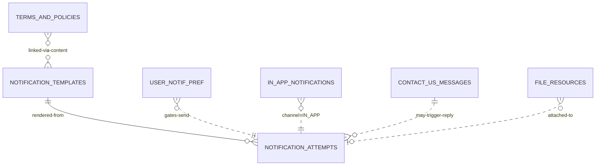

# `notifications-service` Schema

> Owns: notification templates (per locale), dispatch attempts, user
> preferences, in-app inbox, customer-support messages, CMS documents
> (Terms & Privacy), and a generated-PDF/file index.
>
> Conventions: see [`../07-database-design.md`](../07-database-design.md) §3.
> **Column names are PascalCase, double-quoted in SQL.**

**Database name:** `notifications_db`

**Anchors:**
- Multi-channel notification fan-out: `D:\Rean\reancare-service\src\services\general\reminder.sender.service.ts`
- ContactUs entity: `D:\Batterlicious\batterlicious-service\src\database\typeorm\models\contact.us.entity.ts`
- Terms & policy CMS: `D:\Batterlicious\batterlicious-service\src\database\typeorm\models\terms.and.policy.entity.ts`
- File-resource pattern: `D:\Batterlicious\batterlicious-service\src\database\typeorm\models\file.resource.entity.ts`

---

## Tables overview

| # | Table                              | Purpose                                                                            |
|---|------------------------------------|------------------------------------------------------------------------------------|
| 1 | `notification_templates`           | Per-`("Key", "Locale", "Channel")` template body.                                   |
| 2 | `notification_attempts`            | One row per send attempt, per channel, per recipient.                               |
| 3 | `user_notification_preferences`    | Per-user opt-in/out per channel and category.                                       |
| 4 | `in_app_notifications`             | Customer/admin inbox messages.                                                      |
| 5 | `contact_us_messages`              | Customer-submitted "Contact us" form entries.                                       |
| 6 | `terms_and_policies`               | Versioned CMS docs in English + Marathi.                                           |
| 7 | `file_resources`                   | Generated-PDF index and other file metadata.                                        |

Plus shared infra: `event_store`, `idempotency_keys`.

---

## 1. `notification_templates`

| Field           | Type                | Constraints                                       | Notes                                                                |
|-----------------|---------------------|---------------------------------------------------|----------------------------------------------------------------------|
| `id`            | UUID                | PK                                                |                                                                      |
| `TenantId`      | UUID                |                                                   | NULL = platform default                                              |
| `Key`           | VARCHAR(128)        | NOT NULL                                          | `order.created`, `order.ready`, `payment.received`                    |
| `Channel`       | notif_channel_enum  | NOT NULL                                          | `SMS`, `EMAIL`, `WHATSAPP`, `PUSH`, `IN_APP`                          |
| `Locale`        | CHAR(2)             | NOT NULL                                          | `en`, `mr`                                                            |
| `Subject`       | VARCHAR(255)        |                                                   | Email subject                                                         |
| `Body`          | TEXT                | NOT NULL                                          | Handlebars/Mustache with placeholders                                 |
| `Variables`     | JSONB               |                                                   | Schema: `{orderId:'string', customerName:'string'}`                   |
| `Description`   | TEXT                |                                                   |                                                                      |
| `Category`      | VARCHAR(64)         | NOT NULL                                          | `Transactional`, `Marketing`, `OperationsAlert`                       |
| `IsActive`      | BOOLEAN             | NOT NULL DEFAULT TRUE                             |                                                                      |
| `Version`       | INT                 | NOT NULL DEFAULT 1                                |                                                                      |
| `CreatedAt`, `UpdatedAt`, `DeletedAt` | …  |                                                  |                                                                      |
| `CreatedBy`, `UpdatedBy` | UUID   |                                                  |                                                                      |

```sql
CREATE TYPE notif_channel_enum AS ENUM ('SMS','EMAIL','WHATSAPP','PUSH','IN_APP');

CREATE TABLE notification_templates (
  id            UUID PRIMARY KEY DEFAULT gen_random_uuid(),
  "TenantId"    UUID,
  "Key"         VARCHAR(128) NOT NULL,
  "Channel"     notif_channel_enum NOT NULL,
  "Locale"      CHAR(2) NOT NULL,
  "Subject"     VARCHAR(255),
  "Body"        TEXT NOT NULL,
  "Variables"   JSONB,
  "Description" TEXT,
  "Category"    VARCHAR(64) NOT NULL,
  "IsActive"    BOOLEAN NOT NULL DEFAULT TRUE,
  "Version"     INT NOT NULL DEFAULT 1,
  "CreatedAt"   TIMESTAMPTZ NOT NULL DEFAULT now(),
  "UpdatedAt"   TIMESTAMPTZ NOT NULL DEFAULT now(),
  "DeletedAt"   TIMESTAMPTZ,
  "CreatedBy"   UUID,
  "UpdatedBy"   UUID,
  CONSTRAINT ux_notif_templates_key UNIQUE (COALESCE("TenantId", '00000000-0000-0000-0000-000000000000'::uuid), "Key", "Channel", "Locale", "Version")
);
CREATE INDEX ix_notif_templates_active ON notification_templates ("Key", "Channel", "Locale") WHERE "IsActive" = TRUE AND "DeletedAt" IS NULL;
```

**Resolution at send-time:** lookup most-recent active row for `("TenantId" ?? PLATFORM, "Key", "Channel", "Locale")`. Fall back from `mr` → `en` if no Marathi template. Cache in Redis 10 min.

---

## 2. `notification_attempts`

| Field              | Type                  | Constraints                                       | Notes                                                                       |
|--------------------|-----------------------|---------------------------------------------------|-----------------------------------------------------------------------------|
| `id`               | UUID                  | PK                                                |                                                                             |
| `TenantId`         | UUID                  | NOT NULL                                          |                                                                             |
| `UserId`           | UUID                  |                                                   | Cross-service                                                                |
| `CustomerId`       | UUID                  |                                                   | Cross-service                                                                |
| `Channel`          | notif_channel_enum    | NOT NULL                                          |                                                                             |
| `Recipient`        | VARCHAR(255)          | NOT NULL                                          | Phone / email / fcm token (snapshot)                                        |
| `TemplateKey`      | VARCHAR(128)          | NOT NULL                                          |                                                                             |
| `TemplateVersion`  | INT                   |                                                   | Snapshot                                                                    |
| `Locale`           | CHAR(2)               | NOT NULL                                          |                                                                             |
| `Subject`          | VARCHAR(255)          |                                                   | Rendered                                                                    |
| `Body`             | TEXT                  | NOT NULL                                          | Rendered                                                                    |
| `VariablesData`    | JSONB                 |                                                   |                                                                             |
| `State`            | notif_state_enum      | NOT NULL DEFAULT 'Queued'                         | `Queued`, `Sent`, `Delivered`, `Read`, `Failed`, `Skipped`                   |
| `FailureReason`    | TEXT                  |                                                   |                                                                             |
| `Provider`         | VARCHAR(32)           |                                                   | `MSG91`, `SES`, `FCM`, `WhatsApp`                                            |
| `ProviderMsgId`    | VARCHAR(128)          |                                                   |                                                                             |
| `CostInPaise`      | INT                   |                                                   |                                                                             |
| `SentAt`           | TIMESTAMPTZ           |                                                   |                                                                             |
| `DeliveredAt`      | TIMESTAMPTZ           |                                                   |                                                                             |
| `ReadAt`           | TIMESTAMPTZ           |                                                   |                                                                             |
| `OrderId`          | UUID                  |                                                   |                                                                             |
| `BillId`           | UUID                  |                                                   |                                                                             |
| `SubscriptionId`   | UUID                  |                                                   |                                                                             |
| `CorrelationId`    | UUID                  |                                                   |                                                                             |
| `IdempotencyKey`   | VARCHAR(64)           |                                                   | Send-side de-dup                                                            |
| `CreatedAt`        | TIMESTAMPTZ           | NOT NULL DEFAULT now()                            |                                                                             |

```sql
CREATE TYPE notif_state_enum AS ENUM ('Queued','Sent','Delivered','Read','Failed','Skipped');

CREATE TABLE notification_attempts (
  id                  UUID PRIMARY KEY DEFAULT gen_random_uuid(),
  "TenantId"          UUID NOT NULL,
  "UserId"            UUID,
  "CustomerId"        UUID,
  "Channel"           notif_channel_enum NOT NULL,
  "Recipient"         VARCHAR(255) NOT NULL,
  "TemplateKey"       VARCHAR(128) NOT NULL,
  "TemplateVersion"   INT,
  "Locale"            CHAR(2) NOT NULL,
  "Subject"           VARCHAR(255),
  "Body"              TEXT NOT NULL,
  "VariablesData"     JSONB,
  "State"             notif_state_enum NOT NULL DEFAULT 'Queued',
  "FailureReason"     TEXT,
  "Provider"          VARCHAR(32),
  "ProviderMsgId"     VARCHAR(128),
  "CostInPaise"       INT,
  "SentAt"            TIMESTAMPTZ,
  "DeliveredAt"       TIMESTAMPTZ,
  "ReadAt"            TIMESTAMPTZ,
  "OrderId"           UUID,
  "BillId"            UUID,
  "SubscriptionId"    UUID,
  "CorrelationId"     UUID,
  "IdempotencyKey"    VARCHAR(64),
  "CreatedAt"         TIMESTAMPTZ NOT NULL DEFAULT now()
);
CREATE INDEX ix_notif_attempts_user_state ON notification_attempts ("UserId", "State") WHERE "State" IN ('Queued','Failed');
CREATE INDEX ix_notif_attempts_template ON notification_attempts ("TemplateKey", "CreatedAt" DESC);
CREATE INDEX ix_notif_attempts_state_time ON notification_attempts ("State", "CreatedAt") WHERE "State" IN ('Queued','Failed');
CREATE UNIQUE INDEX ux_notif_attempts_idempotency ON notification_attempts ("IdempotencyKey") WHERE "IdempotencyKey" IS NOT NULL;
```

---

## 3. `user_notification_preferences`

| Field          | Type                | Constraints                                       | Notes                                                |
|----------------|---------------------|---------------------------------------------------|------------------------------------------------------|
| `UserId`       | UUID                | PK part                                           | Cross-service                                         |
| `Category`     | VARCHAR(64)         | PK part                                           | `Transactional`, `Marketing`, `OperationsAlert`       |
| `Channel`      | notif_channel_enum  | PK part                                           |                                                      |
| `IsEnabled`    | BOOLEAN             | NOT NULL DEFAULT TRUE                             | `Transactional` cannot be disabled (enforced in code) |
| `ConsentAt`    | TIMESTAMPTZ         |                                                   | DPDP compliance                                       |
| `RevokedAt`    | TIMESTAMPTZ         |                                                   |                                                      |
| `CreatedAt`, `UpdatedAt` | …    |                                                  |                                                      |

```sql
CREATE TABLE user_notification_preferences (
  "UserId"      UUID NOT NULL,
  "Category"    VARCHAR(64) NOT NULL,
  "Channel"     notif_channel_enum NOT NULL,
  "IsEnabled"   BOOLEAN NOT NULL DEFAULT TRUE,
  "ConsentAt"   TIMESTAMPTZ,
  "RevokedAt"   TIMESTAMPTZ,
  "CreatedAt"   TIMESTAMPTZ NOT NULL DEFAULT now(),
  "UpdatedAt"   TIMESTAMPTZ NOT NULL DEFAULT now(),
  PRIMARY KEY ("UserId", "Category", "Channel")
);
```

---

## 4. `in_app_notifications`

| Field           | Type            | Constraints                                       | Notes                                          |
|-----------------|-----------------|---------------------------------------------------|------------------------------------------------|
| `id`            | UUID            | PK                                                |                                                |
| `TenantId`      | UUID            | NOT NULL                                          |                                                |
| `UserId`        | UUID            | NOT NULL                                          |                                                |
| `Type`          | VARCHAR(64)     | NOT NULL                                          | `OrderUpdate`, `Promotion`, `Subscription`      |
| `Title`         | VARCHAR(255)    | NOT NULL                                          |                                                |
| `Body`          | TEXT            |                                                   |                                                |
| `Icon`          | VARCHAR(64)     |                                                   |                                                |
| `ImageUrl`      | VARCHAR(512)    |                                                   |                                                |
| `DeepLink`      | VARCHAR(512)    |                                                   | `app://orders/abc-123`                          |
| `Data`          | JSONB           |                                                   |                                                |
| `OrderId`       | UUID            |                                                   |                                                |
| `ReadAt`        | TIMESTAMPTZ     |                                                   |                                                |
| `DismissedAt`   | TIMESTAMPTZ     |                                                   |                                                |
| `CreatedAt`     | TIMESTAMPTZ     | NOT NULL DEFAULT now()                            |                                                |

```sql
CREATE TABLE in_app_notifications (
  id            UUID PRIMARY KEY DEFAULT gen_random_uuid(),
  "TenantId"    UUID NOT NULL,
  "UserId"      UUID NOT NULL,
  "Type"        VARCHAR(64) NOT NULL,
  "Title"       VARCHAR(255) NOT NULL,
  "Body"        TEXT,
  "Icon"        VARCHAR(64),
  "ImageUrl"    VARCHAR(512),
  "DeepLink"    VARCHAR(512),
  "Data"        JSONB,
  "OrderId"     UUID,
  "ReadAt"      TIMESTAMPTZ,
  "DismissedAt" TIMESTAMPTZ,
  "CreatedAt"   TIMESTAMPTZ NOT NULL DEFAULT now()
);
CREATE INDEX ix_in_app_user_unread ON in_app_notifications ("UserId", "CreatedAt" DESC) WHERE "ReadAt" IS NULL AND "DismissedAt" IS NULL;
CREATE INDEX ix_in_app_user_time ON in_app_notifications ("UserId", "CreatedAt" DESC);
```

---

## 5. `contact_us_messages`

| Field             | Type                | Constraints                                       | Notes                                          |
|-------------------|---------------------|---------------------------------------------------|------------------------------------------------|
| `id`              | UUID                | PK                                                |                                                |
| `TenantId`        | UUID                | NOT NULL                                          |                                                |
| `UserId`          | UUID                |                                                   | NULL if anonymous                              |
| `CustomerId`      | UUID                |                                                   |                                                |
| `Name`            | VARCHAR(255)        | NOT NULL                                          | Snapshot                                       |
| `Email`           | VARCHAR(255)        |                                                   |                                                |
| `Phone`           | VARCHAR(20)         |                                                   |                                                |
| `Subject`         | VARCHAR(255)        |                                                   |                                                |
| `Body`            | TEXT                | NOT NULL                                          |                                                |
| `OrderId`         | UUID                |                                                   | Optional context                                |
| `Category`        | VARCHAR(64)         |                                                   | `Complaint`, `Feedback`, `Query`, `Other`       |
| `State`           | support_state_enum  | NOT NULL DEFAULT 'Open'                           |                                                |
| `AssignedTo`      | UUID                |                                                   | Admin user                                      |
| `ResolvedAt`      | TIMESTAMPTZ         |                                                   |                                                |
| `ResolutionNotes` | TEXT                |                                                   |                                                |
| `Attachments`     | TEXT[]              |                                                   | S3 URLs                                         |
| `IpAddress`       | VARCHAR(64)         |                                                   |                                                |
| `UserAgent`       | VARCHAR(512)        |                                                   |                                                |
| `CreatedAt`, `UpdatedAt`, `DeletedAt` | …  |                                                  |                                                |

```sql
CREATE TYPE support_state_enum AS ENUM ('Open','InProgress','Resolved','Closed');

CREATE TABLE contact_us_messages (
  id                  UUID PRIMARY KEY DEFAULT gen_random_uuid(),
  "TenantId"          UUID NOT NULL,
  "UserId"            UUID,
  "CustomerId"        UUID,
  "Name"              VARCHAR(255) NOT NULL,
  "Email"             VARCHAR(255),
  "Phone"             VARCHAR(20),
  "Subject"           VARCHAR(255),
  "Body"              TEXT NOT NULL,
  "OrderId"           UUID,
  "Category"          VARCHAR(64),
  "State"             support_state_enum NOT NULL DEFAULT 'Open',
  "AssignedTo"        UUID,
  "ResolvedAt"        TIMESTAMPTZ,
  "ResolutionNotes"   TEXT,
  "Attachments"       TEXT[],
  "IpAddress"         VARCHAR(64),
  "UserAgent"         VARCHAR(512),
  "CreatedAt"         TIMESTAMPTZ NOT NULL DEFAULT now(),
  "UpdatedAt"         TIMESTAMPTZ NOT NULL DEFAULT now(),
  "DeletedAt"         TIMESTAMPTZ
);
CREATE INDEX ix_contact_state ON contact_us_messages ("State", "CreatedAt" DESC) WHERE "DeletedAt" IS NULL;
CREATE INDEX ix_contact_customer ON contact_us_messages ("CustomerId") WHERE "CustomerId" IS NOT NULL;
```

---

## 6. `terms_and_policies`

| Field             | Type            | Constraints                                       | Notes                                                |
|-------------------|-----------------|---------------------------------------------------|------------------------------------------------------|
| `id`              | UUID            | PK                                                |                                                      |
| `TenantId`        | UUID            |                                                   | NULL = platform default                              |
| `DocType`         | doc_type_enum   | NOT NULL                                          | `TermsOfService`, `PrivacyPolicy`, `RefundPolicy`, `ShippingPolicy`, `Disclaimer` |
| `Locale`          | CHAR(2)         | NOT NULL                                          | `en`, `mr`                                            |
| `Title`           | VARCHAR(255)    | NOT NULL                                          |                                                      |
| `Body`            | TEXT            | NOT NULL                                          | Markdown / HTML                                       |
| `EffectiveFrom`   | TIMESTAMPTZ     | NOT NULL DEFAULT now()                            |                                                      |
| `EffectiveTo`     | TIMESTAMPTZ     |                                                   | NULL = current                                       |
| `Version`         | INT             | NOT NULL DEFAULT 1                                |                                                      |
| `IsActive`        | BOOLEAN         | NOT NULL DEFAULT TRUE                             |                                                      |
| `PublishedBy`     | UUID            |                                                   |                                                      |
| `CreatedAt`, `UpdatedAt`, `DeletedAt` | … |                                                  |                                                      |

```sql
CREATE TYPE doc_type_enum AS ENUM ('TermsOfService','PrivacyPolicy','RefundPolicy','ShippingPolicy','Disclaimer');

CREATE TABLE terms_and_policies (
  id                UUID PRIMARY KEY DEFAULT gen_random_uuid(),
  "TenantId"        UUID,
  "DocType"         doc_type_enum NOT NULL,
  "Locale"          CHAR(2) NOT NULL,
  "Title"           VARCHAR(255) NOT NULL,
  "Body"            TEXT NOT NULL,
  "EffectiveFrom"   TIMESTAMPTZ NOT NULL DEFAULT now(),
  "EffectiveTo"     TIMESTAMPTZ,
  "Version"         INT NOT NULL DEFAULT 1,
  "IsActive"        BOOLEAN NOT NULL DEFAULT TRUE,
  "PublishedBy"     UUID,
  "CreatedAt"       TIMESTAMPTZ NOT NULL DEFAULT now(),
  "UpdatedAt"       TIMESTAMPTZ NOT NULL DEFAULT now(),
  "DeletedAt"       TIMESTAMPTZ
);
CREATE INDEX ix_terms_active ON terms_and_policies ("DocType", "Locale", "EffectiveFrom" DESC) WHERE "IsActive" = TRUE AND "DeletedAt" IS NULL;
```

---

## 7. `file_resources`

| Field                    | Type            | Constraints                                       | Notes                                          |
|--------------------------|-----------------|---------------------------------------------------|------------------------------------------------|
| `id`                     | UUID            | PK                                                |                                                |
| `TenantId`               | UUID            | NOT NULL                                          |                                                |
| `OwnerUserId`            | UUID            |                                                   |                                                |
| `OwnerResourceType`      | VARCHAR(64)     |                                                   | `Bill`, `Order`, `Vendor`, `Settlement`         |
| `OwnerResourceId`        | UUID            |                                                   |                                                |
| `Storage`                | VARCHAR(32)     | NOT NULL                                          | `S3` / `Local`                                  |
| `Bucket`                 | VARCHAR(255)    |                                                   |                                                |
| `ObjectKey`              | VARCHAR(512)    | NOT NULL                                          |                                                |
| `OriginalName`           | VARCHAR(255)    | NOT NULL                                          |                                                |
| `MimeType`               | VARCHAR(128)    | NOT NULL                                          |                                                |
| `SizeBytes`              | BIGINT          | NOT NULL                                          |                                                |
| `Sha256`                 | VARCHAR(64)     |                                                   |                                                |
| `SignedUrlCache`         | TEXT            |                                                   | Cached signed URL                               |
| `SignedUrlExpiresAt`     | TIMESTAMPTZ     |                                                   |                                                |
| `Metadata`               | JSONB           |                                                   |                                                |
| `CreatedAt`, `UpdatedAt`, `DeletedAt` | … |                                                  |                                                |
| `CreatedBy`              | UUID            |                                                   |                                                |

```sql
CREATE TABLE file_resources (
  id                      UUID PRIMARY KEY DEFAULT gen_random_uuid(),
  "TenantId"              UUID NOT NULL,
  "OwnerUserId"           UUID,
  "OwnerResourceType"     VARCHAR(64),
  "OwnerResourceId"       UUID,
  "Storage"               VARCHAR(32) NOT NULL,
  "Bucket"                VARCHAR(255),
  "ObjectKey"             VARCHAR(512) NOT NULL,
  "OriginalName"          VARCHAR(255) NOT NULL,
  "MimeType"              VARCHAR(128) NOT NULL,
  "SizeBytes"             BIGINT NOT NULL CHECK ("SizeBytes" >= 0),
  "Sha256"                VARCHAR(64),
  "SignedUrlCache"        TEXT,
  "SignedUrlExpiresAt"    TIMESTAMPTZ,
  "Metadata"              JSONB,
  "CreatedAt"             TIMESTAMPTZ NOT NULL DEFAULT now(),
  "UpdatedAt"             TIMESTAMPTZ NOT NULL DEFAULT now(),
  "DeletedAt"             TIMESTAMPTZ,
  "CreatedBy"             UUID
);
CREATE INDEX ix_file_resources_owner ON file_resources ("OwnerResourceType", "OwnerResourceId");
CREATE INDEX ix_file_resources_tenant_time ON file_resources ("TenantId", "CreatedAt" DESC);
```

---

## ER diagram (notifications service)



---

## Cross-service references

| Column                                             | Refers to                                       |
|----------------------------------------------------|-------------------------------------------------|
| `notification_attempts."UserId"` / `"CustomerId"`  | `identity_db.users.id` / `customers.id`         |
| `notification_attempts."OrderId"` / `"BillId"` / `"SubscriptionId"` | `orders_db.*` / `payments_db.bills.id` |
| `user_notification_preferences."UserId"`           | `identity_db.users.id`                          |
| `in_app_notifications."UserId"` / `"OrderId"`      | upstream                                        |
| `contact_us_messages."UserId"` / `"CustomerId"` / `"AssignedTo"` / `"OrderId"` | upstream                            |
| `terms_and_policies."PublishedBy"`                 | `identity_db.users.id`                          |
| `file_resources."OwnerUserId"` / `"CreatedBy"`     | `identity_db.users.id`                          |
| `file_resources."OwnerResourceId"`                 | depends on `"OwnerResourceType"`                |

---

## Seed data

Templates seeded in both `en` and `mr` (BRIEF §4). JSON keys use PascalCase.

```
seed.data/
└── notification_templates/
    ├── order.created.sms.en.json
    ├── order.created.sms.mr.json
    ├── order.created.email.en.json
    ├── order.created.email.mr.json
    ├── order.created.push.en.json
    ├── order.created.push.mr.json
    ├── order.ready.sms.en.json
    ├── order.ready.sms.mr.json
    ├── order.out_for_delivery.sms.en.json
    ├── order.out_for_delivery.sms.mr.json
    ├── order.delivered.sms.en.json
    ├── payment.received.sms.en.json
    ├── payment.received.sms.mr.json
    ├── payment.failed.sms.en.json
    ├── subscription.purchased.email.en.json
    ├── subscription.renewed.email.en.json
    ├── subscription.renewal.failed.email.en.json
    ├── subscription.expiring.push.en.json
    ├── otp.login.sms.en.json     ("Your OTP is {code}. Valid for 5 minutes.")
    ├── otp.login.sms.mr.json     ("तुमचा OTP {code}. ५ मिनिटांत वैध.")
    └── welcome.email.en.json
```

Plus default `terms_and_policies` rows: `TermsOfService`, `PrivacyPolicy`, `RefundPolicy` × `en` + `mr`.

Example `order.ready.sms.mr.json`:
```json
{
  "Key":      "order.ready",
  "Channel":  "SMS",
  "Locale":   "mr",
  "Category": "Transactional",
  "Body":     "नमस्कार {{customerName}}, ऑर्डर #{{orderNo}} तयार आहे. एकूण ₹{{amount}}. — PT Kharade Drycleaners"
}
```

---

## Operational notes

- **Quiet hours** for `SMS` and `WHATSAPP`: 22:00–08:00 IST. Mark blocked attempts as `Skipped` with `"FailureReason"='quiet_hours'`.
- **Provider failure handling**: on first failure, retry once with backoff; on second, mark `Failed` and emit `notifications.send.failed` event for fallback.
- **Cost tracking**: `"CostInPaise"` populated from provider API receipts; daily report on admin dashboard.
- **DPDP / consent**: `user_notification_preferences` rows for `Marketing` category created **only after explicit opt-in**. Transactional notifications are not gated by preferences.

---

*End of notifications schema. Return to [`../07-database-design.md`](../07-database-design.md) for the master index.*
